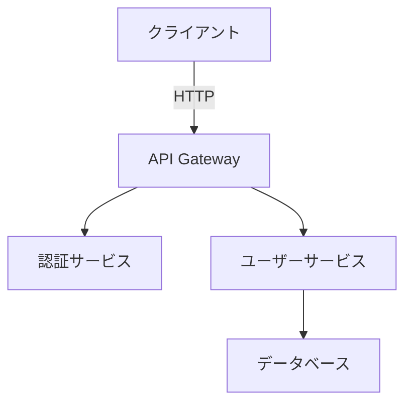

# Living Documentation（リビングドキュメンテーション）

## 概要

Living Documentationは、最小限の労力で自動的に進化するドキュメント。自動化を利用してドキュメントを作成し、最新の状態に保つ。

## 起源

この用語は、Gojko Adzicの著書「Specification by Example」で造られた。

## 定義

従来のドキュメントがすぐに古くなるのとは異なり、Living Documentationは、コードの変更、テスト結果、システムの動作と自動的に同期することで、その関連性を維持する。

## 4つの原則（Cyrille Martrai著「Living Documentation」より）

優れたLiving Documentationの4つの原則：

### 1. Reliable（信頼性）
- 常に最新で正確
- コードと同期している
- 自動生成または検証

### 2. Low Effort（少ない労力）
- 最小限のメンテナンスコスト
- 自動化による更新
- 手動作業を削減

### 3. Collaborative（協調的）
- チーム全体で共有
- フィードバックを取り入れやすい
- アクセシビリティが高い

### 4. Insightful（洞察的）
- 有用な情報を提供
- 意思決定を支援
- 理解を促進

## 自動化ドキュメンテーションの実践

### 1. 実行可能な仕様（Executable Specifications）

ビジネス要件と技術実装のギャップを埋める：

#### ツール
- **Cucumber**: 自然言語で書かれた仕様を実行可能なテストに変換
- **SpecFlow**: .NET向けのBDDフレームワーク
- **Behave**: Python向けのBDDツール

#### 例（Cucumber/Gherkin）
```gherkin
Feature: ユーザー登録
  Scenario: 有効な情報での登録
    Given ユーザーが登録ページにアクセスしている
    When ユーザーが有効なメールアドレスとパスワードを入力する
    And 登録ボタンをクリックする
    Then ユーザーアカウントが作成される
    And 確認メールが送信される
```

この仕様は以下の役割を果たす：
- ビジネス要件の文書化
- 自動テストとして実行
- 常に最新の状態を保証

### 2. API ドキュメント自動生成

モダンなAPIドキュメントツールは、APIの定義やコードアノテーションから直接インタラクティブなドキュメントを生成：

#### ツール
- **OpenAPI (Swagger)**: REST APIの標準仕様
- **Postman**: APIドキュメント生成とテスト
- **Insomnia**: APIクライアント＆ドキュメント
- **GraphQL**: 自己文書化されたAPI

#### OpenAPI の例
```yaml
openapi: 3.0.0
info:
  title: User API
  version: 1.0.0
paths:
  /users:
    get:
      summary: ユーザー一覧を取得
      responses:
        '200':
          description: 成功
          content:
            application/json:
              schema:
                type: array
                items:
                  $ref: '#/components/schemas/User'
```

コードアノテーションからの自動生成例（TypeScript）:
```typescript
/**
 * @openapi
 * /users:
 *   get:
 *     description: ユーザー一覧を取得
 *     responses:
 *       200:
 *         description: ユーザーのリスト
 */
app.get('/users', (req, res) => {
  // 実装
})
```

### 3. コードから生成されるドキュメント

#### JSDoc / TypeDoc（JavaScript/TypeScript）
```typescript
/**
 * ユーザーを作成する
 * @param {string} email - ユーザーのメールアドレス
 * @param {string} password - パスワード
 * @returns {Promise<User>} 作成されたユーザー
 * @throws {ValidationError} 入力が不正な場合
 */
async function createUser(email: string, password: string): Promise<User> {
  // 実装
}
```

#### Docstring（Python）
```python
def create_user(email: str, password: str) -> User:
    """
    ユーザーを作成する

    Args:
        email (str): ユーザーのメールアドレス
        password (str): パスワード

    Returns:
        User: 作成されたユーザー

    Raises:
        ValidationError: 入力が不正な場合
    """
    # 実装
```

### 4. アーキテクチャドキュメント

#### Architecture Decision Records (ADR)
技術的決定を文書化（詳細は別ファイル参照）

#### コードベースからの図生成
- **PlantUML**: テキストから図を生成
- **Mermaid**: Markdown内で図を記述
- **Graphviz**: グラフ構造の可視化

Mermaidの例：


### 5. テストレポート

自動テストの結果を可視化：
- テストカバレッジレポート
- パフォーマンステストレポート
- E2Eテストレポート

## Living Documentationの利点

### 1. 常に最新
- コードと同期
- 古いドキュメントの問題を解決
- 信頼性の高い情報源

### 2. 効率性
- 手動更新の時間を削減
- 開発チームの負担を軽減
- 自動化による一貫性

### 3. 協調性
- チーム全体で共有
- ビジネスサイドと技術サイドの橋渡し
- フィードバックループの改善

### 4. 品質向上
- ドキュメントとコードの乖離を防ぐ
- テストとドキュメントの統合
- 理解の促進

## 統計データ

Agile Allianceの最近の調査によると：
- **37%のプロジェクト遅延削減**: 効果的なアジャイルドキュメントプラクティスを取り入れたチーム
- **28%のチーム生産性向上**: Living Documentationを実践しているチーム

## 実装戦略

### フェーズ1: 基盤の構築
1. 既存のドキュメントプロセスを評価
2. 自動化の機会を特定
3. 適切なツールを選択

### フェーズ2: 段階的な導入
1. APIドキュメントの自動生成から開始
2. テストドキュメントを統合
3. アーキテクチャドキュメントを追加

### フェーズ3: 継続的改善
1. フィードバックを収集
2. プロセスを改善
3. 自動化を拡大

## CI/CDとの統合

### GitHub Actions例
```yaml
name: Documentation
on: [push]
jobs:
  docs:
    runs-on: ubuntu-latest
    steps:
      - uses: actions/checkout@v4
      - name: Generate API Docs
        run: npm run docs:generate
      - name: Generate Test Report
        run: npm test -- --coverage
      - name: Deploy to GitHub Pages
        uses: peaceiris/actions-gh-pages@v3
        with:
          github_token: ${{ secrets.GITHUB_TOKEN }}
          publish_dir: ./docs
```

## ツールとエコシステム

### ドキュメント生成
- **Docusaurus**: モダンなドキュメントサイト
- **VitePress**: Vue製ドキュメントジェネレーター
- **MkDocs**: Python製ドキュメントツール
- **Sphinx**: Python公式ドキュメントツール

### API ドキュメント
- **Swagger UI**: インタラクティブなAPI探索
- **ReDoc**: OpenAPI向け美しいドキュメント
- **GraphiQL**: GraphQL向けインタラクティブエディタ

### テストドキュメント
- **Jest**: カバレッジレポート
- **Playwright**: テストレポート生成
- **Allure**: 包括的なテストレポート

## ベストプラクティス

### 1. ドキュメントをコードの近くに配置
```
src/
  ├── user/
  │   ├── user.service.ts
  │   ├── user.service.spec.ts
  │   └── README.md  # このモジュールのドキュメント
  └── auth/
      ├── auth.service.ts
      ├── auth.service.spec.ts
      └── README.md
```

### 2. コードアノテーションを活用
型情報やコメントから自動生成

### 3. ドキュメントもレビュー対象に
プルリクエストでドキュメント変更もレビュー

### 4. CI/CDで自動チェック
- リンク切れチェック
- スペルチェック
- フォーマットチェック

### 5. バージョン管理
- ドキュメントもGitで管理
- リリースノートの自動生成
- 変更履歴の追跡

## アンチパターン

### 避けるべきこと

#### 1. 完璧主義
- 100%のドキュメントを目指さない
- 重要な部分に焦点を当てる
- 段階的に改善

#### 2. 過度な手動作業
- 自動化できることは自動化
- 手動更新が必要なドキュメントを最小化
- ツールを活用

#### 3. ドキュメントとコードの分離
- ドキュメントをコードと別に管理しない
- 同じリポジトリに配置
- 同時に更新

## 参考資料

### 書籍
- 「Specification by Example」by Gojko Adzic
- 「Living Documentation」by Cyrille Martraire

### 記事とガイド
- [CodeLucky: Agile Documentation Guide](https://codelucky.com/agile-documentation-living-approach/)
- [AgileManía: Agile Documentation Needs](https://agilemania.com/agile-documentation-needs)
- [Swimm: Documentation in Agile](https://swimm.io/learn/code-documentation/documentation-in-agile-why-it-matters-and-tips-for-success)
- [Bluefruit: Why Living Documentation](https://bluefruit.co.uk/processes/why-need-living-documentationsoftware/)

### ツール
- [Cucumber](https://cucumber.io/)
- [OpenAPI](https://www.openapis.org/)
- [Docusaurus](https://docusaurus.io/)
- [PlantUML](https://plantuml.com/)

## まとめ

Living Documentationは、アジャイル開発において不可欠な実践。自動化を活用することで、ドキュメントを常に最新の状態に保ち、開発チームの生産性を大幅に向上させることができる。段階的に導入し、継続的に改善することで、チーム全体のコラボレーションと品質を向上させることができる。
