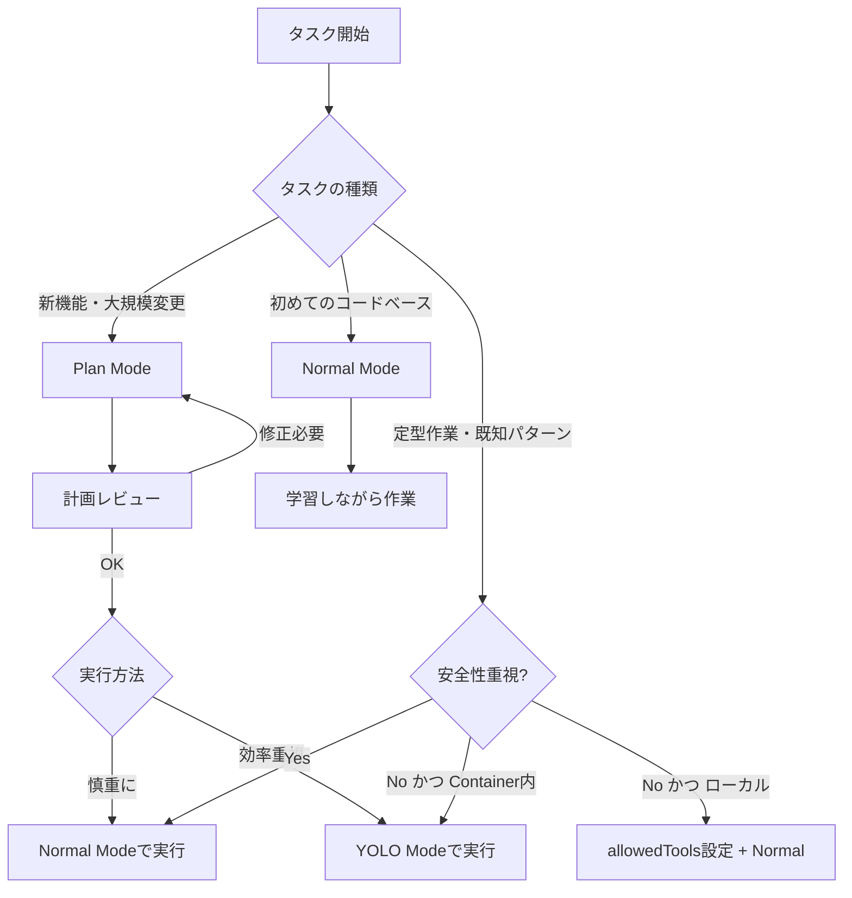

# 20. Claude Codeのモード切り替え（Plan / YOLO / Normal / Bypass Permissions）

**最終更新**: 2025-01-07
**カテゴリ**: 開発手法・ツール
**関連トピック**: [18. Trust but Verify](./18-trust-but-verify.md)、[19. Guardrails](./19-guardrails.md)

---

## 概要

Claude Codeには複数の実行モードがあり、状況に応じて使い分けることで開発効率と安全性のバランスを最適化できる。各モードは許可（permission）の扱い方が異なり、適切な使い分けが重要。

---

## 5つの主要モード

Claude Codeには、Normal Mode、Plan Mode、YOLO Mode（--dangerously-skip-permissions）、Bypass Permissions Mode（allowedTools設定）、およびそれらの組み合わせがあります。

### 1. Normal Mode（通常モード / Safe Mode）

**特徴**:
- デフォルトのモード
- すべてのアクション（ファイル編集、コマンド実行等）で明示的な許可を求める
- 最も安全だが、頻繁な確認が必要

**使用タイミング**:
- 初めて触るコードベース
- 本番環境に近い重要なファイルを扱う時
- セキュリティに配慮が必要な作業

**メリット**:
- 意図しない変更を防げる
- 各ステップを確認できる
- 学習段階で安全

**デメリット**:
- 頻繁な確認で作業が中断される
- 定型作業では非効率

---

### 2. Plan Mode（計画モード）

**起動方法**: `Shift + Tab` を2回押す（終了も `Shift + Tab`）

**特徴**:
- **実行前に計画を提示し、承認を待つ**
- ファイル編集、コマンド実行は計画承認後のみ
- 読み取り専用ツール（Read、LS、Glob、Grep）のみ利用可能

**使用タイミング**:
- 大規模な変更を行う前
- 複数ファイルにまたがる実装
- アーキテクチャ変更
- 新しい機能の追加

**メリット**:
- **実装前にレビュー・修正できる**（Escapeキーで計画を修正可能）
- AIの思考プロセスが可視化される
- バグの少ないコードが生成される
- より多くのユースケースをカバー

**デメリット**:
- 単純な作業では冗長
- 計画と実行が分かれるため、ワークフローが2段階になる

**ベストプラクティス**:
```
1. Plan Modeで計画立案 → Escapeで修正 → 承認
2. Normalモードで実行（またはYOLOモードで自動実行）
```

**出典**: [ClaudeLog - Plan Mode](https://claudelog.com/mechanics/plan-mode/)、[Cooking with Claude Code](https://www.siddharthbharath.com/claude-code-the-complete-guide/)

---

### 3. YOLO Mode（危険な自動実行モード）

**起動方法**: `claude --dangerously-skip-permissions`

**正式名称**: Dangerous Skip Permissions Mode

**特徴**:
- **すべての許可チェックを完全にスキップ**
- AIが中断なしで完了まで実行
- 「人間のループ」チェックを完全に無効化
- ファイル編集、削除、コマンド実行、すべて自動承認

**使用タイミング**:
- Lintエラーの一括修正（数百件）
- ボイラープレートコード生成
- 定型的なリファクタリング
- 複数ファイルの一括リネーム
- 既知のパターンの実装

**メリット**:
- **圧倒的に速い**（許可待ち時間ゼロ）
- 定型作業の効率化
- 繰り返し作業に最適
- 数百のファイルを連続処理可能

**デメリット・リスク**:
- **データ損失の可能性**（ファイル削除、上書き）
- **システム破壊の可能性**（危険なコマンド実行）
- **データ漏洩の可能性**（prompt injection攻撃）
- **機密情報の流出リスク**（.env、credentials.jsonの送信）
- **予期しないファイル削除**（rm -rf の実行リスク）
- **開発環境の破壊**（r/ClaudeAI で報告多数）

**安全な使い方**:

#### 方法1: Docker/Container内で実行（最推奨）

```bash
# Dockerコンテナ内で実行（インターネット接続なし）
docker run --rm -it \
  --network none \
  -v $(pwd):/workspace:rw \
  -w /workspace \
  myproject-dev \
  claude --dangerously-skip-permissions
```

**重要**: `--network none` でインターネット接続を遮断し、データ漏洩を防ぐ。

#### 方法2: タスクのスコープを厳格に制限

```bash
# ❌ ダメな例（広すぎる）
claude --dangerously-skip-permissions
> 「Webアプリを作って」

# ✅ 良い例（具体的で境界が明確）
claude --dangerously-skip-permissions
> 「src/main/java/com/example/service/ 配下のJavaファイルで、
   Checkstyle違反（未使用import）を全て修正して。
   他のディレクトリには触れないで。」
```

#### 方法3: Shell Alias で安全化

```bash
# ~/.bashrc または ~/.zshrc
alias cc-yolo='docker run --rm -it --network none -v $(pwd):/workspace -w /workspace claude-dev claude --dangerously-skip-permissions'
```

**コミュニティの意見**:
- **効率重視派**（約30%）: 「常にYOLOモード」を推奨
- **セキュリティ専門家**（約40%）: 「Containerなしで使うな」と警告
- **中間派**（約30%）: 「定型作業のみYOLO、新規実装はNormal」を推奨

**実際のトラブル事例**（Reddit r/ClaudeAI より）:
- 「開発環境のnode_modulesを全削除された」
- 「.gitディレクトリを誤って削除され、履歴が消えた」
- 「本番環境の設定ファイルを上書きされた」

**出典**:
- [Claude --dangerously-skip-permissions](https://blog.promptlayer.com/claude-dangerously-skip-permissions/)
- [Safe Usage Guide](https://www.ksred.com/claude-code-dangerously-skip-permissions-when-to-use-it-and-when-you-absolutely-shouldnt/)
- [ClaudeLog - Dangerous Skip Permissions](https://claudelog.com/mechanics/dangerous-skip-permissions/)

---

### 4. Bypass Permissions Mode（安全な部分自動化）

**起動方法**: `allowedTools` 設定 + Normal Mode

**別名**: Selective Permissions Mode、Granular Permissions Mode

**特徴**:
- **特定のツールのみ許可リストに追加**
- 最小権限の原則（Principle of Least Privilege）に従う
- YOLOモードより安全、Normalモードより効率的
- 透明性が高く、監査可能

**使用タイミング**:
- 定型作業だが、完全自動は不安
- 読み取り操作は自動、書き込みは手動承認
- Gitコミットのみ自動化
- テスト実行のみ自動化

**設定方法**:

#### 方法1: `/permissions` コマンド（対話的）

Claude Code起動後：

```
/permissions
```

表示されるメニューで、以下を選択：

```
Allowed Tools:
[ ] Read(*)           - ファイル読み取り
[ ] Grep(*)           - コード検索
[x] Edit(*)           - ファイル編集（チェックで自動許可）
[ ] Write(*)          - ファイル作成
[x] Bash(git commit:*) - git commit のみ自動許可
[ ] Bash(*)           - すべてのBashコマンド
```

#### 方法2: 設定ファイル（永続化）

**階層構造**:

```
1. User設定（最低優先度）
   ~/.claude/settings.json
   - 全プロジェクトに適用

2. Project設定（中優先度）
   /path/to/project/.claude/settings.json
   - チームで共有（Git管理下）

3. Local Project設定（最高優先度）
   /path/to/project/.claude/settings.local.json
   - 個人用（.gitignore に追加）
```

**User設定例**（~/.claude/settings.json）:

```json
{
  "allowedTools": [
    "Read(*)",
    "Grep(*)",
    "LS(*)",
    "Glob(*)"
  ],
  "restrictedPaths": [
    "/etc",
    "/usr",
    "~/.ssh",
    "~/.aws"
  ]
}
```

**Project設定例**（.claude/settings.json）:

```json
{
  "allowedTools": [
    "Read(*)",
    "Grep(*)",
    "Edit(src/**/*.java)",
    "Edit(src/**/*.js)",
    "Bash(mvn test)",
    "Bash(npm test)",
    "Bash(git add *)",
    "Bash(git commit:*)"
  ],
  "restrictedPaths": [
    ".env",
    "credentials.json",
    "src/main/resources/application-prod.properties"
  ]
}
```

**Local Project設定例**（.claude/settings.local.json）:

```json
{
  "allowedTools": [
    "Edit(*)",
    "Write(*)",
    "Bash(docker-compose up -d)"
  ]
}
```

#### 方法3: CLI フラグ（セッション限定）

```bash
claude --allowedTools "Read(*)" "Grep(*)" "Bash(mvn test)"
```

**パターン記法**:

| パターン | 説明 | 例 |
|---------|------|-----|
| `Tool(*)` | そのツールすべて許可 | `Edit(*)` → 全ファイル編集可能 |
| `Tool(path/*)` | 特定パス配下のみ許可 | `Edit(src/main/java/*)` → Java ファイルのみ |
| `Bash(command)` | 特定コマンドのみ許可 | `Bash(git commit:*)` → git commit のみ |
| `Bash(command:*)` | 特定コマンドのすべての引数許可 | `Bash(mvn:*)` → mvn すべてのサブコマンド |

**メリット**:
- YOLOモードよりはるかに安全
- Normal Modeより効率的
- 透明性が高い（設定ファイルで監査可能）
- チーム全体で標準化できる（Project設定）
- プロンプトインジェクション攻撃への耐性

**デメリット**:
- 初期設定が必要
- パターン記法の学習コスト
- 完全自動化（YOLO）より遅い

**推奨設定例（Java/Spring Boot開発）**:

```json
{
  "allowedTools": [
    "Read(*)",
    "Grep(*)",
    "LS(*)",
    "Glob(*)",
    "Edit(src/main/java/**/*.java)",
    "Edit(src/test/java/**/*.java)",
    "Edit(src/main/resources/static/**/*.js)",
    "Write(src/main/java/**/*.java)",
    "Write(src/test/java/**/*.java)",
    "Bash(mvn clean test)",
    "Bash(mvn checkstyle:check)",
    "Bash(npm test)",
    "Bash(npx eslint *)",
    "Bash(git add *)",
    "Bash(git commit:*)",
    "Bash(git status)",
    "Bash(git diff)"
  ],
  "restrictedPaths": [
    ".env",
    ".env.local",
    "credentials.json",
    "src/main/resources/application-prod.properties",
    "src/main/resources/application-secret.properties",
    ".git/config",
    "~/.ssh",
    "~/.aws"
  ]
}
```

**出典**:
- [A complete guide to Claude Code permissions - eesel AI](https://www.eesel.ai/blog/claude-code-permissions)
- [How to use Allowed Tools in Claude Code](https://www.instructa.ai/blog/claude-code/how-to-use-allowed-tools-in-claude-code)
- [Claude Code Best Practices - Anthropic](https://www.anthropic.com/engineering/claude-code-best-practices)

---

## モードの使い分けフロー



---

## 具体的な使い分け例（Java/Spring Boot開発）

### ケース1: TODO管理アプリの新機能追加

**状況**: 優先度フィルタリング機能を追加

**推奨モード**: **Plan Mode**

**理由**:
- 複数ファイル変更（TodoService、TodoController、Repository、Thymeleafテンプレート、JavaScript）
- テストコードも追加必要
- 計画段階で設計をレビューしたい

**ワークフロー**:
```
1. Shift+Tab×2 でPlan Mode起動
2. 「優先度フィルタリング機能を追加して。GIVEN WHEN THEN形式の受入条件は...」
3. Claude が計画提示
4. Escapeキーで計画修正（「Repositoryメソッド名を findByPriorityOrderByDueDateAsc に変更して」）
5. 承認後、Normal Modeで実行（またはYOLOモードで自動実行）
```

---

### ケース2: ESLintエラー50件の一括修正

**状況**: `npm run lint` で50件のエラー

**推奨モード**: **YOLO Mode（Container内）**

**理由**:
- 定型的な修正（未使用変数削除、命名規約違反修正）
- リスクが低い（テストで検証可能）
- 50回の許可確認は非効率

**ワークフロー**:
```bash
# Dockerコンテナ内で実行
docker run --rm -it -v $(pwd):/app -w /app node:21 bash
npm install
claude --dangerously-skip-permissions

# プロンプト: 「ESLintエラーを全て修正して。修正後にnpm run lintで確認して」
```

---

### ケース3: 新しいOSSプロジェクトの調査

**状況**: GitHub からクローンした知らないプロジェクト

**推奨モード**: **Normal Mode**

**理由**:
- コードベースの理解が不十分
- 意図しない変更を防ぐ
- 読み取り専門ツール（Read、Glob、Grep）で調査

**ワークフロー**:
```
1. Normal Mode（デフォルト）で起動
2. 「このプロジェクトの構造を説明して」（Readツールで調査）
3. 「TodoServiceの実装を見せて」（Readツールで表示）
4. 理解が深まったら、Plan ModeまたはYOLO Modeに切り替え
```

---

## モード切り替えのショートカット

| モード | 起動方法 | 終了方法 |
|--------|----------|----------|
| Normal Mode | デフォルト | - |
| Plan Mode | `Shift + Tab` ×2 | `Shift + Tab` |
| YOLO Mode | `claude --dangerously-skip-permissions` | Claude終了 |
| Bypass Permissions（設定） | `.claude/config.json` で `allowedTools` 設定 | 設定ファイル削除 |

---

## Trust but Verify との関係

各モードは「Trust but Verify」の3層検証と組み合わせる：

- **Plan Mode**: Layer 1（自動検証）前に、**Layer 0（計画レビュー）** を追加
- **Normal Mode**: Layer 1-3 すべてを手動実行
- **YOLO Mode**: Layer 1（自動検証）のみ。Layer 2（AI自己レビュー）・Layer 3（人間レビュー）は別途実行

**推奨フロー（最も安全）**:
```
Plan Mode（計画） → Normal Mode（実行） → Layer 1（CI/CD） → Layer 2（AI自己レビュー） → Layer 3（人間レビュー）
```

**推奨フロー（効率重視）**:
```
Plan Mode（計画） → YOLO Mode（実行） → Layer 1（CI/CD） → Layer 3（git diff確認）
```

---

## よくある質問

**Q1: YOLOモードを使うべきか？**

A: 以下の条件を**すべて**満たす場合のみ推奨：
- Dockerコンテナ内で実行
- 定型的な作業（Lint修正、ボイラープレート生成）
- テストで検証可能
- バックアップ済み

それ以外は `allowedTools` 設定を使うか、Normal Modeを推奨。

**Q2: Plan Modeは毎回使うべきか？**

A: **No**。以下の場合は不要：
- 1ファイルのみの小さな変更
- 既知のパターンの実装
- ドキュメント更新

以下の場合は**必須**：
- 複数ファイルにまたがる変更
- アーキテクチャ変更
- 新機能追加

**Q3: モードを途中で変更できるか？**

A: Plan Mode ⇔ Normal Mode は `Shift+Tab` で切り替え可能。YOLO Modeは起動時のフラグなので、途中変更不可（Claude再起動が必要）。

---

## 参考資料

### 公式・準公式
- [Claude Code Best Practices - Anthropic](https://www.anthropic.com/engineering/claude-code-best-practices)
- [ClaudeLog - Plan Mode](https://claudelog.com/mechanics/plan-mode/)
- [Claude Code Docs - Common Workflows](https://docs.claude.com/en/docs/claude-code/common-workflows)

### コミュニティ記事
- [Cooking with Claude Code: The Complete Guide](https://www.siddharthbharath.com/claude-code-the-complete-guide/)
- [How I use Claude Code (+ my best tips) - Builder.io](https://www.builder.io/blog/claude-code)
- [Our Claude Code Cheatsheet - Neon](https://neon.com/blog/our-claude-code-cheatsheet)
- [Claude --dangerously-skip-permissions - PromptLayer](https://blog.promptlayer.com/claude-dangerously-skip-permissions/)

### 日本語リソース
- [Claude Code完全攻略ガイド - Zenn](https://zenn.dev/uguisu_blog/articles/003_claude-code-slash-commands)
- [開発現場必須！Claude CLIの使い方 - Apidog](https://apidog.com/jp/blog/claude-code-cli-commands-jp/)

---

## セミナーでの活用

**01 入門編**:
- Normal Mode → Plan Mode の切り替えデモ
- YOLOモードの危険性を説明（Trust but Verify Layer 3の重要性）

**02 基本編**:
- Plan Mode でタスク分解（Issue #1-5）
- Normal Mode で実装サイクル（Red-Green-Refactor）

**03 実践編**:
- YOLO Mode（Container内）でLintエラー一括修正デモ
- `allowedTools` 設定による安全なYOLOモード代替案
