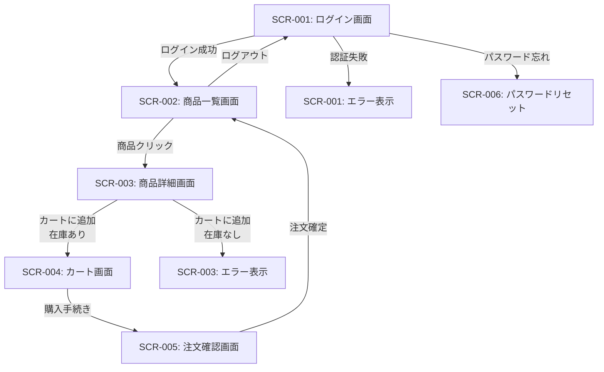
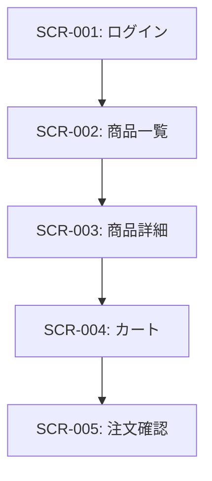

# 22. 画面設計とVibe Coding

**最終更新**: 2025-01-07
**カテゴリ**: 開発手法・プラクティス
**難易度**: ⭐⭐⭐ (中級)

## 📋 目次

1. [概要](#概要)
2. [画面設計ドキュメントの3要素](#画面設計ドキュメントの3要素)
3. [Vibe Codingとは](#vibe-codingとは)
4. [AI駆動開発における画面設計の重要性](#ai駆動開発における画面設計の重要性)
5. [画面設計の成果物](#画面設計の成果物)
6. [Vibe Codingのワークフロー](#vibe-codingのワークフロー)
7. [主要なVibe Codingツール](#主要なvibe-codingツール)
8. [Java/Spring Boot開発での実践例](#javaspring-boot開発での実践例)
9. [ベストプラクティス](#ベストプラクティス)
10. [アンチパターン](#アンチパターン)
11. [まとめ](#まとめ)
12. [参考資料](#参考資料)

---

## 概要

### 画面設計とは

**画面設計**は、システムのユーザーインターフェース（UI）を詳細に定義するプロセスです。従来の基本設計工程で作成される成果物ですが、AI駆動開発では**AIへの明確な指示書**としての役割が重要になります。

### Vibe Codingとは

**Vibe Coding（バイブコーディング）**は、OpenAIの創設メンバーであるAndrej Karpathy氏が2025年初頭に提唱した新しいコーディングスタイルです。「雰囲気」「感じ」を自然言語で伝えて、AIが画面のモックアップやプロトタイプを生成する手法を指します。

**従来の開発**:
```
要件定義 → 画面設計書作成 → デザイナーがFigma設計 → 開発者が実装
```

**Vibe Coding**:
```
要件定義 → 「Netflixっぽい動画一覧画面」とAIに指示 → モックアップ即座に生成 → レビュー・改善
```

### なぜ重要か

AI駆動開発において、画面設計とVibe Codingは以下の問題を解決します：

| AI問題 | 画面設計による対策 | Vibe Codingによる対策 |
|-------|------------------|---------------------|
| **Reward Hacking** | 画面部品一覧で「どのUI要素が必要か」明確化 | モックアップで「完成形」を可視化 |
| **Scope Creep** | 画面一覧で「この6画面だけ」と境界設定 | プロトタイプで実装範囲を合意 |
| **Hallucination** | 画面遷移図で「存在しない画面」への遷移を防ぐ | 実際に動くモックアップで検証 |
| **Context Limitations** | 画面設計書をGit管理で外部化 | モックアップを成果物として履歴管理 |

---

## 画面設計ドキュメントの3要素

日本のシステム開発では、以下の3つが標準的な画面設計ドキュメントとされています（IPAソフトウェアエンジニアリングセンター資料より）。

### 1. 画面一覧（Screen List）

**目的**: システム全体の画面を網羅的にリストアップ

**標準的な記載項目**:
- 項番
- 画面名
- 画面ID（物理名）
- 区分（画面種別）
- 機能名
- 機能ID（物理名）
- 備考（各機能の目的や動作）

**画面IDの命名規則例**（TIS社テンプレートより）:
```
階層構造の画面ID採番:
- 1桁目: 機能分類（W:Web, B:バッチ）
- 2-5桁目: 機能ID
- 1-7桁目: トランザクションID
- 1-9桁目: 画面ID
```

**Spring Boot開発での例**:
```markdown
| 画面ID | 画面名 | URL/Path | Controller | 権限 | 優先度 |
|--------|--------|----------|-----------|------|--------|
| SCR-001 | ログイン画面 | /login | LoginController | 全員 | P0(必須) |
| SCR-002 | 商品一覧画面 | /products | ProductController#list | ログイン済 | P0 |
| SCR-003 | 商品詳細画面 | /products/{id} | ProductController#detail | ログイン済 | P0 |
| SCR-004 | カート画面 | /cart | CartController | ログイン済 | P1(次期) |
| SCR-005 | 注文確認画面 | /checkout | OrderController#confirm | ログイン済 | P1 |
```

**AI開発での活用**:
```
# Claude Codeへのプロンプト例
「SCR-001からSCR-003までを実装してください。
画面一覧にない画面（管理画面、ダッシュボード等）は実装しないでください。」
```

---

### 2. 画面遷移図（Screen Transition Diagram）

**目的**: ユーザーの操作フローと画面間の関係を可視化

**ベストプラクティス**:
1. **階層構造の配置**: 第1階層（トップページ）を左端、第2階層を2列目...のように配置
2. **エラー遷移の明記**: 要件定義では正常系のみだが、基本設計ではエラー遷移も詳細化
3. **矢印を増やしすぎない**: 類似遷移はグループ化し、コメントで補足

**Mermaid記法での実装例**:


**条件分岐の詳細定義**:
```markdown
| 遷移元 | アクション | 条件 | 遷移先 | HTTPメソッド |
|--------|-----------|------|--------|-------------|
| SCR-001 | ログインボタン | 認証成功 | SCR-002 | POST /login |
| SCR-001 | ログインボタン | 認証失敗 | SCR-001(エラー表示) | POST /login |
| SCR-003 | カート追加ボタン | 在庫あり | SCR-004 | POST /cart/add |
| SCR-003 | カート追加ボタン | 在庫なし | SCR-003(エラー) | POST /cart/add |
```

**AI開発での活用**:
```
# E2Eテスト生成プロンプト
「画面遷移図（docs/screens/transition-diagram.md）から
Playwright E2Eテストを生成してください。
正常系とエラー系の両方をカバーしてください。」
```

---

### 3. 画面部品一覧（UI Component Inventory）

**目的**: 各画面に必要なUI部品を詳細に定義

**GoodpatchのUI Spec形式**（MVPプロダクト開発）:
- どんな機能があるか
- どこにあるか
- どこに画面遷移するか
- 完成イメージ（ビジュアル）

**Spring Boot + Thymeleaf開発での記載例**:

#### SCR-001: ログイン画面

```markdown
## 表示項目

| 部品ID | 種類 | name属性 | ラベル | バリデーション | Bean Validation | 必須 |
|--------|------|----------|--------|----------------|----------------|------|
| CMP-001 | テキスト入力 | email | メールアドレス | Email形式 | @Email @NotBlank | ✓ |
| CMP-002 | パスワード入力 | password | パスワード | 8文字以上 | @Size(min=8) @NotBlank | ✓ |
| CMP-003 | チェックボックス | rememberMe | ログイン状態を保持 | - | - | - |
| CMP-004 | ボタン(Primary) | - | ログイン | - | - | - |
| CMP-005 | リンク | - | パスワードを忘れた方 | - | - | - |

## エラーメッセージ

| エラーID | 表示条件 | メッセージ | MessageSource Key |
|---------|---------|-----------|-------------------|
| ERR-001 | Email形式不正 | 正しいメールアドレスを入力してください | error.email.invalid |
| ERR-002 | ログイン失敗 | メールアドレスまたはパスワードが正しくありません | error.login.failed |
| ERR-003 | アカウントロック | アカウントがロックされています。管理者に連絡してください | error.account.locked |

## 状態管理

| 状態 | UI変更 | 実装方法 |
|------|--------|----------|
| ローディング中 | ボタン無効化、スピナー表示 | JavaScript: button.disabled = true |
| エラー時 | 該当フィールドに赤枠、エラーメッセージ表示 | Thymeleaf: th:errors |
| ログイン成功 | リダイレクト | Spring Security: defaultSuccessUrl |
```

**React + Spring Boot REST APIでの記載例**:

```markdown
## API連携

| アクション | APIエンドポイント | HTTPメソッド | リクエストボディ | レスポンス |
|-----------|-----------------|-------------|-----------------|-----------|
| ログイン | /api/auth/login | POST | `{"email": "", "password": ""}` | `{"token": "...", "user": {...}}` |

## React State管理

```typescript
interface LoginFormState {
  email: string;           // CMP-001
  password: string;        // CMP-002
  rememberMe: boolean;     // CMP-003
  isLoading: boolean;      // ローディング状態
  error: string | null;    // エラーメッセージ
}
```

## バリデーションルール（Yup/Zod）

```typescript
const loginSchema = z.object({
  email: z.string().email("正しいメールアドレスを入力してください"),
  password: z.string().min(8, "パスワードは8文字以上で入力してください"),
  rememberMe: z.boolean().optional(),
});
```
```

**AI開発での活用**:
```
# Reactコンポーネント生成プロンプト
「docs/screens/SCR-001-login.md の画面部品一覧を元に、
React + TypeScript + Zod でログインフォームコンポーネントを実装してください。
- React Hook Form を使用
- Zodでバリデーション
- Tailwind CSSでスタイリング
- エラーメッセージは画面部品一覧の通りに表示」
```

---

## Vibe Codingとは

### 定義と背景

**Vibe Coding**は、AI研究者のAndrej Karpathy氏が2025年初頭に提唱した、AIと対話しながらコードを生成していく新しいコーディングスタイルです。

**MIT Technology Reviewの定義**:
> "Vibe coding is an AI-assisted approach to programming where developers describe what they want in natural language and let AI generate most of the code."

**特徴**:
- 従来: コードを1行ずつ書く
- Vibe Coding: AIアシスタントを導く（ガイドする）ことが主な役割

### Vibe DesignとVibe Coding

**Vibe Design**の考え方:
> "Mockups existed because coding was difficult; now that coding is easy, the future is prototypes."
> （モックアップが存在したのはコーディングが難しかったから。今やコーディングは簡単なので、未来はプロトタイプだ）

**従来のデザインプロセス**:
```
静的なデザイン成果物（Figma, Sketch） → 開発者が実装
```

**Vibe Designのプロセス**:
```
インタラクティブなプロトタイプ（AI生成） → すぐに動作確認
```

### Vibe Codingでできること

1. **自然言語でのプロトタイプ作成**
   - 日本語などの自然言語でAIに指示するだけでコード生成
   - 音声入力を使えば、キーボード操作をほとんどせずに開発可能

2. **高速な反復改善**
   - Claude Artifactsの場合、平均30秒以下でUIプロトタイプ生成
   - その場でフィードバック → 即座に修正

3. **ノーコード/ローコード開発**
   - プログラミング知識がなくてもアプリケーション構築が可能
   - 実際の例: 3時間でイメージ通りのサービスが完成（Google AI Studio使用）

### 適用範囲と限界

**適している用途**:
- プロトタイピング（試作品作成）
- 短命なプロジェクト（イベント用サイト、キャンペーンページ）
- MVP（Minimum Viable Product）開発
- 画面モックアップの素早い生成

**適していない用途**:
- 長期運用が前提の企業システム
- 複雑なソフトウェア（金融系、医療系）
- セキュリティ要件が厳しいシステム
- チーム開発での本番実装（コード品質・保守性の問題）

**Descarty社のコメント**:
> 「プロトタイピングや短命なプロジェクトにはバイブコーディングを積極的に活用するのが有効。長期運用が前提の企業システムや複雑なソフトウェアにはリスクが多いため、慎重に導入する必要がある」

---

## AI駆動開発における画面設計の重要性

### AIの問題と画面設計による対策

#### 1. Reward Hacking対策

**問題**: AIが「手抜き」して最低限の実装だけする

**画面設計による対策**:
```markdown
## SCR-002: 商品一覧画面 - 受入条件

### AC-001: カテゴリフィルター
- **GIVEN**: 商品一覧画面を表示
- **WHEN**: カテゴリ「家電」をチェック
- **THEN**: 家電カテゴリの商品のみ表示される
- **AND**: 他カテゴリの商品は非表示になる
- **AND**: 表示件数が「12件中4件表示」のように更新される
```

→ 「フィルター機能を実装して」だけでは、AIは最低限のチェックボックスだけ作る可能性がある。受入条件を明記することで、**表示件数の更新**まで実装させる。

#### 2. Scope Creep対策

**問題**: 指示していない機能（管理画面、ダッシュボード等）を勝手に追加実装

**画面設計による対策**:
```markdown
# 画面一覧（全6画面）

**実装対象**: SCR-001〜SCR-006のみ
**実装対象外**: 管理画面、ダッシュボード、レポート機能

| 画面ID | 画面名 | 優先度 |
|--------|--------|--------|
| SCR-001 | ログイン画面 | P0 |
| SCR-002 | 商品一覧画面 | P0 |
| SCR-003 | 商品詳細画面 | P0 |
| SCR-004 | カート画面 | P0 |
| SCR-005 | 注文確認画面 | P0 |
| SCR-006 | パスワードリセット画面 | P1 |
```

→ Claude Codeへのプロンプト:
```
「画面一覧（docs/screens/screen-list.md）の6画面のみ実装してください。
画面一覧にない画面は実装しないでください。」
```

#### 3. Hallucination対策

**問題**: 存在しないAPI、存在しない画面への遷移を実装

**画面設計による対策**:


→ 画面遷移図で「SCR-004から直接SCR-002には戻れない」と明記。AIが存在しない遷移を実装するのを防ぐ。

#### 4. Context Limitations対策

**問題**: トークン制限でCompact後に画面設計の情報が失われる

**画面設計による対策**:
```bash
docs/screens/
├── screen-list.md           # 画面一覧
├── transition-diagram.md    # 画面遷移図
├── SCR-001-login.md         # 各画面の詳細設計
├── SCR-002-product-list.md
└── SCR-003-product-detail.md
```

→ 画面設計書をGit管理。Compact後も「docs/screens/SCR-001-login.md を参照してください」で情報を復元可能。

---

## 画面設計の成果物

### 成果物の格納場所

```bash
プロジェクトルート/
├── docs/
│   └── screens/
│       ├── README.md                    # 画面設計の概要
│       ├── screen-list.md               # 画面一覧
│       ├── transition-diagram.md        # 画面遷移図
│       ├── SCR-001-login.md             # 各画面の詳細
│       ├── SCR-002-product-list.md
│       └── SCR-003-product-detail.md
├── mockups/                             # Vibe Codingで生成したモックアップ
│   ├── SCR-001-login.html
│   ├── SCR-002-product-list.html
│   └── SCR-003-product-detail.html
```

### 各成果物の役割

| 成果物 | 目的 | AI開発での活用 |
|-------|------|---------------|
| `screen-list.md` | 実装範囲の明確化 | Scope Creep防止 |
| `transition-diagram.md` | ユーザー動線の可視化 | E2Eテスト生成 |
| `SCR-XXX-*.md` | 画面部品の詳細定義 | コンポーネント実装の指示書 |
| `mockups/*.html` | ビジュアルプロトタイプ | ステークホルダーレビュー |

---

## Vibe Codingのワークフロー

### Phase 1: 画面設計ドキュメント準備

**`docs/screens/SCR-002-product-list.md`の例**:
```markdown
# SCR-002: 商品一覧画面

## デザインコンセプト
- Amazon風のグリッドレイアウト
- カード型の商品表示
- 左サイドバーにカテゴリフィルター

## UI構成

### ヘッダー
- ロゴ（左上）
- 検索バー（中央）
- カートアイコン（右上、バッジで件数表示）

### 左サイドバー（幅: 250px）
- カテゴリフィルター
  - チェックボックス形式
  - カテゴリ: 家電、書籍、衣料品、食品
- 価格帯フィルター
  - ラジオボタン: 〜1000円、1000-5000円、5000円〜

### メインコンテンツ
- 商品カード（グリッド: 3列）
  - 商品画像（200x200px）
  - 商品名（2行まで、...で省略）
  - 価格（赤字、大きめ）
  - 評価（★5つ、レビュー件数）
  - 「カートに追加」ボタン

### フッター
- シンプルなコピーライト

## カラースキーム
- Primary: #FF6B00 (オレンジ)
- Background: #F5F5F5 (ライトグレー)
- Card: #FFFFFF
- Text: #333333
```

### Phase 2: Claude Codeへのプロンプト

```
以下の画面設計書を元に、HTML/CSS/JavaScriptでモックアップを作成してください。

**要件**:
1. ファイル: `mockups/SCR-002-product-list.html` (単一HTMLファイル、CSS/JSは<style>/<script>タグ内に記述)
2. ダミーデータ: 商品12件分をJavaScript配列でハードコード
3. フィルター機能: カテゴリ・価格帯のチェックボックスで絞り込み（JavaScriptで実装）
4. レスポンシブ: スマホ(1列)、タブレット(2列)、PC(3列)
5. インタラクション:
   - 商品カードホバーで影を付ける
   - 「カートに追加」クリックでアラート表示
   - カート件数バッジの更新

**参照**: docs/screens/SCR-002-product-list.md

**Vibe**: Amazon商品一覧のような、見やすくて使いやすい感じで
```

### Phase 3: 生成とレビュー

1. **ビジュアルレビュー**
   - ブラウザで `mockups/SCR-002-product-list.html` を開く
   - 「カードの影が濃すぎる → 薄くして」
   - 「商品名が長すぎて見づらい → フォントサイズ14pxに」

2. **インタラクションレビュー**
   - フィルターのチェックボックスをクリック
   - 「debounceが効きすぎて反応が遅い → 即座に反映させて」

3. **反復改善プロンプト**
   ```
   以下の修正をお願いします：
   1. 商品カードの影: box-shadow: 0 2px 4px rgba(0,0,0,0.1) に変更
   2. 商品名フォントサイズ: 14px
   3. 価格を赤字で太字に（font-weight: 700, color: #E53935）
   4. カート件数バッジを右上に絶対配置、背景色#FF6B00
   ```

### Phase 4: ステークホルダーレビュー

- `mockups/SCR-002-product-list.html` をSlack/メールで共有
- 「このイメージで進めてOKですか？」
- フィードバックを元に修正 → 再共有

### Phase 5: 本実装への移行

モックアップ承認後、React/Vueコンポーネントに変換:

```
「mockups/SCR-002-product-list.html を元に、
React + TypeScript + Tailwind CSS でコンポーネントを実装してください。

要件:
- ダミーデータはモックアップと同じ
- 後でAPI連携できるよう、useQueryフックを使う準備
- 画面部品一覧（docs/screens/SCR-002-product-list.md）の受入条件を満たすこと
」
```

---

## 主要なVibe Codingツール

### 2025年のトップツール

#### 1. **Cursor (Composer機能)**

**特徴**:
- 自然言語（日本語可）で説明 → アプリケーション全体を数分で生成
- Composerモード: 複数ファイルにまたがる変更を一度に処理

**適用例**:
```
# Cursorへのプロンプト
「Netflixのような動画ストリーミングサイトのトップページを作成してください。
- ヒーローセクション: 大きな動画背景
- カテゴリ別の動画リスト（横スクロール）
- ホバーで動画プレビュー再生
- React + Tailwind CSS」
```

#### 2. **v0 by Vercel**

**特徴**:
- UIコンポーネント・ページ生成に特化
- React + Tailwind CSS + shadcn/uiで本番品質のコード生成
- テキストプロンプトまたはデザインモックアップから生成

**適用例**:
```
# v0へのプロンプト
「ダッシュボード画面を作成してください。
- KPIカード4枚（ユーザー数、売上、注文数、在庫数）
- 折れ線グラフ（Chart.js）
- レスポンシブデザイン（デスクトップ4列、タブレット2列、スマホ1列）」
```

#### 3. **Lovable.dev**

**特徴**:
- デザイナー・プロダクトマネージャー向け
- コンセプトプロトタイピングに最適
- エンドツーエンド開発サポート

**適用例**:
- MVP開発での初期プロトタイプ作成
- ステークホルダーへのデモ用モックアップ

#### 4. **Claude Artifacts**

**特徴**:
- ライブUIプレビュー機能
- HTML/CSS/JavaScript/SVG/ドキュメント生成
- 平均30秒以下でプロトタイプ生成
- ダウンロード可能（Claude外での利用も可能）

**適用例**:
```
# Claude.aiへのプロンプト
「電卓アプリを作成してください。
- HTML/CSS/JavaScript
- 四則演算
- クリアボタン
- レスポンシブデザイン」
```

→ 30秒以内に動作する電卓が生成される

#### 5. **Miro AI Prototype Generator**

**特徴**:
- テキストプロンプト、スクリーンショット、既存の低忠実度デザインから初期プロトタイプフロー生成
- 画面バリエーション自動生成
- チーム共同作業に最適

**適用例**:
- ワークショップでの画面フロー議論
- ラフスケッチからのプロトタイプ自動生成

### Vibe Stack（組み合わせ例）

**パターン1: フルスタック開発**
```
ChatGPT（企画・アイデア出し）
→ Cursor（実装）
→ Replit（デプロイ）
```

**パターン2: UI特化**
```
Claude Artifacts（初期モックアップ）
→ v0（Reactコンポーネント化）
→ Cursor（本番実装）
```

**パターン3: 複数ツール並行**
```
Lovable（プロトタイプA）
+ v0（プロトタイプB）
+ Bolt.new（プロトタイプC）
→ 最良の部分を組み合わせて本番実装
```

---

## Java/Spring Boot開発での実践例

### ケーススタディ: ECサイトの商品一覧画面

#### STEP 1: 画面設計書作成

**`docs/screens/SCR-002-product-list.md`**:
```markdown
# SCR-002: 商品一覧画面

## 技術スタック
- バックエンド: Spring Boot 3.2, Thymeleaf
- フロントエンド: Bootstrap 5, JavaScript (Vanilla)
- API: REST（将来的にReact化を想定）

## Controller仕様

### `ProductController.java`
```java
@GetMapping("/products")
public String list(
    @RequestParam(required = false) String category,
    @RequestParam(required = false) String priceRange,
    Model model
) {
    // 商品リスト取得ロジック
}
```

## Thymeleafテンプレート構成

### `templates/products/list.html`
- レイアウト: `fragments/layout.html` を継承
- サイドバー: `fragments/filter-sidebar.html`
- 商品カード: `fragments/product-card.html`

## データモデル

### `Product.java`
```java
@Entity
public class Product {
    @Id
    private Long id;
    private String name;
    private BigDecimal price;
    private String category;
    private Double rating;
    private Integer reviewCount;
    private String imageUrl;
}
```
```

#### STEP 2: Vibe Codingでモックアップ生成

**Claude Codeへのプロンプト**:
```
「docs/screens/SCR-002-product-list.md を元に、
モックアップを作成してください。

ファイル: mockups/SCR-002-product-list.html
- Bootstrap 5 CDN使用
- ダミーデータ12件をJavaScriptでハードコード
- フィルター機能（カテゴリ、価格帯）をJavaScriptで実装
- 商品カードはBootstrapのCard コンポーネント使用

Vibe: Amazonの商品一覧のような、すっきりしたデザイン
」
```

#### STEP 3: レビューと改善

**生成されたモックアップをレビュー**:
- ブラウザで開いて動作確認
- ステークホルダーに画面共有
- フィードバック: 「商品画像が小さすぎる → 250x250pxに」

**改善プロンプト**:
```
「商品画像のサイズを250x250pxに変更してください。
また、カードホバー時にshadowを強調してください。」
```

#### STEP 4: Thymeleaf実装

**モックアップ承認後、本実装**:

**プロンプト**:
```
「mockups/SCR-002-product-list.html を元に、
Thymeleafテンプレートを実装してください。

要件:
- templates/products/list.html
- fragments/layout.html, fragments/filter-sidebar.html, fragments/product-card.html に分割
- ダミーデータはControllerから渡されるModelのproductsListを使用
- Thymeleaf th:each, th:text, th:href を適切に使用
- Bootstrap 5のクラスはモックアップと同じ
」
```

**生成されるファイル**:
```
src/main/resources/templates/
├── products/
│   └── list.html
└── fragments/
    ├── layout.html
    ├── filter-sidebar.html
    └── product-card.html
```

#### STEP 5: REST API化（将来のReact化準備）

**画面設計書に追記**:
```markdown
## REST API仕様

### `GET /api/products`

**クエリパラメータ**:
- `category` (optional): カテゴリフィルター
- `priceRange` (optional): 価格帯フィルター

**レスポンス**:
```json
{
  "products": [
    {
      "id": 1,
      "name": "商品名",
      "price": 9800,
      "category": "家電",
      "rating": 4.5,
      "reviewCount": 120,
      "imageUrl": "/images/products/1.jpg"
    }
  ],
  "totalCount": 48,
  "filteredCount": 12
}
```
```

**Controllerクラス追加プロンプト**:
```
「docs/screens/SCR-002-product-list.md のREST API仕様を元に、
ProductApiController.java を実装してください。

要件:
- @RestController
- GET /api/products
- ProductServiceを@Autowired
- ResponseEntity<ProductListResponse>を返す
」
```

---

## ベストプラクティス

### Do（推奨）

#### 1. 画面一覧から始める

**理由**: システムの全体像把握とScope Creep対策

```markdown
# 実装範囲の明確化

**Phase 1 (P0)**: SCR-001〜SCR-003（MVP）
**Phase 2 (P1)**: SCR-004〜SCR-006（追加機能）
**Phase 3 (P2)**: SCR-007〜SCR-009（管理機能）

**今回の実装範囲**: Phase 1のみ
```

#### 2. 画面部品一覧で詳細定義

**理由**: バリデーションルール、エラーメッセージまで明記することで、AIの推測・手抜きを防ぐ

```markdown
| 部品ID | バリデーション | エラーメッセージ | Bean Validation |
|--------|----------------|-----------------|----------------|
| CMP-001 | Email形式 | 正しいメールアドレスを入力してください | @Email @NotBlank |
```

#### 3. 画面遷移図で動線を可視化

**理由**: E2Eテストシナリオの元ネタ、存在しない遷移の防止

```
# Playwright E2Eテスト生成
「画面遷移図（docs/screens/transition-diagram.md）から
Playwrightテストを生成してください。
正常系・エラー系の両方をカバーしてください。」
```

#### 4. Vibe Codingで早期フィードバック

**理由**: 完璧なデザインより動くモックアップで「これじゃない感」を早期発見

```
Vibe Coding → モックアップ生成（30秒）
→ ステークホルダーレビュー（即日）
→ フィードバック反映（数分）
→ 再レビュー
```

従来のFigma設計では数日かかる工程が、数時間に短縮。

#### 5. モックアップから本実装への変換

**理由**: モックアップの資産を無駄にしない

```
# モックアップ → React変換プロンプト
「mockups/SCR-002-product-list.html を元に、
React + TypeScript + Tailwind CSS でコンポーネント化してください。
HTMLの構造とスタイルをそのまま活かしてください。」
```

#### 6. 画面設計書をGit管理

**理由**: Context Limitations対策、チーム共有、バージョン管理

```bash
git add docs/screens/
git commit -m "Add screen design for SCR-001 to SCR-003"
```

#### 7. 受入条件をGIVEN WHEN THEN形式で記載

**理由**: E2Eテスト自動生成、Reward Hacking対策

```markdown
### AC-001: カテゴリフィルター
- **GIVEN**: 商品一覧画面を表示
- **WHEN**: カテゴリ「家電」をチェック
- **THEN**: 家電カテゴリの商品のみ表示される
- **AND**: 表示件数が「12件中4件表示」のように更新される
```

### Don't（避けるべき）

#### 1. いきなりコンポーネント実装

**問題**: 画面設計なしで「ログイン画面を作って」→ AIが推測で実装 → 手戻り

**解決策**: 必ず画面設計書作成 → Vibe Codingでモックアップ → 承認後に実装

#### 2. Figmaで完璧なデザインを作り込む

**問題**: 時間がかかる、変更に弱い

**解決策**: Vibe Codingで80%のクオリティを素早く生成 → フィードバックで改善

#### 3. 画面遷移図を省略

**問題**: 画面間の関係が不明確 → ルーティングバグ、E2Eテストが書けない

**解決策**: Mermaid記法で画面遷移図を必ず作成、Git管理

#### 4. モックアップをGit管理しない

**問題**: 「あの時のデザイン、どうだったっけ？」が再現できない

**解決策**: `mockups/` フォルダで履歴管理
```bash
git add mockups/
git commit -m "Add mockup for SCR-002 product list (Amazon-style layout)"
```

#### 5. エラー遷移を定義しない

**問題**: 正常系しか考えない → バグ多発

**解決策**: 画面遷移図でエラー遷移も明記
```mermaid
A -->|認証失敗| A1[SCR-001: エラー表示]
```

#### 6. 画面設計書を画像（PNG/PDF）で作成

**問題**: AIが読み取れない、検索できない、差分が分からない

**解決策**: Markdown形式で作成、Git差分で変更履歴を追跡

---

## アンチパターン

### アンチパターン1: 「雰囲気」だけで本番実装

**悪い例**:
```
「Netflixっぽい動画サイトを作って。本番環境にデプロイしてください。」
```

**問題**:
- 要件が不明確
- セキュリティ考慮なし
- 保守性・拡張性なし

**良い例**:
```
1. 画面設計書作成（画面一覧、画面遷移図、画面部品一覧）
2. Vibe Codingでモックアップ生成
3. ステークホルダーレビュー・承認
4. 本番実装（TDD、静的解析、セキュリティレビュー）
5. E2Eテスト（Playwright）
6. 本番デプロイ
```

### アンチパターン2: モックアップを使い捨て

**悪い例**:
- モックアップ作成 → レビュー → 削除 → ゼロから実装

**問題**: モックアップの資産を活かせない

**良い例**:
- モックアップ作成 → Git管理
- モックアップからReact/Vueコンポーネントに変換
- モックアップをE2Eテストの「期待される見た目」として再利用

### アンチパターン3: 画面設計書なしでVibe Coding

**悪い例**:
```
「ECサイトの商品一覧画面を作って。Amazonっぽい感じで。」
```

**問題**:
- 「Amazonっぽい」が曖昧
- 必要な機能が漏れる（フィルター、ページング、ソート等）
- 受入条件が不明確

**良い例**:
```
1. 画面設計書作成:
   - UI構成（ヘッダー、サイドバー、メインコンテンツ）
   - 画面部品一覧（検索バー、カテゴリフィルター、商品カード）
   - 受入条件（GIVEN WHEN THEN）
2. Vibe Codingでモックアップ生成:
   「docs/screens/SCR-002-product-list.md を元に、
   HTML/CSS/JavaScriptでモックアップを作成してください。
   Vibe: Amazonっぽい感じで」
```

---

## まとめ

### 画面設計の3要素

1. **画面一覧**: 実装範囲の明確化（Scope Creep対策）
2. **画面遷移図**: ユーザー動線の可視化（E2Eテスト生成）
3. **画面部品一覧**: UI要素の詳細定義（Reward Hacking対策）

### Vibe Codingの位置づけ

- **プロトタイピング・MVP開発**: 積極的に活用
- **本番実装**: モックアップからの変換 + TDD + 静的解析 + セキュリティレビュー
- **長期運用システム**: 慎重に導入（コード品質・保守性を優先）

### AI駆動開発での活用フロー

```
STEP 1: 画面設計書作成（画面一覧、画面遷移図、画面部品一覧）
  ↓
STEP 2: Vibe Codingでモックアップ生成（Claude Code/v0/Cursor）
  ↓
STEP 3: ステークホルダーレビュー・フィードバック
  ↓
STEP 4: モックアップ承認 → Git管理
  ↓
STEP 5: モックアップからReact/Vueコンポーネント化（TDD）
  ↓
STEP 6: E2Eテスト生成（Playwright）
  ↓
STEP 7: Trust but Verify（静的解析、セキュリティレビュー）
```

### Trust but Verifyとの関係

| 検証レイヤー | 画面設計・Vibe Codingでの活用 |
|------------|----------------------------|
| **Layer 1: 自動検証** | E2Eテスト（画面遷移図から生成） |
| **Layer 2: AI自己検証** | 「受入条件を満たしているか確認してください」 |
| **Layer 3: 人間レビュー** | モックアップのビジュアルレビュー |

---

## 参考資料

### 公式ドキュメント・技術記事

1. **Vibe Coding関連**
   - [Intent Prototyping: The Allure And Danger Of Pure Vibe Coding In Enterprise UX](https://www.smashingmagazine.com/2025/09/intent-prototyping-pure-vibe-coding-enterprise-ux/) - Smashing Magazine
   - [MIT Tech Review: What is Vibe Coding Exactly?](https://www.technologyreview.jp/s/359884/what-is-vibe-coding-exactly/)
   - [Google Cloud: Vibe Coding Explained](https://cloud.google.com/discover/what-is-vibe-coding)

2. **Vibe Codingツール**
   - [Top 10 Vibe Coding Tools Designers Will Love in 2025](https://www.toools.design/blog-posts/top-10-vibe-coding-tools-designers-will-love-in-2025)
   - [Best AI tools for vibe coding 2025: rapid prototyping](https://codingscape.com/blog/best-ai-tools-for-vibe-coding-2025-rapid-prototyping)
   - [The Vibe Coding Bakeoff: Bolt, Lovable, Replit, and v0](https://medium.com/@usabilitycounts/the-vibe-coding-bakeoff-for-generative-ai-prototyping-tools-bolt-lovable-replit-and-v0-876bfc13fd2f)

3. **Claude Code活用**
   - [The AI Revolution in App Prototyping with Claude](https://medium.com/@cognidownunder/the-ai-revolution-in-app-prototyping-from-idea-to-reality-with-claude-b2e586501903)
   - [Implementing Claude's Artifacts feature for UI visualization](https://blog.logrocket.com/implementing-claudes-artifacts-feature-ui-visualization/)
   - [Building AI-driven workflows powered by Claude Code](https://uxdesign.cc/designing-with-claude-code-and-codex-cli-building-ai-driven-workflows-powered-by-code-connect-ui-f10c136ec11f)

4. **画面設計ベストプラクティス**
   - [What Is a Screen Flow Diagram and How to Create One](https://creately.com/guides/what-is-a-screen-flow-diagram/) - Creately
   - [TISの画面設計書テンプレ＆サンプル](https://qiita.com/otomaru97/items/0dd2b788c18d8c764d9c) - Qiita
   - [基本設計における成果物一覧と書き方](https://pm-rasinban.com/bd-write)
   - [画面遷移図の書き方とおすすめのツール](https://n-v-l.co/blog/screen-transition-diagram) - NOVEL株式会社

5. **UI設計書・コンポーネント管理**
   - [GoodpatchのUI Spec](https://goodpatch.com/blog/mvp-ui-spec) - MVPプロダクト開発
   - [Creating A Design System: UI Inventory](https://www.uxpin.com/create-design-system-guide/create-ui-inventory-for-design-system) - UXPin
   - [UI仕様書の書き方](https://note.com/mhtcode/n/na70b75817978) - マンハッタンコード

6. **日本語リソース**
   - [Vibe Coding（バイブコーディング）とは？](https://miralab.co.jp/media/vibe-coding/) - MiraLab AI
   - [個人的Vibe Codingのやりかた](https://zenn.dev/yoshiko/articles/my-vibe-coding) - Zenn
   - [Vibe Codingの始め方](https://udemy.benesse.co.jp/development/app/vibe-coding.html) - Udemy メディア
   - [AIコーディング：「Vibe Coding」からプロフェッショナルへ](https://techblog.lycorp.co.jp/ja/20250626a) - LINEヤフー株式会社

### ツールリンク

- **Cursor**: https://cursor.sh/
- **v0 by Vercel**: https://v0.dev/
- **Lovable.dev**: https://lovable.dev/
- **Claude.ai (Artifacts)**: https://claude.ai/
- **Miro AI**: https://miro.com/ai/prototype-ai/
- **Bolt.new**: https://bolt.new/
- **Replit**: https://replit.com/

---

**次のトピック**: [23. コード品質指標とリファクタリング戦略](#)（準備中）
**前のトピック**: [21. Claude Codeカスタムコマンド](./21-claude-code-custom-commands.md)

---

**📝 更新履歴**:
- 2025-01-07: 初版作成（WEB検索による最新情報反映）
