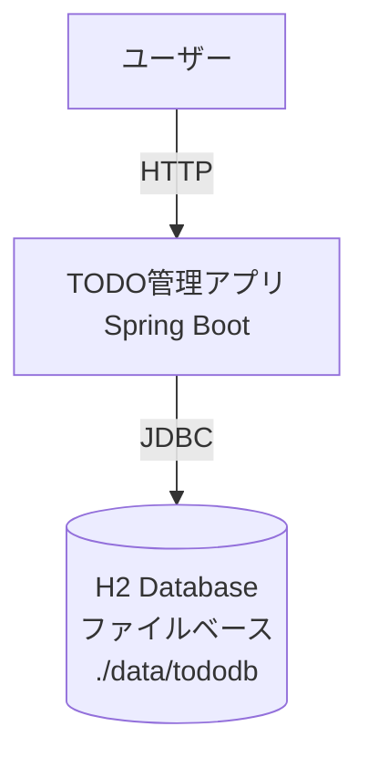

# arc42、C4 Model、ADR（Architecture Decision Records）

**対象**: AI駆動開発でアーキテクチャを文書化する開発者
**目的**: arc42フレームワークとC4 Modelを組み合わせたADR（アーキテクチャ決定記録）の作成手法を理解する
**関連**: knowledges/08-architecture-decision-records-adr.md（基本編）

---

## arc42とは

arc42は、ソフトウェアアーキテクチャドキュメント作成のためのテンプレート。
12セクション構成で、アーキテクチャの全体像を体系的に記録できる。

### arc42の12セクション

1. **Introduction and Goals** - イントロダクションと目標
2. **Constraints** - 制約条件
3. **Context and Scope** - コンテキストとスコープ
4. **Solution Strategy** - ソリューション戦略
5. **Building Block View** - ビルディングブロックビュー
6. **Runtime View** - ランタイムビュー
7. **Deployment View** - デプロイメントビュー
8. **Crosscutting Concepts** - 横断的関心事
9. **Architecture Decisions** - アーキテクチャ決定（ADR）
10. **Quality Requirements** - 品質要件
11. **Risks and Technical Debt** - リスクと技術的負債
12. **Glossary** - 用語集

**AI駆動開発での活用**: Section 9（Architecture Decisions）でADRを管理

---

## C4 Modelとは

C4 Modelは、ソフトウェアアーキテクチャを4つのレベルで図示する手法。
Context、Container、Component、Codeの4階層で、段階的にズームインしていく。

### C4 Modelの4レベル

1. **Context（コンテキスト図）**: システム全体と外部システム・ユーザーの関係
2. **Container（コンテナ図）**: システム内部のアプリケーション、データベース、サービスの構成
3. **Component（コンポーネント図）**: 各コンテナ内部のコンポーネント構造
4. **Code（コード図）**: クラス図、ERD等の詳細設計

**AI駆動開発での活用**: ADRにC4 Modelのコンテキスト図を含めて、技術的決定の影響範囲を視覚化

---

## ADR（Architecture Decision Records）とは

技術的決定を記録するドキュメント。「なぜこの技術を選んだのか」を後から理解できるようにする。
arc42のSection 9で管理し、C4 Modelで影響範囲を図示する。

### ADRの基本構造（arc42準拠）

- **Status**: Proposed（提案中）、Accepted（承認済み）、Deprecated（非推奨）、Superseded（置き換え済み）
- **Context**: この決定が必要になった背景・問題（arc42: Section 9）
- **Decision**: 採用する技術・方式
- **Consequences**: この決定の影響（Pros/Cons）
- **C4 Model Diagram**: コンテキスト図（影響範囲を視覚化）

---

## Claude Codeへの指示例

### ADR作成の指示

```
H2 Database（ファイルベース）を使う決定のADRを作って。
arc42のADRテンプレート（Section 9）とC4 Modelのコンテキスト図を含めて。
docs/adr/0001-use-h2-database-for-data-persistence.md に保存して。
```

### AIの生成例

```markdown
# ADR-0001: H2 Database（ファイルベース）をデータ永続化に採用

## Status
Accepted

## Context (arc42: Section 9 - Architecture Decisions)
TODO管理アプリケーションで、データをファイルに永続化する必要がある。
要件：
- 認証なし、単一ユーザー想定
- セットアップの簡易性を重視
- Spring Boot統合

PostgreSQL、MySQL等の外部DBサーバーは、セットアップコストが高く要件に不適。

## Decision
H2 Database（ファイルベース）を採用。

**技術詳細**:
- JDBC URL: `jdbc:h2:file:./data/tododb`
- Driver: `com.h2database:h2:2.2.224`
- Spring Bootの自動設定活用（`spring.datasource.*`）

## Consequences

**Pros**:
- セットアップ不要（JARファイル追加のみ）
- 軽量（数MB）
- Spring Boot統合が容易（自動設定）
- SQLダンプ、CSV出力機能あり

**Cons**:
- 同時アクセス制限（ファイルロック）
- 大規模データ非対応（100万レコード以上は性能劣化）
- 本番環境ではPostgreSQL等への移行が必要

## C4 Model - Context Diagram



## 関連決定
- ADR-0002: Spring Data JPAの採用（Repository層の実装方式）
```

---

## 7つの質問の詳細テンプレート

STEP 5（リファクタリング・ドキュメント化）でClaude Codeに投げる7つの質問の詳細版。

### ①技術的負債を見付けて

```
このプロジェクトの技術的負債を見付けて。特に以下を重点的に：
1. Cyclomatic Complexity 10以上のメソッド
2. 重複コード（3行以上の類似コード）
3. 使われていないメソッド・変数（dead code）
4. 例外処理が不足している箇所
5. JavaDocがないpublicメソッド

優先度をP0（即座に対応）、P1（今週中）、P2（来週以降）で分類して。
```

### ②冗長・重複・dead codeを削除して

```
冗長・重複・dead code を見付けて削除して。
特にバリデーションロジックの重複を抽出してメソッド化して。
テストは壊さないで。リファクタリング後にmvn testを実行して確認して。
```

### ③循環的複雑度を減らして

```
このプロジェクトで循環的複雑度が10以上のメソッドをリストアップして。
リストアップしたら、それぞれを10以下にリファクタリングして。
Extract MethodパターンとGuard Clauseパターンを使って。
テストは壊さないで。
```

### ④効果的にライブラリを活用できる箇所は

```
このプロジェクトで、効果的にライブラリを活用できる箇所を見付けて。
Apache Commons、Guava、Lombok等の活用箇所を提案して。
コードをライブラリを使った実装に置き換えて。
```

**AIの提案例**:
- 手書きの空文字チェック → `StringUtils.isBlank()` (Apache Commons Lang)
- コレクション操作 → `Lists.partition()` (Guava)
- getter/setter/constructor → `@Data`、`@Builder` (Lombok)
- 日付操作 → `LocalDate.plusDays()` (Java 8 Time API)
- NULL安全 → `Optional.ofNullable()` (Java 8)

### ⑤効果的にデザインパターンを活用できる箇所は

```
このプロジェクトで、効果的にデザインパターンを活用できる箇所を見付けて。
Strategy、Factory、Builder、Template Method等の適用箇所を提案して。
デザインパターンを適用したリファクタリング案を示して。
過剰な適用は避けて、本当に必要な箇所のみ提案して。
```

**AIの提案例**:
- 優先度による処理分岐（if-else連続） → **Strategy Pattern** で分岐をクラスに分離
- Todoエンティティの複雑な生成ロジック → **Builder Pattern** で可読性向上
- 複数の通知方法（Email、Slack、SMS） → **Factory Pattern** で生成ロジック分離
- 検証処理の共通ロジック → **Template Method Pattern** で共通処理抽出

### ⑥JavaDoc を書いて

```
[クラス名]クラスの全publicメソッドにJavaDocを書いて。
@param、@return、@throwsを含めて。
複雑なprivateメソッドにもJavaDocを追加して。
```

**生成例**:
```java
/**
 * TODOを作成し、デフォルト値を設定してH2 Databaseに保存する。
 *
 * @param title TODOのタイトル（必須、1-200文字）
 * @param description TODOの説明（任意、最大1000文字）
 * @param priority 優先度（null の場合、デフォルト: Priority.MEDIUM）
 * @param status ステータス（null の場合、デフォルト: Status.TODO）
 * @return 作成されたTodoエンティティ（id、created_at、updated_atが設定済み）
 * @throws IllegalArgumentException タイトルが空、またはタイトルが200文字超の場合
 */
public Todo create(String title, String description, Priority priority, Status status) {
    validateTitle(title);
    Todo todo = buildTodo(title, description, priority, status);
    return todoRepository.save(todo);
}
```

### ⑦arc42 と C4 Model を採用した ADR を書いて

```
[技術的決定の内容]のADRを作って。
arc42のADRテンプレート（Section 9）とC4 Modelのコンテキスト図（Mermaid）を含めて。
docs/adr/000X-[決定内容].md に保存して。

ADR構造：
- Status: Accepted
- Context (arc42: Section 9)
- Decision（技術詳細含む）
- Consequences（Pros/Cons）
- C4 Model - Context Diagram（Mermaid）
```

---

## まとめ

arc42、C4 Model、ADRを組み合わせることで、技術的決定を体系的に記録できる。
Claude Codeに指示すれば、これらを自動生成できる。
Living Documentation（コードが唯一の真実の情報源）として、コード変更と同時にADRも更新する。

---

## 参考資料

- arc42公式サイト: https://arc42.org/
- C4 Model公式サイト: https://c4model.com/
- knowledges/08-architecture-decision-records-adr.md（ADR基本編）
- knowledges/11-living-documentation.md（Living Documentation）
