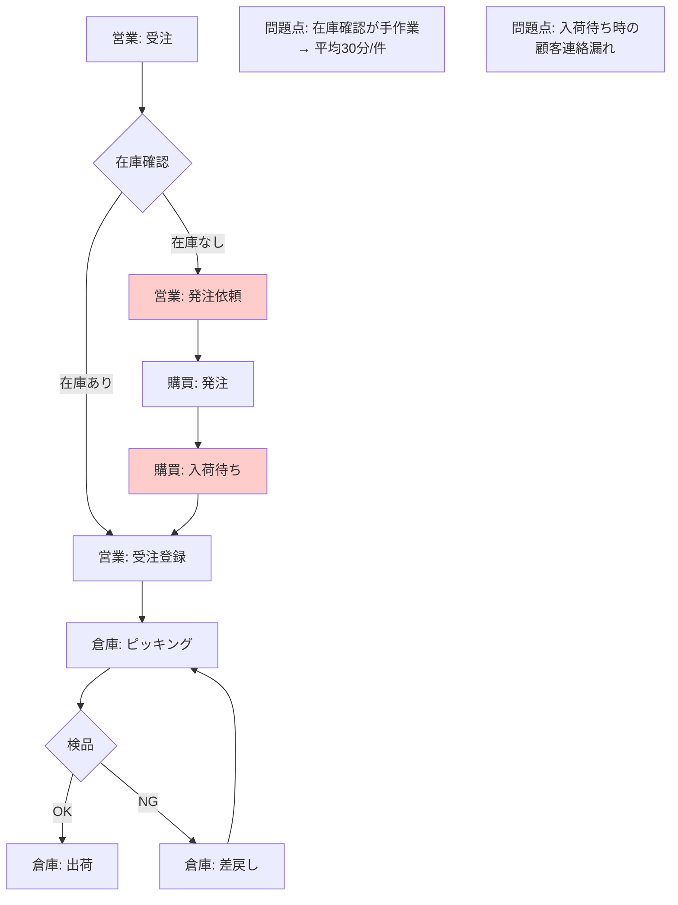
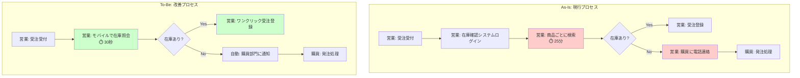

# ヒアリング文字起こしからのユーザーストーリー・業務フロー生成: AI活用ガイド

## 概要

ユーザーインタビューやヒアリング結果の文字起こしデータを活用し、AIを使ってユーザーストーリー、現行業務フロー（As-Is）、理想業務フロー（To-Be）を自動生成する手法についてまとめる。特に、Geminiの大容量トークン（2M）とClaudeの優れた日本語処理能力を活かした使い分け戦略を中心に解説。

## 目次

1. [なぜ文字起こしデータからAI生成するのか](#1-なぜ文字起こしデータからai生成するのか)
2. [AIツールの特性と使い分け](#2-aiツールの特性と使い分け)
3. [文字起こしからユーザーストーリー生成](#3-文字起こしからユーザーストーリー生成)
4. [As-Is/To-Be業務フロー自動生成](#4-as-isto-be業務フロー自動生成)
5. [実践ワークフロー](#5-実践ワークフロー)
6. [ツール別実装ガイド](#6-ツール別実装ガイド)
7. [ベストプラクティス](#7-ベストプラクティス)

---

## 1. なぜ文字起こしデータからAI生成するのか

### 1.1 従来の要件定義の課題

**時間コスト**
- ヒアリング後の議事録作成: 2-4時間/回
- ユーザーストーリー作成: 8-16時間
- 業務フロー図作成: 4-8時間
- 合計: **14-28時間/プロジェクト初期段階**

**品質の問題**
- ヒアリング時のメモ漏れによる情報欠落
- 個人の解釈によるバイアス
- ステークホルダー間の認識齟齬

### 1.2 AI活用による効果

**劇的な時間短縮**
```
従来: 40時間 → AI活用後: 4時間
効率化率: 90%削減
```
[出典: chatgptを使ってツールの要件定義をしたら工数が40時間→4時間になった]

**品質向上**
- AI分析ツールで合成プロセスが5倍高速化
- ChatGPTで合成プロセスを80%削減、主要テーマとパターンのハイライト版を生成
- 人間の見落としがちなパターンや関連性を発見

---

## 2. AIツールの特性と使い分け

### 2.1 Gemini 2M トークンの強み

**コンテキストウィンドウ**
```
Gemini 1.5 Pro: 最大2,000,000トークン（史上最長）
Gemini 1.5 Flash: 1,000,000トークン

換算例:
- 書籍約25冊分（ハリーポッター全巻の2倍）
- 音声: 最大19時間
- 動画: 約2時間
```

**適用シーン**
1. **複数回のヒアリング結果を一括分析**
   - 5-10回分のインタビュー文字起こしを同時投入
   - 全体を通した矛盾点や共通パターンを抽出

2. **既存ドキュメント+ヒアリングの統合分析**
   - 現行システムの仕様書（数百ページ）
   - ヒアリング文字起こし（複数回分）
   - 既存業務マニュアル
   → すべてを同時に読み込んで分析

3. **マルチモーダル分析**
   - ヒアリング動画（音声+画面録画）を直接投入
   - プレゼン資料+説明音声の統合分析

**実績データ**
- Gemini 2.5 Pro: 100万トークンで99.7%のリコール精度
- 53万トークンまでは100%リコール

**ケーススタディ: UX研究でのインタビュー分析**
Netizen Experienceの実践例:
- Google Meetの自動文字起こし（マレー語の "kampung" を "kong kong" と誤認識）
- Geminiは文脈から「村落・田舎」を正しく推論してサマリ作成
- 混合言語コミュニケーションにおける文脈理解能力を実証

### 2.2 Claudeの強み: 日本語ビジネス文書品質

**日本語処理能力の優位性**

ベンチマークデータ:
```
日本語能力試験（採用テスト）:
- Claude 3 Opus: 62%
- GPT-4: 55%
- Gemini 1.5 Pro: 52%

多言語精度:
- Claude 3: 日本語含む8言語以上で90%超（MGSM）
- ポルトガル語、日本語、イタリアなど副次言語: 92%
```

**翻訳品質の定性評価**
```
ビジネスコンテキストでの翻訳比較:
- Claude: 最も適切な表現を使用
- Claude: 自然な表現に優れる
- Gemini: やや硬直的な表現になる場合あり
```

**日本語ビジネス文書での活用実績**

要件定義書・仕様書作成:
- Claude Codeで要件定義書（requirements.md）自動生成
- プロジェクト目的、スコープ、機能要件、非機能要件を統合
- 対話履歴の分析から自動構築

ビジネス文書品質標準:
```markdown
出力設定:
- 言語: 日本語（ビジネス敬語、ポジティブトーン）
- 構造: Markdown
- 文書ルール:
  - 結論ファースト（要点→理由→詳細）
  - 箇条書き: 1行1メッセージ
  - 2-6行以内
```

**限界と補完**
- Claude 3の日本語学習データは欧州言語比で限定的
- ビジネス・旅行コンテキストでは効果的なコミュニケーションが可能
- 2024年5月時点で日本企業での利用に最適なLLM（ベンチマークテスト）

### 2.3 ツール使い分け戦略

| フェーズ | 推奨ツール | 理由 |
|---------|-----------|------|
| **大量データ一括分析** | Gemini 2M | 複数回ヒアリング+既存資料の統合分析 |
| **動画インタビュー分析** | Gemini 2M | 音声19時間、動画2時間までのマルチモーダル処理 |
| **日本語ユーザーストーリー作成** | Claude | 自然で適切なビジネス日本語表現 |
| **要件定義書・仕様書作成** | Claude | ビジネス文書品質、Markdown構造化 |
| **業務フロー図生成** | Claude/Gemini | Mermaid/BPMN生成（両者可能） |
| **長期セッション維持** | Gemini 2M | コンテキスト劣化なく長時間対話 |

---

## 3. 文字起こしからユーザーストーリー生成

### 3.1 ユーザーストーリーとは

**定義**
アジャイル開発における「理想的なユーザー体験」をユーザー視点で簡潔に表現したもの

**形式**
```
As a [ユーザータイプ]
I want [機能・行動]
So that [価値・目的]
```

**要件との違い**
- 要件ではなく、ユーザー視点の維持が目的
- 詳細は顧客とプログラマーの対話で決定（作成後）
- 要件定義フェーズの**前段階**で作成

### 3.2 AI生成のアプローチ

**ステップ1: 文字起こし前処理**

```python
# 文字起こしの構造化例
transcript_structure = {
    "header": {
        "date": "2025-01-15",
        "interviewer": "I",
        "respondent": "R",
        "duration": "45min"
    },
    "sections": [
        {
            "topic": "現行システムの課題",
            "timestamp": "00:00-15:00",
            "content": "..."
        },
        {
            "topic": "理想の業務フロー",
            "timestamp": "15:00-30:00",
            "content": "..."
        }
    ]
}
```

**ベストプラクティス: フォーマット標準化**
- フォント: Arial/Times New Roman 12pt
- 行間: 1.5または2.0
- 話者識別: I（インタビュアー）、R（回答者）
- ヘッダー: 日付、時刻、参加者情報

**ステップ2: AIプロンプト設計**

Gemini 2M での複数インタビュー統合分析:
```
以下は5回のユーザーインタビュー文字起こしです（合計8万トークン）。

[Interview 1: 営業部門 - 2025-01-10]
...

[Interview 5: 経理部門 - 2025-01-14]
...

タスク:
1. 全インタビューから共通する課題を抽出
2. 部門横断的なニーズを特定
3. 各ニーズをユーザーストーリー形式で出力
4. 優先度を3段階（高・中・低）で評価

出力形式:
## 共通課題
- [課題1]
  - 言及回数: X回
  - 関連部門: [A, B, C]

## ユーザーストーリー
### 高優先度
- As a ...

条件:
- 日本語ビジネス敬語で出力
- 各ストーリーに元インタビューの引用を付記
```

Claude での日本語品質重視:
```
以下はユーザーインタビューの文字起こしです。

[文字起こし内容]

このインタビューから、アジャイル開発で使用するユーザーストーリーを作成してください。

要件:
1. 形式: "As a [ユーザー] I want [機能] So that [価値]"
2. 言語: 自然で読みやすい日本語ビジネス文書
3. 各ストーリーに「受け入れ基準」を3-5項目付加
4. インタビューからの直接引用で根拠を明示

出力例:
## ユーザーストーリー #1
**ストーリー:**
営業担当者として、外出先からスマホで在庫を確認したい。
これにより、顧客との商談中にリアルタイムで納期回答できる。

**受け入れ基準:**
- [ ] スマホブラウザで在庫照会画面にアクセス可能
- [ ] 商品コード/名称で検索可能
- [ ] 在庫数と次回入荷予定日が表示される
- [ ] レスポンスタイム3秒以内

**根拠（インタビュー引用）:**
「お客さんの前で『会社に戻って確認します』って言うのが一番もどかしい」(R1, 12:34)
```

**ステップ3: テーマ抽出とパターン認識**

主要AIツールの機能:
- **感情・センチメント検出**: 自動で感情トーンをタグ付け、混合反応をハイライト
- **テーマ発見**: レスポンスを「価格懸念」「オンボーディング課題」などのテーマにグループ化
- **自動タグ付け**: 共通テーマを識別し、後のレビュー用にデータスニペットを自動タグ付け

### 3.3 専門ツールの活用

**統合プラットフォーム**

1. **Dovetail**
   - フルサイクル対応: 文字起こし→タグ付け→インサイト生成
   - クロススタディパターン認識
   - 自動レポート生成

2. **LoopPanel**
   - 話者識別付き自動文字起こし
   - センチメント分析、キーモーメント検出
   - 一般的インタビュータイプのテンプレート

3. **Outset**
   - ビデオ、オーディオ、ユーザビリティセッションの実施と合成
   - インタビューの深さ×サーベイの速度・規模

**コスト削減技術**

Gemini API のコンテキストキャッシング:
```
長大なコンテキスト利用時のコスト管理:
- Gemini 1.5 Pro/Flash でキャッシング機能
- 同じ文字起こしデータを複数クエリで再利用
- 入力コスト削減
```

---

## 4. As-Is/To-Be業務フロー自動生成

### 4.1 業務フロー図の重要性

**As-Is（現状）フロー**
- 現行業務の可視化
- ボトルネック・無駄の特定
- ステークホルダー間の認識統一

**To-Be（理想）フロー**
- 改善後の業務プロセス
- システム化範囲の明確化
- 開発スコープの合意形成

### 4.2 AI + Mermaid/BPMN による自動生成

**従来の課題**
```
業務コンサルティング工程:
1. 現状のヒアリング → 2-4時間
2. 問題点の洗い出し → 4-8時間
3. フロー図作成（手作業） → 8-16時間
4. 改善策の検討 → 4-8時間
5. 提案書作成 → 8-16時間
合計: 26-52時間
```

**AI活用による変革**
```
AI + Mermaid の組み合わせ:
1. 文字起こしから現状フロー抽出 → 15分
2. AIとの対話で改善案ブラッシュアップ → 30-60分
3. Mermaid形式で図自動生成 → 即時
4. 提案書統合 → 30分
合計: 約2時間（96%削減）
```

### 4.3 具体的な生成方法

**ツール: 業務フロー作成くん**
- 入力: 業務フロー情報（テキスト）
- 出力形式選択: BPMN / UML / Draw.io / Mermaid
- 自動生成機能

**JAPAN AI CHAT の実装**
- Mermaid記法 + 生成AI
- 自然言語入力からフローチャート生成
- 機能例:
  - 要件定義書 → フローチャート
  - 議事録 → ガントチャート
  - システム仕様 → シーケンス図

**プロンプト設計例（Mermaid生成）**

```
以下のヒアリング内容から、現行の業務フローをMermaid形式で生成してください。

[文字起こし内容: 受注から出荷までのプロセス説明]

要件:
1. Mermaid flowchart 形式
2. 条件分岐を明確に記載
3. 各ステップに担当部門を注記
4. 問題点を赤色で強調

出力後、以下の改善提案も生成:
- To-Beフロー（システム化による改善版）
- 削減可能時間の試算
- 導入効果の定量評価
```

**生成例（Mermaid）**



### 4.4 制限事項と対応策

**現状の課題**
1. **条件分岐の複雑さ**
   - 複雑な分岐は手直しが必要
   - プロンプトでの丁寧な記述が重要

2. **標準フォーマット対応**
   - BPMN 2.0などの厳密なテンプレート準拠は未対応
   - 生成後の手動調整が必要

3. **プロンプト品質依存**
   - 入力文書の正確性・簡潔性がポイント
   - あいまいな表現はAIが誤解釈

**ベストプラクティス**
```
効果的なプロンプト作成:
1. 各ステップを明確に番号付け
2. 条件分岐は「もし〜ならば」で明記
3. 担当者・部門を各ステップに記載
4. 時間・頻度などの定量情報を含める

悪い例:
「受注処理をする」

良い例:
「1. 営業担当者が顧客から受注（FAXまたはメール）
2. 在庫システムで在庫を確認（所要時間: 約30分）
   - もし在庫ありならば → ステップ3へ
   - もし在庫なしならば → 購買部門に発注依頼（メール）→ 入荷待ち（平均3-5日）
3. 営業担当者が受注管理システムに登録...」
```

---

## 5. 実践ワークフロー

### 5.1 5フェーズアプローチ

このワークフローは、以前のナレッジ「36-ai-tools-separation-strategy.md」の考え方を継承・拡張したもの。

```
Phase 1: データ収集・文字起こし
  ↓
Phase 2: 大規模分析（Gemini）
  ↓
Phase 3: 構造化・ストーリー生成（Claude）
  ↓
Phase 4: フロー図生成（Claude/Gemini）
  ↓
Phase 5: レビュー・精緻化
```

### 5.2 Phase 1: データ収集・文字起こし

**ツール選定**

文字起こし専門ツール（2025年）:
- **Otter.ai**: リアルタイム文字起こし、話者識別
- **Rev**: 人間による高精度文字起こし（有料）
- **Whisper (OpenAI)**: オープンソース、多言語対応
- **YY文字起こし**: 日本語特化、ChatGPT連携

**品質確保**
- 自動生成文字起こしの精度チェック（特に専門用語）
- 話者の一貫した識別（I: / R: など）
- タイムスタンプの付与

**構造化**
```markdown
# インタビュー記録

## メタデータ
- 日付: 2025-01-15
- インタビュアー: 山田太郎
- 回答者: 佐藤花子（営業部 課長）
- 時間: 45分
- 場所: オンライン（Zoom）

## セクション1: 現行業務の課題 (00:00-15:00)

I: 現在の受注プロセスで最も時間がかかる部分はどこですか？

R: やはり在庫確認ですね。システムが古くて、商品ごとに画面を切り替えないといけない。大口の注文だと30分以上かかることもあります。

...
```

### 5.3 Phase 2: 大規模分析（Gemini 2M）

**目的**
- 複数回のインタビューを統合分析
- 既存ドキュメント（仕様書、マニュアル）と突合
- 矛盾点・共通パターンの抽出

**実装例**

```python
import google.generativeai as genai

# Gemini 1.5 Pro with 2M context
model = genai.GenerativeModel('gemini-1.5-pro')

# 複数文字起こし + 既存資料の統合
context = f"""
## 既存システム仕様書（50,000トークン）
{existing_spec}

## ユーザーインタビュー（各10,000トークン × 5回 = 50,000トークン）
{interview_1}
{interview_2}
{interview_3}
{interview_4}
{interview_5}

## 現行業務マニュアル（30,000トークン）
{current_manual}

合計: 約130,000トークン
"""

prompt = """
上記の資料とインタビューから以下を分析してください:

1. **矛盾点の抽出**
   - 既存仕様書とユーザー証言の矛盾
   - インタビュー間の認識の相違

2. **共通課題の特定**
   - 全インタビューで言及された課題
   - 優先度順にランキング

3. **部門横断的なニーズ**
   - 複数部門に影響する要件
   - システム化の優先候補

4. **数値データの集約**
   - 現行処理時間の平均
   - エラー発生率
   - 利用頻度

出力形式: Markdown、日本語ビジネス文書
"""

response = model.generate_content(context + prompt)
print(response.text)
```

**期待される出力**
```markdown
# 統合分析レポート

## 1. 矛盾点
### 在庫管理システムの更新頻度
- **仕様書**: リアルタイム更新
- **ユーザー証言**:
  - 営業部（佐藤氏）: 「30分遅れることがある」
  - 倉庫（田中氏）: 「手動で更新ボタンを押さないと反映されない」
- **結論**: 仕様と実運用が乖離、要調査

## 2. 共通課題（優先度順）
1. **在庫確認の非効率性**（5/5インタビューで言及）
   - 平均処理時間: 25分/件（営業証言）
   - 年間影響: 約500時間/人

2. **モバイル対応の欠如**（4/5で言及）
   - 外出先からアクセス不可
   - 顧客対応の即応性低下

...
```

### 5.4 Phase 3: 構造化・ストーリー生成（Claude）

**Phase 2の出力を新しいClaudeセッションに投入**

重要: コンテキスト汚染防止のため、**新規セッション**で開始

```
[Claude Webで新規チャット開始]

以下はユーザーインタビューの統合分析レポートです。

[Geminiの出力を貼り付け]

このレポートから、アジャイル開発用のユーザーストーリーを作成してください。

要件:
1. 自然な日本語ビジネス文書
2. 優先度（高・中・低）の明記
3. 受け入れ基準（Acceptance Criteria）を各ストーリーに3-5個
4. 見積もり工数（ストーリーポイント: 1, 2, 3, 5, 8）
5. Epic（大機能）への分類

形式: Markdown、GitHub Issueにコピペ可能な形式
```

**Claude生成例**

```markdown
# ユーザーストーリー集

## Epic 1: 在庫管理の効率化

### Story 1.1 - リアルタイム在庫照会【高優先度】
**ストーリー:**
営業担当者として、商談中にリアルタイムで在庫を確認したい。
これにより、顧客への即座の納期回答が可能になる。

**受け入れ基準:**
- [ ] 営業システムから在庫照会APIを呼び出し可能
- [ ] レスポンスタイム3秒以内
- [ ] 商品コード・商品名での検索をサポート
- [ ] 在庫数、次回入荷予定日、引当状況を表示
- [ ] 複数倉庫の在庫を統合表示

**ストーリーポイント:** 5

**根拠:**
- 現行処理時間: 平均25分/件
- 年間影響: 500時間/人削減
- 5/5インタビューで最優先課題として言及

---

### Story 1.2 - モバイル在庫照会【高優先度】
**ストーリー:**
外回り営業として、スマートフォンから在庫を確認したい。
これにより、外出先での顧客対応力が向上する。

**受け入れ基準:**
- [ ] レスポンシブWebデザイン（スマホ最適化）
- [ ] タッチ操作に最適化されたUI
- [ ] オフライン時のキャッシュ表示
- [ ] 検索履歴の保存（最大20件）

**ストーリーポイント:** 3

...
```

### 5.5 Phase 4: フロー図生成（Claude/Gemini）

**同じClaudeセッションで継続**

```
先ほどのユーザーストーリーに基づき、以下を生成してください:

1. **As-Isフロー**: 現行の受注～出荷プロセス（Mermaid形式）
2. **To-Beフロー**: Story 1.1, 1.2実装後の改善プロセス（Mermaid形式）
3. **比較表**: 処理時間、工数、エラー率の改善予測

Mermaid記法で、視覚的に分かりやすく。
問題点は赤、改善点は緑で強調。
```

**生成されるMermaidコード**



**比較表**

| 指標 | As-Is | To-Be | 改善率 |
|------|-------|-------|--------|
| 在庫確認時間 | 25分/件 | 30秒/件 | **98%削減** |
| 外出先対応 | 不可 | 可能 | - |
| 年間工数（営業10名） | 5,000時間 | 100時間 | **98%削減** |
| 顧客待ち時間 | 平均2日 | 即時 | **即日対応** |

### 5.6 Phase 5: レビュー・精緻化

**人間によるレビューポイント**

1. **ビジネスロジックの妥当性**
   - AIが見落とした業務ルール・例外処理
   - 法規制・コンプライアンス要件

2. **優先度の調整**
   - 経営戦略との整合性
   - リソース制約の反映

3. **受け入れ基準の具体化**
   - 測定可能な基準への変換
   - テストシナリオとの連携

**反復改善**
```
Claudeセッションで追加質問:

「Story 1.1について、以下の点を考慮して受け入れ基準を追加してください:
- 在庫の引当中/引当済みステータスの区別
- 他営業との同時アクセス時の排他制御
- 権限による閲覧範囲の制限（担当顧客のみ等）」
```

---

## 6. ツール別実装ガイド

### 6.1 Gemini 2M トークン活用

**APIコード例（Python）**

```python
import google.generativeai as genai
import os

genai.configure(api_key=os.environ['GOOGLE_API_KEY'])

# モデル選択
model = genai.GenerativeModel(
    'gemini-1.5-pro',
    generation_config={
        'temperature': 0.2,  # 分析的タスクのため低め
        'top_p': 0.8,
        'top_k': 40,
        'max_output_tokens': 8192,
    }
)

# コンテキストキャッシングの活用（コスト削減）
cached_content = genai.caching.CachedContent.create(
    model='gemini-1.5-pro',
    system_instruction='あなたは要件定義の専門家です。ユーザーインタビューから構造化された要件を抽出します。',
    contents=[
        # 繰り返し使う大量コンテキスト
        {'role': 'user', 'parts': [{'text': interview_transcripts_combined}]}
    ],
    ttl=datetime.timedelta(minutes=60)  # 1時間キャッシュ
)

# キャッシュを使った複数クエリ
model_with_cache = genai.GenerativeModel.from_cached_content(cached_content)

# クエリ1: ユーザーストーリー抽出
response1 = model_with_cache.generate_content('ユーザーストーリーを生成')

# クエリ2: As-Isフロー抽出（同じコンテキスト、追加コストなし）
response2 = model_with_cache.generate_content('現行業務フローを抽出')
```

**コスト管理**

```
Gemini 1.5 Pro 料金（2025年1月時点）:
- 入力: $0.00125 / 1K tokens (128K以下)
- 入力: $0.0025 / 1K tokens (128K超)
- 出力: $0.005 / 1K tokens

例: 150,000トークンの文字起こしで10回クエリ
- キャッシングなし: 150K × 10 × $0.0025 = $3.75
- キャッシングあり: (150K × $0.0025) + (10回のクエリ) = $0.375 + α
→ 約90%削減
```

### 6.2 Claude 活用

**Claude Web（要件定義フェーズ）**

```
[Claude.ai で新規チャット]

# プロジェクト設定（Artifacts機能の活用）

あなたは要件定義の専門家です。
以下のインタビュー分析から、ユーザーストーリーと業務フローを作成してください。

[分析結果を貼り付け]

出力は以下の形式でArtifactsとして生成:
1. Markdown形式のユーザーストーリー集
2. Mermaid形式のAs-Isフロー図
3. Mermaid形式のTo-Beフロー図

各Artifactは独立したファイルとして生成し、後でダウンロード可能にしてください。
```

**Claude Code（詳細仕様化フェーズ）**

```bash
# プロジェクトルートにCLAUDE.mdを作成

# CLAUDE.md
## プロジェクト概要
在庫管理システムのモダナイゼーション

## 要件定義書
- 場所: /docs/requirements/user-stories.md
- 形式: GitHub Markdown
- ステータス: レビュー中

## 業務フロー
- As-Is: /docs/flows/as-is.mmd
- To-Be: /docs/flows/to-be.mmd

## コーディング規約
- 言語: TypeScript
- フレームワーク: Next.js 14
- 状態管理: Zustand
- API: tRPC

## 出力品質基準
- 日本語: ビジネス敬語、自然な表現
- コメント: JSDoc形式、日本語
- ドキュメント: Markdown、結論ファースト
```

```bash
# Claude Codeでの実行

$ claude

> /docs/requirements/user-stories.md の Story 1.1 について、
> 詳細な技術仕様書を生成してください。
>
> 含めるべき項目:
> - API仕様（エンドポイント、リクエスト/レスポンス）
> - データモデル（TypeScript型定義）
> - UI/UXワイヤーフレーム（Mermaid）
> - エラーハンドリング
> - パフォーマンス要件
> - セキュリティ考慮事項
```

**Claude Agent Skills（新機能）の活用**

```
# .claude/skills/requirements-spec/ フォルダ作成

## skill.md
このスキルは、ユーザーストーリーから詳細な技術仕様書を生成します。

### 手順
1. ユーザーストーリーの受け入れ基準を分析
2. 必要なAPI仕様を定義
3. データモデルを TypeScript で定義
4. UI/UX ワイヤーフレームを Mermaid で生成
5. 非機能要件（性能、セキュリティ）を明記

### テンプレート
[template.md を参照]

### 出力先
/docs/specifications/{story-id}-spec.md
```

Claude Codeで実行:
```bash
> Story 1.1 について requirements-spec スキルを適用
```

自動的に:
- テンプレートに従った仕様書生成
- API定義、型定義、ワイヤーフレーム作成
- 適切なファイル配置

---

## 7. ベストプラクティス

### 7.1 インタビュー実施時の準備

**録音・文字起こしの最適化**

1. **環境設定**
   - ノイズキャンセリングマイク使用
   - 静かな環境（エアコン・パソコンのファン音に注意）
   - 複数人の場合は話者ごとにマイク

2. **構造化インタビュー**
   ```
   セクション1: アイスブレイク（5分）
   セクション2: 現行業務の理解（15分）
     - 典型的な1日の業務フロー
     - 使用中のツール・システム
   セクション3: 課題の深掘り（15分）
     - 最も時間がかかる作業
     - ミスが発生しやすいポイント
     - 改善したい点
   セクション4: 理想の業務イメージ（10分）
     - あったらいい機能
     - 削減したい作業
   ```

3. **記録の工夫**
   - タイムスタンプ付きメモ（重要発言の時刻記録）
   - 画面共有の録画（現行システム操作の記録）
   - 感情・トーンのメモ（文字起こしでは失われる情報）

### 7.2 AI生成の品質管理

**人間の監督が重要な理由**

研究結果:
- AIは定型タスク（文字起こし、初期パターン識別）を処理
- **文脈理解、共感、戦略的解釈には人間が不可欠**
- エラーが発生する可能性あり
- プロジェクト全体のデータを投入して完全な洞察を期待するのは不可

**チェックリスト**

```markdown
## AI生成ユーザーストーリーのレビュー

### ビジネス妥当性
- [ ] 業務フローの理解が正確か
- [ ] 法規制・コンプライアンス要件を見落としていないか
- [ ] 現実的な実装スコープか

### 技術的妥当性
- [ ] 受け入れ基準が測定可能か
- [ ] 既存システムとの整合性
- [ ] セキュリティ・パフォーマンス要件

### ステークホルダー視点
- [ ] 実際のユーザーニーズを反映しているか
- [ ] 優先度が経営戦略と整合しているか
- [ ] 見積もり工数が現実的か

### 文書品質
- [ ] 用語が統一されているか
- [ ] 第三者が理解可能な記述か
- [ ] トレーサビリティ（元インタビューへの参照）
```

### 7.3 コンテキスト汚染の防止

**セッション分離戦略**

ナレッジ「35-ai-context-contamination-quality-degradation.md」の原則を適用:

```
Phase 1: Gemini 2M（大量データ分析）
  → 出力を保存・レビュー

[セッションクローズ]

Phase 2: Claude Web（新規セッション）
  → Phase 1の「精製された」出力のみ投入
  → ユーザーストーリー生成

[セッションクローズ]

Phase 3: Claude Code（新規セッション + CLAUDE.md）
  → Phase 2の成果物のみ投入
  → 詳細仕様化・実装
```

**誤った指示後の対応**

```
NGパターン:
[Claudeセッション中]
> ユーザーストーリーを生成して
[AIが生成]
> あ、間違えた。購買システムじゃなくて在庫システムね
[訂正するが、コンテキストは汚染済み]

OKパターン:
[Claudeセッション中]
> ユーザーストーリーを生成して
[AIが生成]
> /clear  # セッションリセット
[新規セッション]
> [最初から正しい指示で再実行]
```

### 7.4 コスト最適化

**トークン使用量の見積もり**

```python
# 簡易トークン計算（日本語）
def estimate_tokens_ja(text):
    # 日本語は約1.5-2文字 = 1トークン
    char_count = len(text)
    return int(char_count / 1.5)

# 例
interview_text = "..." # 20,000文字の文字起こし
tokens = estimate_tokens_ja(interview_text)
print(f"推定トークン数: {tokens}")  # 約13,333トークン
```

**コスト削減戦略**

1. **Geminiのコンテキストキャッシング**
   - 大量の文字起こしを1回キャッシュ
   - 複数クエリで再利用

2. **段階的分析**
   ```
   ステップ1: 要約生成（大量トークン→少量トークン）
   ステップ2: 要約を使った詳細分析
   → 後続クエリのトークン削減
   ```

3. **モデル使い分け**
   - 探索的分析: Gemini Flash（安価、高速）
   - 最終成果物: Claude/Gemini Pro（高品質）

**ROI計算例**

```
従来の要件定義:
- 工数: 40時間
- コスト: 40h × ¥5,000/h = ¥200,000

AI活用後:
- 工数: 4時間
- 人件費: 4h × ¥5,000/h = ¥20,000
- APIコスト: 約¥500
- 合計: ¥20,500

削減額: ¥179,500 (89.7%削減)
```

### 7.5 チーム導入のステップ

**段階的導入計画**

```
Week 1-2: パイロットプロジェクト
- 小規模機能の要件定義で試行
- 1-2回のインタビュー
- 成功事例の作成

Week 3-4: テンプレート整備
- プロンプトテンプレート集
- 品質チェックリスト
- サンプル成果物

Week 5-6: チームトレーニング
- ハンズオンワークショップ
- ツール使い分けガイド
- Q&Aセッション

Week 7-8: 本格導入
- 全プロジェクトへの適用
- 週次レビュー会
- 継続的改善
```

**成功指標（KPI）**

```markdown
## 定量指標
- 要件定義工数: 40h → 4h（目標: 80%削減）
- ユーザーストーリー数: 従来比150%（網羅性向上）
- 手戻り率: 30% → 10%（精度向上）

## 定性指標
- ステークホルダー満足度: アンケート評価
- 文書の可読性: レビュアー評価
- チームの学習曲線: 習熟度アンケート
```

---

## まとめ

### 重要ポイント

1. **ツールの使い分けが成功の鍵**
   - Gemini 2M: 大量データの統合分析
   - Claude: 日本語ビジネス文書の品質

2. **段階的ワークフロー**
   - データ収集 → 大規模分析 → 構造化 → フロー生成 → レビュー
   - セッション分離でコンテキスト品質維持

3. **人間の監督は必須**
   - AIは効率化ツール、最終判断は人間
   - ビジネスロジック、戦略的判断、共感は人間の領域

4. **ROIは劇的**
   - 工数90%削減の実績
   - 品質向上（網羅性、一貫性）
   - 早期のステークホルダー合意形成

### 次のステップ

1. 小規模プロジェクトでパイロット実施
2. プロンプトテンプレート集を構築
3. チームへの知識共有・トレーニング
4. 継続的な改善サイクルの確立

### 参考資料

- [36-ai-tools-separation-strategy.md](./36-ai-tools-separation-strategy.md) - AIツール分離戦略
- [35-ai-context-contamination-quality-degradation.md](./35-ai-context-contamination-quality-degradation.md) - コンテキスト汚染対策
- [33-ai-context-documentation-importance.md](./33-ai-context-documentation-importance.md) - コンテキスト設計の重要性

---

## 引用・参考文献

### AI Interview Analysis
- Looppanel: "AI Interview Analysis: The Ultimate Guide to Tools & Best Practices"
  https://www.looppanel.com/blog/ai-interview-analysis

- User Interviews: "How a UX Researcher Uses AI in Their Daily Workflow"
  https://www.userinterviews.com/blog/ai-powered-ux-research-workflow

- Insight7: "How to Analyze Interview Transcripts with AI Tools"
  https://insight7.io/how-to-analyze-interview-transcripts-with-ai-tools/

### Gemini 2M Token Context
- Google Developers Blog: "Gemini 1.5 Pro の 2M コンテキスト ウィンドウ、コード実行機能、Gemma 2 を本日より公開"
  https://developers.googleblog.com/ja/new-features-for-the-gemini-api-and-google-ai-studio/

- Google Cloud: "Long context | Generative AI on Vertex AI"
  https://cloud.google.com/vertex-ai/generative-ai/docs/long-context

- Netizen Experience: "AI In UX Research: What It's Like Using Gemini In A User Interview Study"
  https://www.netizenexperience.com/blog/ai-in-ux-research-guide/

### Claude Japanese Language Quality
- Medium (Nakano Kappei): "AI Language Models Ace Japanese Recruitment Test: Claude Outperforms GPT-4 and Google's Gemini"
  https://medium.com/@kappei/ai-language-models-ace-japanese-recruitment-test-claude-outperforms-gpt-4-and-googles-gemini-22218532f49c

- Kafkai: "Innovative AI's Performance of Claude 3: How Does It Handle Japanese?"
  https://kafkai.com/en/blog/claude3-vs-chatgpt-comparison-japanese-ai-adoption/

### Business Process Flow Generation
- AI時代のコンサルティング提案に活きる「Mermaid記法」活用法
  https://note.com/hiroshikinoshita/n/n8c533483dd84

- 生成AIで業務フローを作成してみた – 株式会社グランフェアズ
  https://www.granfairs.com/blog/entry-3973/

- JAPAN AIがMermaid記法を活用した視覚コンテンツ生成機能を実装
  https://xexeq.jp/blogs/media/topics21874

### Requirements Definition with AI
- chatgptを使ってツールの要件定義をしたら工数が40時間→4時間になった
  https://ripurun.com/media/requirement-specification/requirement-definition-with-chatgpt/

- Claude Codeによる要件定義ガイド：全手順とプロンプト活用術 - Taskhub
  https://taskhub.jp/useful/claude-code-requirements-definition/

- Kiroの仕様書駆動開発プロセスをClaude Codeで実践
  https://tech.enechange.co.jp/entry/2025/08/14/000000

### AI Process Automation
- ClickUp: "How to Create an AI Process Mapping Process"
  https://clickup.com/blog/ai-process-mapping/

- ShiftX: "Generate business processes with AI"
  https://shiftx.com/ai

- GBTEC: "AI in Business Process Management: Benefits & Use Cases"
  https://www.gbtec.com/resources/ai-in-business-process-management/

---

**文書バージョン:** 1.0
**作成日:** 2025-01-08
**最終更新:** 2025-01-08
