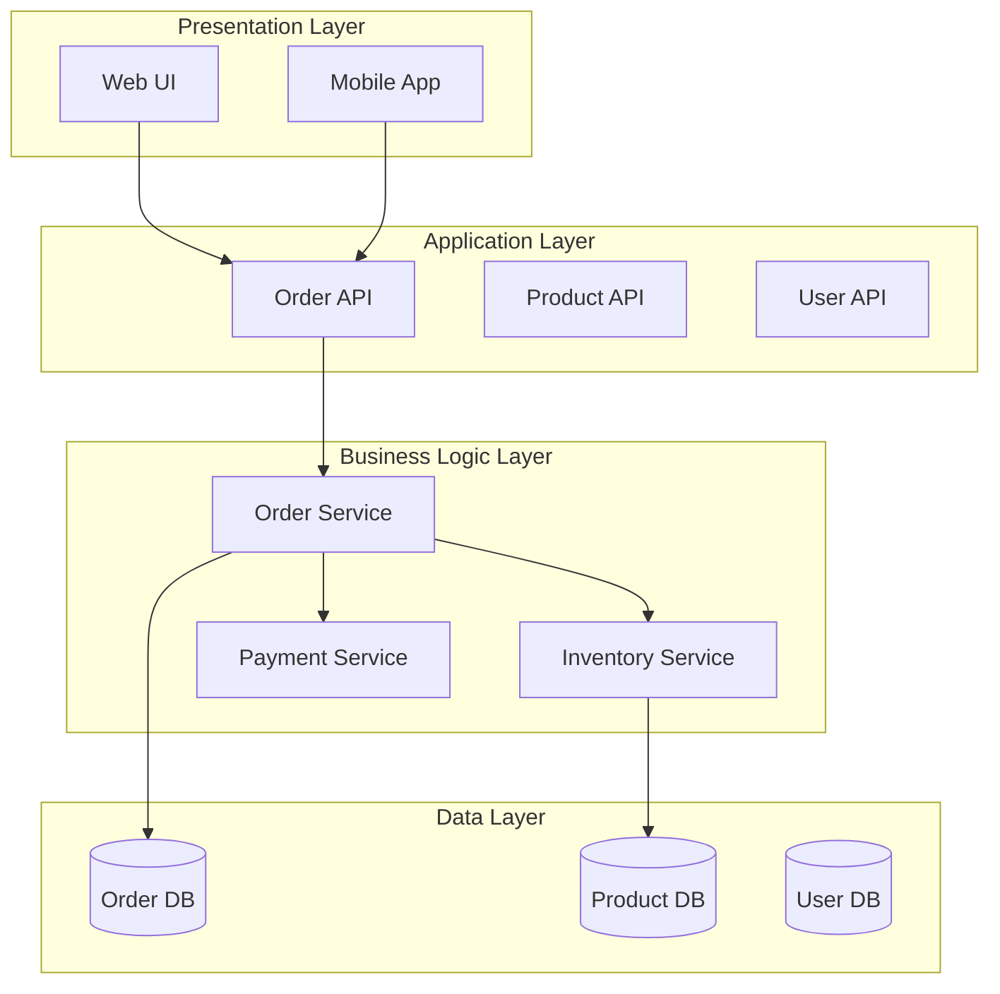
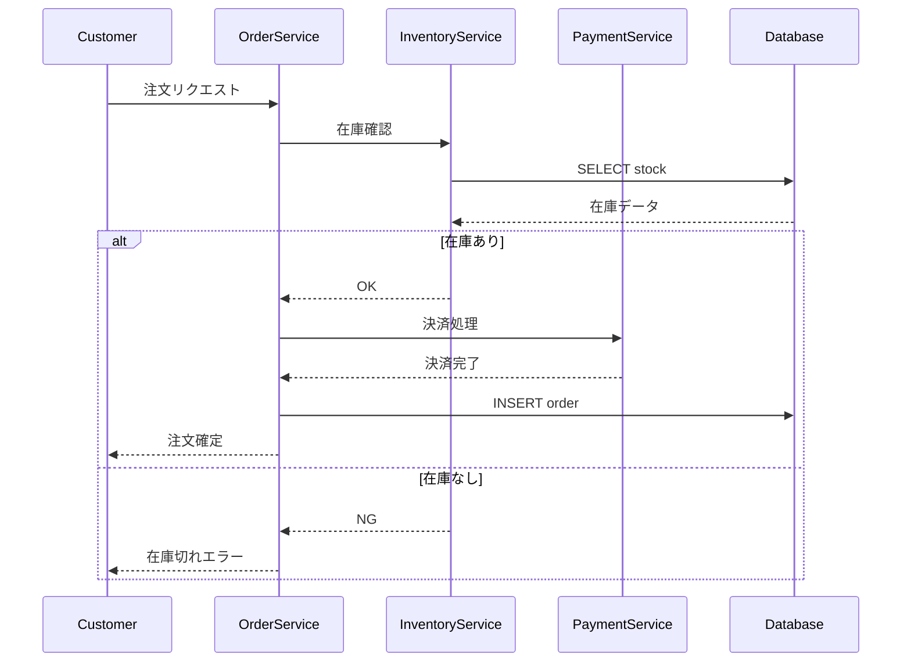
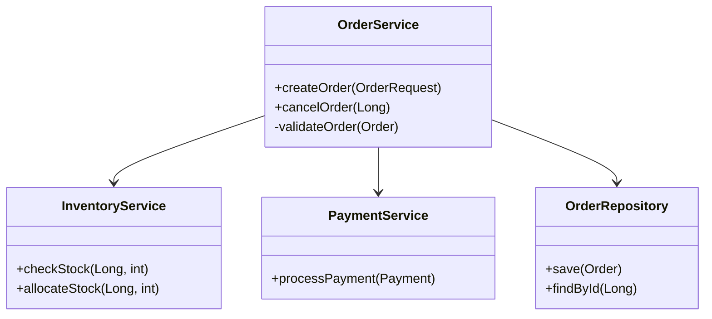
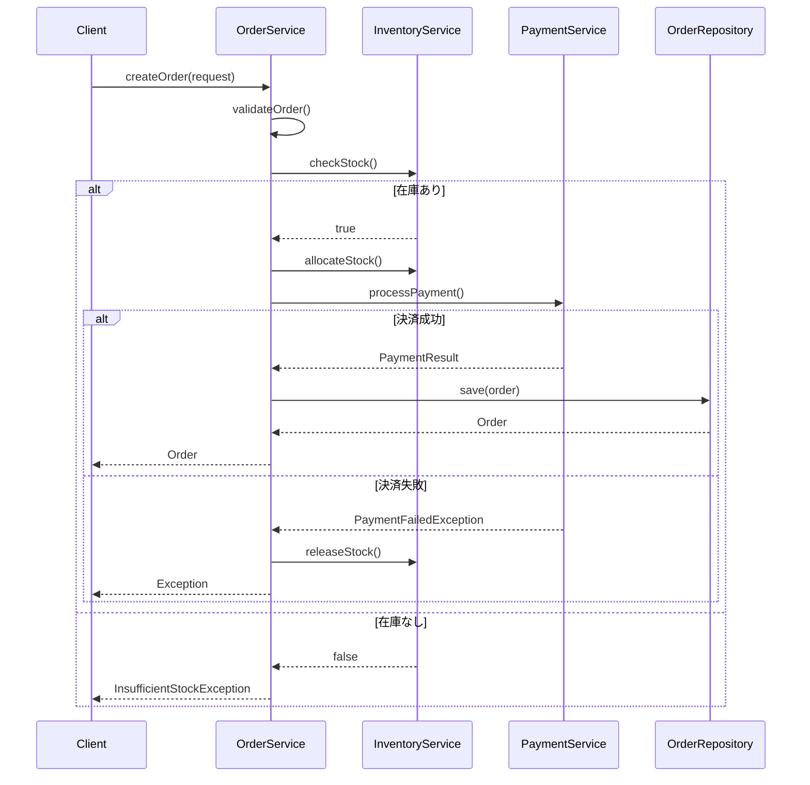

# AI駆動リバースエンジニアリング: 既存システムのドキュメント整備戦略

## 概要

既存システム（レガシーシステム）の保守運用・追加開発において、AIを活用したリバースエンジニアリングにより設計書や要件定義書を作成することが、AI駆動開発の効果を最大化する鍵となる。本ドキュメントでは、レガシーコードからドキュメントを自動生成する手法、ツール、ベストプラクティスを体系的に解説する。

## 目次

1. [なぜリバースエンジニアリングが必要か](#1-なぜリバースエンジニアリングが必要か)
2. [AIリバースエンジニアリングの技術](#2-aiリバースエンジニアリングの技術)
3. [主要ツールとサービス](#3-主要ツールとサービス)
4. [実装アプローチ](#4-実装アプローチ)
5. [効果測定と成功事例](#5-効果測定と成功事例)
6. [ベストプラクティス](#6-ベストプラクティス)
7. [課題と対策](#7-課題と対策)

---

## 1. なぜリバースエンジニアリングが必要か

### 1.1 レガシーシステムのドキュメント問題

**深刻な現状**

```
統計データ（2024-2025年）:
- 70%の企業が依然としてレガシープラットフォームで
  ミッションクリティカルなシステムを運用している
- しかし、正確なドキュメントを持つ企業は20%未満
- ドキュメントとコードの乖離が深刻化
```

**典型的な問題パターン**

1. **ドキュメント不在**
   - 開発当時の設計書が存在しない
   - あっても紙媒体で保管場所不明
   - 電子化されていても検索不可

2. **ドキュメント腐敗**
   - 何度も改修を重ねてコードと乖離
   - 更新されずに10年、20年が経過
   - 誰も信用していない「参考資料」化

3. **知識の属人化**
   - システムを理解しているのは1-2名のベテランのみ
   - その担当者も「コードを見ないとわからない」状態
   - 退職・異動でブラックボックス化

### 1.2 AI駆動開発における致命的な問題

**コンテキスト不足によるAIの誤動作**

以前のナレッジ「33-ai-context-documentation-importance.md」で解説したように、AIは**コンテキスト**が生命線。

```
ドキュメントなし → AIのコンテキスト不足
  ↓
AIの出力品質低下
  ↓
間違った実装・意図しない破壊的変更
  ↓
本番障害・データ破損
```

**具体例: ドキュメントなしでAI開発した場合**

```
シナリオ: 在庫管理システムに「予約在庫」機能を追加

【AIへの指示】
> 在庫数から予約数を差し引いて表示する機能を追加して

【AIの実装（ドキュメントなし）】
```python
def get_available_stock(product_id):
    stock = get_stock_count(product_id)
    reserved = get_reserved_count(product_id)
    return stock - reserved  # 単純に引き算
```

【問題】
- 実は「在庫数」は既に予約分を引いた値だった（仕様を知らない）
- 二重に引き算してしまい、在庫数がマイナス表示
- 受注可能数を誤認して受注→欠品発生

【正しい実装（ドキュメントあり）】
```python
def get_available_stock(product_id):
    # 設計書より: stock_count は物理在庫数
    # available_stock = stock_count - reserved_count - allocated_count
    # ※reserved: 予約済み、allocated: 出荷準備中
    stock = get_physical_stock_count(product_id)
    reserved = get_reserved_count(product_id)
    allocated = get_allocated_count(product_id)
    return stock - reserved - allocated
```
```

**ドキュメントの価値**

```markdown
## ドキュメントがない場合のAI開発リスク
- コードの意図を推測で判断 → 誤解釈
- ビジネスルールを理解できない → 要件違反
- 依存関係を把握できない → 意図しない副作用
- テストケースが不十分 → 潜在バグ

## ドキュメントがある場合のAI開発効果
- 正確なコンテキストでコード生成
- ビジネスロジックの継承
- 既存機能への影響分析
- 適切なテストケース生成
```

### 1.3 なぜ「リバース」エンジニアリングか

**従来の開発フロー**

```
要件定義 → 設計 → 実装 → テスト
（Forward Engineering）
```

**リバースエンジニアリング**

```
実装（既存コード） → 設計書復元 → 要件定義復元
（Reverse Engineering）
```

**レガシーシステムでリバースが必須な理由**

1. **「正」の情報はコードのみ**
   - 仕様書は信用できない（更新されていない）
   - 実際に動いているコードが唯一の真実

2. **AI開発の前提条件**
   - AI駆動開発には設計書・要件定義書が必須
   - コードだけでは不十分（ビジネス意図が不明）
   - リバースでドキュメント作成 → AI開発が可能に

3. **投資対効果**
   - 手動でのドキュメント作成: 数ヶ月～数年
   - AIリバースエンジニアリング: 数日～数週間
   - **50-70%の工数削減**（後述）

---

## 2. AIリバースエンジニアリングの技術

### 2.1 AIがコードを理解する仕組み

**従来のリバースエンジニアリング（人間）**

```
1. コードを読む（数千行～数万行）
2. 処理フローを追う
3. データ構造を理解する
4. ビジネスロジックを推測する
5. ドキュメントに記述する
   ↓
数週間～数ヶ月の時間
```

**AIによるリバースエンジニアリング**

```
1. コード全体をAIに入力
2. AIが構文解析・意味解析
3. パターン認識・類似コード検索
4. ドキュメント自動生成
   ↓
数時間～数日
```

### 2.2 使用される技術

**1. 自然言語処理（NLP）**

```
コメントや変数名のパターン分析
  ↓
機能の推測

例:
calculateTax() → 「税金計算機能」
validateCreditCard() → 「クレジットカード検証機能」
```

**2. グラフニューラルネットワーク（GNN）**

```
コールグラフ（関数呼び出し関係）をマッピング
  ↓
モジュール間の依存関係を可視化

例:
OrderService → InventoryService → DatabaseService
  ↓
「受注処理は在庫管理とデータベースに依存」
```

**3. Transformerモデル（Codex等）**

```
コードベース全体の文脈理解
  ↓
関連性のある処理をグループ化

例:
createOrder(), updateOrder(), cancelOrder()
  ↓
「注文管理機能」としてグループ化
```

### 2.3 RAGアプローチによる精度向上

**RAG（Retrieval-Augmented Generation）とは**

知識グラフを用いた情報検索 + AI生成のハイブリッドアプローチ

**従来のLLM単体の限界**

```
問題点:
- コードの構造情報を完全には理解できない
- レガシーコードは自己記述性が低い（変数名が不明瞭等）
- トークン制限で全コードを一度に処理できない
```

**RAG + 知識グラフの威力**

```
ステップ1: 知識グラフ構築
  - コードから構造情報を抽出
  - 関数呼び出し、データフロー、変更履歴をグラフ化
  - 外部依存、ビジネスドメイン知識を追加

ステップ2: 情報検索
  - 関連するコード片を知識グラフから検索
  - テキスト以上の構造情報を保持

ステップ3: AI生成
  - 検索された情報を元にLLMがドキュメント生成
  - 構造的な文脈を考慮した高精度な出力
```

**効果**

```
LLM単体: テキストベースの推測
  ↓
精度: 60-70%程度

RAG + 知識グラフ:
  ↓
精度: 80-90%超
（MIT研究: 83%の精度で未文書化関数の目的を特定）
```

### 2.4 生成されるドキュメントの種類

**レベル1: コードレベルドキュメント**

```python
# AI生成前
def calc(a, b, c):
    return (a * b) - c

# AI生成後（JSDoc形式）
/**
 * 売上金額を計算する
 *
 * @param {number} a - 単価
 * @param {number} b - 数量
 * @param {number} c - 割引額
 * @returns {number} 割引後の売上金額
 *
 * @example
 * calc(100, 5, 50) // => 450 (100円 × 5個 - 50円割引)
 */
function calculateSalesAmount(unitPrice, quantity, discount) {
    return (unitPrice * quantity) - discount;
}
```

**レベル2: モジュール/クラス設計書**

```markdown
## OrderService クラス

### 責務
顧客からの注文を受け付け、在庫確認、決済処理を経て
注文を確定するビジネスロジックを担当。

### 依存関係
- InventoryService: 在庫確認・引当
- PaymentService: 決済処理
- NotificationService: 顧客通知

### 主要メソッド
| メソッド名 | 説明 | 引数 | 戻り値 |
|-----------|------|------|--------|
| createOrder() | 新規注文作成 | OrderRequest | Order |
| cancelOrder() | 注文キャンセル | orderId | boolean |

### ビジネスルール
1. 在庫がない場合は受注不可
2. 決済失敗時は自動的にロールバック
3. 注文確定後、顧客に確認メールを送信
```

**レベル3: システム全体のアーキテクチャ図**



**レベル4: 業務フロー図（As-Is）**



**レベル5: 要件定義書**

```markdown
# 機能要件

## FR-001: 注文作成機能
顧客が商品を選択し、注文を作成できる機能

### 前提条件
- 顧客がログイン済み
- 商品が在庫管理システムに登録済み

### 入力
- 商品ID
- 数量
- 配送先住所
- 支払い方法

### 処理
1. 在庫の確認（在庫数 ≥ 注文数）
2. 在庫の引当（在庫数を減算）
3. 決済処理
4. 注文データの保存
5. 顧客への確認メール送信

### 出力
- 注文ID
- 注文確定日時
- 予定配送日

### 例外処理
- 在庫不足の場合: エラーメッセージ「在庫切れ」
- 決済失敗の場合: 在庫引当をロールバック

### 非機能要件
- レスポンスタイム: 3秒以内
- 可用性: 99.9%
- 同時注文処理: 100件/秒
```

---

## 3. 主要ツールとサービス

### 3.1 日本国内サービス

**1. SHIFT - AIドキュメントリバースサービス**

```
概要:
生成AIを活用した独自のリバースエンジニアリングツール

特徴:
- 20以上のプログラミング言語に対応
- COBOL、C、Java、VB等のレガシー言語に強い
- ブラックボックス化したソースコードの可視化
- マイグレーション支援との統合

実績:
- 大規模・高難度のレガシーシステムに対応
- 工数削減: 50-70%
- 工期短縮: 50%
- 保守コスト削減: 30%

対応言語（例）:
COBOL, C, C++, Java, VB, VB.NET, C#, JavaScript,
Python, Ruby, PHP, ラダー（PLC）等
```

**2. クリエーションライン - Modernizer AI**

```
概要:
レガシーシステムのモダナイゼーション向けAI駆動開発ツール

機能:
- 既存コードの自動解析
- リバースエンジニアリングによる設計ドキュメント生成
- コード変換（言語移行）
- テストコード自動生成

特徴:
- Claude、GPT等のLLMを活用
- 設計書からの実装コード生成（フォワード）
- 実装コードからの設計書生成（リバース）の両対応
```

**3. 日新システムズ - リバースエンジニアリングサービス**

```
対応言語:
C, C++, C#, VB, VC, Java, ラダー等

生成物:
- フローチャート
- データフロー図
- モジュール構成図
- インターフェース仕様書
```

### 3.2 海外ツール・プラットフォーム

**1. Swimm Auto-docs**

```
特徴:
- 決定論的解析（LLMの限界を補完）
- コードベース全体をスキャンして自動ドキュメント生成
- レガシー言語対応（COBOL, Java, C++等）

技術:
- AI生成ドキュメント
- 既存ドキュメントとの統合
- 継続的更新（コード変更時に自動再生成）

統合:
- GitHub, GitLab, Bitbucket
- CI/CDパイプライン
```

**2. EPAM ART (AI Reverse-engineering Tool)**

```
機能:
- GenAI技術を活用した高度なコード解析
- 理解と洞察の提供
- 複雑なレガシーシステムの解読

適用例:
- 30年以上前のコードベースの解析
- ドキュメント不在のシステム
```

**3. DocuWriter.ai**

```
特徴:
- 自動化プロセスとの統合
- Git pushイベントでのトリガー
- n8nワークフローとの連携

COBOL特化機能:
- メインフレームコードの理解支援
- 現代的なドキュメント形式での出力
```

**4. Workik**

```
機能:
- GitHub/GitLab/Bitbucketとの自動同期
- API自動ドキュメント生成
  - RESTful API
  - GraphQL API
  - WebSocket
- エンドポイント、パラメータ、レスポンス構造を自動記述

対応言語:
- Python, JavaScript, Go, Rust, Java, C++等
- 50以上の自然言語での出力
```

**5. Bito AI Documentation Generator**

```
CLI統合:
- Bito CLIによるコマンドライン操作
- エディタプラグイン（VS Code等）

多言語対応:
- プログラミング言語: Python, JS, Go, Rust等
- 出力言語: 50言語以上
```

**6. JetBrains AI Assistant**

```
IDE統合:
- IntelliJ IDEA, PyCharm, WebStorm等に組み込み
- LLM（Large Language Model）による宣言のドキュメント生成
- コンテキストを考慮した説明文生成
```

### 3.3 研究・オープンソースプロジェクト

**1. DocAider (Microsoft + UCL)**

```
目的:
オープンソースプロジェクト向けのAI駆動ドキュメント管理

機能:
- Pull Request時に自動ドキュメント生成・更新
- GitHub Actions統合
- 自動化されたドキュメントメンテナンス

現状:
研究段階だが、実用化に向けて進行中
```

**2. SimplAI Legacy Code Modernization Agent**

```
特化領域:
- アセンブリ命令の解析
- 構造化された疑似コードへの変換
- 低レベルコードのモダナイゼーション

適用:
組込みシステム、ファームウェア等
```

### 3.4 ツール選定マトリックス

| ツール/サービス | 対象規模 | 対応言語 | 強み | 価格帯 |
|---------------|---------|---------|------|--------|
| **SHIFT** | 大規模 | COBOL等レガシー中心 | マイグレーション統合 | エンタープライズ |
| **Modernizer AI** | 中～大規模 | モダン言語中心 | フォワード/リバース両対応 | 中～高 |
| **Swimm** | 小～中規模 | 多言語 | 継続的ドキュメント管理 | SaaS（月額） |
| **DocuWriter.ai** | 小～中規模 | 多言語 | 自動化ワークフロー | SaaS（月額） |
| **Workik** | 小～中規模 | モダン言語 | API特化 | SaaS（月額） |
| **Bito** | 個人～小規模 | 多言語 | CLI/エディタ統合 | 無料～低価格 |
| **JetBrains AI** | 個人～小規模 | IDE対応言語 | IDE統合 | IDE有料版 |

---

## 4. 実装アプローチ

### 4.1 段階的アプローチ（推奨）

**Phase 0: 準備・評価（1-2週間）**

```markdown
## タスク
1. 現状調査
   - [ ] コードベースの規模測定（行数、ファイル数）
   - [ ] 使用言語・フレームワークの特定
   - [ ] 既存ドキュメントの棚卸し

2. ツール選定
   - [ ] 候補ツールのトライアル
   - [ ] コスト試算
   - [ ] セキュリティ要件の確認

3. パイロット範囲の決定
   - [ ] 最も重要な1モジュールを選定
   - [ ] リスクの低い周辺機能から開始
```

**Phase 1: パイロット実施（2-4週間）**

```markdown
## 対象
最も重要かつ理解が困難な1モジュール（例: 決済処理）

## 実施内容
1. コード投入
   - モジュール全体をAIツールに入力
   - 依存する他モジュールも部分的に投入

2. ドキュメント生成
   - クラス図
   - シーケンス図
   - 関数仕様書

3. 人間レビュー
   - ベテランエンジニアが内容検証
   - 誤りの修正
   - 不足情報の補完

4. 効果測定
   - 生成時間
   - 精度（正解率）
   - 工数削減率
```

**Phase 2: スコープ拡大（1-2ヶ月）**

```markdown
## 対象
システムの主要機能全体（5-10モジュール）

## 実施内容
1. バッチ処理
   - 複数モジュールを並列処理
   - 夜間実行等でリソース最適化

2. テンプレート整備
   - 生成ドキュメントのフォーマット統一
   - レビューチェックリスト作成

3. 知識グラフ構築
   - モジュール間依存関係のマッピング
   - ビジネスドメイン知識の追加

4. 継続的更新プロセス
   - コード変更時のドキュメント再生成
   - CI/CDパイプライン統合
```

**Phase 3: 全体展開（2-3ヶ月）**

```markdown
## 対象
システム全体

## 実施内容
1. 完全ドキュメントセット生成
   - 要件定義書
   - 基本設計書
   - 詳細設計書
   - テスト仕様書

2. 統合
   - ドキュメント管理システムへの格納
   - 検索可能な形式での公開

3. トレーニング
   - 開発チームへのドキュメント活用研修
   - AI駆動開発への移行準備
```

### 4.2 具体的な実装例

**ステップ1: コードの準備**

```bash
# プロジェクト構造
legacy-system/
├── src/
│   ├── order/
│   │   ├── OrderService.java
│   │   ├── OrderRepository.java
│   │   └── OrderController.java
│   ├── inventory/
│   └── payment/
├── docs/  # ここに生成ドキュメントを配置
└── scripts/
    └── generate_docs.py  # 自動化スクリプト
```

**ステップ2: AI生成スクリプト（Claude Code使用例）**

```python
# scripts/generate_docs.py
import os
from pathlib import Path

def generate_documentation(source_dir, output_dir):
    """
    ソースコードから設計ドキュメントを生成
    """
    # 1. ソースファイルの収集
    java_files = list(Path(source_dir).rglob("*.java"))

    # 2. Claude Codeへのプロンプト準備
    prompt = f"""
以下のJavaコードから、詳細設計書を生成してください。

## 出力形式
- Markdown形式
- 以下のセクションを含む:
  1. クラス概要
  2. 責務
  3. 依存関係（Mermaid図）
  4. メソッド仕様（表形式）
  5. ビジネスルール
  6. シーケンス図（主要処理）

## コード
```java
{source_code}
```

## 注意事項
- 変数名・メソッド名から機能を推測
- コメントがある場合は尊重
- 不明な点は「要確認」と明記
"""

    # 3. 各ファイルに対してドキュメント生成
    for java_file in java_files:
        with open(java_file, 'r', encoding='utf-8') as f:
            source_code = f.read()

        # Claude Code APIを呼び出し（実際のAPI実装は省略）
        documentation = call_claude_code_api(
            prompt.format(source_code=source_code)
        )

        # 4. ドキュメント保存
        output_file = output_dir / java_file.stem / "_design.md"
        output_file.parent.mkdir(parents=True, exist_ok=True)

        with open(output_file, 'w', encoding='utf-8') as f:
            f.write(documentation)

        print(f"Generated: {output_file}")

if __name__ == "__main__":
    generate_documentation("../src", "../docs/design")
```

**ステップ3: 生成されたドキュメントの例**

```markdown
# OrderService クラス設計書

## 1. クラス概要
注文処理のビジネスロジックを担当するサービスクラス。
顧客からの注文受付、在庫確認、決済処理を統括する。

## 2. 責務
- 注文の作成・更新・キャンセル
- 在庫サービスとの連携（在庫確認・引当）
- 決済サービスとの連携
- 注文データの永続化

## 3. 依存関係



## 4. メソッド仕様

| メソッド名 | 引数 | 戻り値 | 説明 | 例外 |
|-----------|------|--------|------|------|
| createOrder | OrderRequest | Order | 新規注文を作成 | InsufficientStockException, PaymentFailedException |
| cancelOrder | Long orderId | boolean | 注文をキャンセル | OrderNotFoundException |
| validateOrder | Order | boolean | 注文内容の検証（private） | - |

## 5. ビジネスルール

### BR-001: 在庫確認
注文作成時、必ず在庫数を確認し、在庫が不足している場合は注文を受け付けない。

**実装箇所**: `createOrder()` 内
```java
if (!inventoryService.checkStock(productId, quantity)) {
    throw new InsufficientStockException("在庫不足");
}
```

### BR-002: トランザクション整合性
決済処理が失敗した場合、引き当てた在庫を自動的にロールバックする。

**実装箇所**: `createOrder()` 内のtry-catchブロック
```java
try {
    paymentService.processPayment(payment);
} catch (PaymentFailedException e) {
    inventoryService.releaseStock(productId, quantity);  // ロールバック
    throw e;
}
```

## 6. 主要処理フロー

### 6.1 注文作成処理



## 7. 要確認事項

以下の点については、ビジネス部門への確認が必要:

1. **キャンセル期限**: 注文後何時間以内ならキャンセル可能か？
   - コード上は制限なし、仕様書に記載なし

2. **在庫引当のタイミング**: 注文作成時？決済完了時？
   - 現状は注文作成時だが、仕様書との整合性要確認

3. **同時注文時の排他制御**: 同じ商品に複数注文が同時に来た場合の処理
   - コード上は楽観的ロック、正式な仕様要確認
```

**ステップ4: レビューと補完**

```markdown
## レビューチェックリスト

### 技術的正確性
- [ ] クラス図の依存関係が正しいか
- [ ] メソッドのシグネチャが正確か
- [ ] 例外処理の記述が漏れていないか

### ビジネスロジック
- [ ] ビジネスルールが全て抽出されているか
- [ ] 暗黙的な前提条件が明記されているか
- [ ] 例外的なケースが網羅されているか

### 網羅性
- [ ] 主要な処理フローが全て図示されているか
- [ ] データの流れが明確か
- [ ] 外部システムとの連携が記載されているか

### 不明点の明確化
- [ ] 「要確認」事項がリストアップされているか
- [ ] 推測で書かれた部分が明示されているか
```

### 4.3 CI/CD統合による継続的ドキュメント更新

```yaml
# .github/workflows/auto-document.yml
name: Auto Documentation

on:
  push:
    branches:
      - main
      - develop
    paths:
      - 'src/**'

jobs:
  generate-docs:
    runs-on: ubuntu-latest
    steps:
      - uses: actions/checkout@v2

      - name: Setup Python
        uses: actions/setup-python@v2
        with:
          python-version: '3.9'

      - name: Install dependencies
        run: |
          pip install -r requirements.txt

      - name: Generate Documentation
        env:
          CLAUDE_API_KEY: ${{ secrets.CLAUDE_API_KEY }}
        run: |
          python scripts/generate_docs.py

      - name: Commit Documentation
        run: |
          git config --local user.email "action@github.com"
          git config --local user.name "GitHub Action"
          git add docs/
          git commit -m "Auto-update documentation" || echo "No changes"
          git push

      - name: Notify Slack
        if: success()
        uses: 8398a7/action-slack@v3
        with:
          status: ${{ job.status }}
          text: 'Documentation updated successfully'
          webhook_url: ${{ secrets.SLACK_WEBHOOK }}
```

---

## 5. 効果測定と成功事例

### 5.1 定量的効果

**Gartner予測（2024-2026）**

```
2023年: 10%未満の企業がAIリバースエンジニアリングを採用
  ↓
2026年: 40%の企業が採用
  ↓
4倍の成長予測
```

**McKinsey調査結果**

```
自動コード解析を採用した企業:
- 復旧時間（MTTR）: 30%短縮
- ドキュメントメンテナンスコスト: 40%削減
- 新規エンジニアのオンボーディング時間: 50%短縮
```

**MIT研究（2023年）**

```
テスト対象: レガシーC言語コード（未文書化関数）

結果:
- AI精度: 83%（関数の目的を正しく特定）
- ジュニア開発者: 49%
  ↓
AIはジュニア開発者を67%上回る精度
```

### 5.2 日本企業の実績

**SHIFT - AIドキュメントリバースサービス導入企業**

```
大規模金融システム（COBOL）のケース:
- コード規模: 300万行
- 従来の手動ドキュメント化想定: 18ヶ月
- AI活用後: 6ヶ月（**工期67%短縮**）
- 精度: 人間レビュー後95%以上
- 保守コスト: 年間30%削減

製造業の基幹システム（Java）のケース:
- モジュール数: 150個
- AI生成ドキュメント: 2週間
- 人間補完: 2週間
- 合計: 1ヶ月（**従来の1/8の期間**）
```

**クリエーションライン - Modernizer AI**

```
流通業のケース:
- 既存システム: VB6 → モダン化対象
- リバースエンジニアリング: 3週間
- 設計書生成: 80%自動化
- 残り20%: 人間が補完
- 移行工数全体: 50-70%削減
```

### 5.3 定性的効果

**1. 知識の民主化**

```
Before:
「あの機能はベテランの田中さんしか分からない」
  ↓
After:
「ドキュメントを見れば誰でも理解できる」

効果:
- 属人性の解消
- チーム全体の生産性向上
- ベテランの負荷軽減
```

**2. リスク低減**

```
Before:
「ここ触ると何が壊れるか分からない」
  ↓
After:
「依存関係が可視化されているので影響範囲が分かる」

効果:
- 変更時の事故率低下
- テストスコープの明確化
- 品質向上
```

**3. AI駆動開発の加速**

```
Before:
AI「このコードの意図が分からず、適切な修正ができません」
  ↓
After:
AI「設計書を参照して、ビジネスロジックを理解しました。
   適切な修正案を3つ提示します」

効果:
- AI生成コードの品質向上
- 開発速度の大幅向上
- バグ率の低下
```

### 5.4 ROI計算例

**前提条件**

```
プロジェクト: 中規模レガシーシステムのドキュメント整備
コード規模: 50万行（Java）
モジュール数: 80個
```

**従来の手動ドキュメント化**

```
工数:
- 1モジュールあたり: 5日（40時間）
- 80モジュール: 400日（3,200時間）

コスト（エンジニア単価 ¥5,000/時間）:
- 3,200時間 × ¥5,000 = ¥16,000,000

期間:
- 2名体制で約10ヶ月
```

**AI活用ドキュメント化**

```
工数:
- AI生成: 80モジュール × 1時間 = 80時間（自動実行）
- 人間レビュー: 80モジュール × 4時間 = 320時間
- 補完・修正: 80モジュール × 2時間 = 160時間
- 合計: 560時間

コスト:
- 人件費: 560時間 × ¥5,000 = ¥2,800,000
- ツール費用（年間）: ¥500,000
- 合計: ¥3,300,000

期間:
- 2名体制で約1.5ヶ月
```

**ROI**

```
削減額: ¥16,000,000 - ¥3,300,000 = ¥12,700,000
削減率: 79.4%
期間短縮: 10ヶ月 → 1.5ヶ月（85%短縮）

投資回収期間:
ツール費用 ¥500,000 ÷ (¥12,700,000 / 年)
= 約2週間（最初のプロジェクトで即回収）
```

---

## 6. ベストプラクティス

### 6.1 準備段階

**1. スコープの明確化**

```markdown
## やるべきこと
- システムの境界を明確にする
- 外部システムとの連携ポイントをリストアップ
- 廃止予定のモジュールは除外

## やらないこと
- 全コードを一度にドキュメント化（段階的に実施）
- 既に正確なドキュメントがある部分の再生成
- テストコードの詳細ドキュメント化（優先度低）
```

**2. 現行ドキュメントの活用**

```
AIへの入力:
- コード
- 既存ドキュメント（古くても参考になる）
- 仕様変更履歴
- バグ修正履歴（Gitログ等）
  ↓
これらを組み合わせると精度向上
```

**3. ビジネスドメイン知識の準備**

```markdown
## ドメイン用語集を作成
例: ECサイトの場合

| 用語 | 意味 | コード上の表現 |
|------|------|--------------|
| 引当 | 在庫を予約済みにすること | allocateStock() |
| 与信 | クレジットカードの限度額確認 | checkCreditLimit() |
| 締め処理 | 1日の売上確定処理 | dailyClosing() |

これをAIに与えると、用語の理解精度が向上
```

### 6.2 生成段階

**1. プロンプトエンジニアリング**

```
【悪いプロンプト】
> このコードのドキュメントを作成して

【良いプロンプト】
> 以下のJavaコードから、新規参加エンジニア向けの
> 詳細設計書を作成してください。
>
> ## 出力形式
> - Markdown形式
> - Mermaid図を活用
>
> ## 必須セクション
> 1. クラス概要（2-3行）
> 2. 責務（箇条書き）
> 3. 依存関係図（Mermaid classDiagram）
> 4. メソッド仕様（表形式）
> 5. ビジネスルール（コード引用付き）
> 6. 主要処理フロー（Mermaid sequenceDiagram）
>
> ## ドメイン知識
> - このシステムはECサイトの注文管理
> - 「引当」= 在庫の予約
> - 「与信」= クレジットカード限度額確認
>
> ## コード
> ```java
> [コードを挿入]
> ```
```

**2. イテレーティブな改善**

```
1回目生成:
  ↓
人間レビュー
  ↓
不足情報を追加プロンプトで補完
  ↓
2回目生成（精度向上）
  ↓
最終レビュー
```

**3. 複数AIの併用**

```
戦略:
1. Claude: 日本語ビジネス文書として自然な記述
2. GPT-4: 技術的な深い分析
3. Gemini 2M: 大規模コードベース全体の関連性分析

使い分け:
- 要件定義レベル: Claude（自然な日本語）
- 技術仕様レベル: GPT-4（正確性）
- アーキテクチャ全体: Gemini 2M（大量コンテキスト）
```

### 6.3 レビュー段階

**1. 多層レビュー体制**

```
レベル1: 技術的正確性（開発者）
  - コードと記述の一致確認
  - メソッドシグネチャの正確性
  - データフローの正確性

レベル2: ビジネスロジック（ドメインエキスパート）
  - ビジネスルールの妥当性
  - 例外処理の網羅性
  - 暗黙的な前提条件の明示

レベル3: 可読性（新人エンジニア）
  - 理解しやすさ
  - 不明点のリストアップ
  - 補足説明の必要箇所の指摘
```

**2. 差分レビュー**

```
初回生成:
- 全体を詳細にレビュー

更新時（コード変更後の再生成）:
- 変更部分のみレビュー
- 差分ツールで効率化

例:
$ diff docs/design/OrderService_v1.md docs/design/OrderService_v2.md
```

### 6.4 運用段階

**1. Living Documentation化**

```yaml
自動更新トリガー:
- コードのコミット時
- Pull Request作成時
- 週次バッチ実行

更新範囲:
- 変更されたファイルに関連するドキュメントのみ
- 依存関係が変わった場合は影響範囲も更新
```

**2. ドキュメントの階層管理**

```
L1: 要件定義レベル（最も安定）
  - 年1-2回の更新
  - 人間が主導、AIが支援

L2: 基本設計レベル（準安定）
  - 四半期ごと、または大規模変更時
  - AI生成 + 人間レビュー

L3: 詳細設計レベル（頻繁に変更）
  - コードコミット時に自動更新
  - AI自動生成、定期的な人間レビュー
```

**3. 検索可能性の確保**

```markdown
## ドキュメント管理システムの要件
- [ ] 全文検索機能
- [ ] クロスリファレンス（相互参照）
- [ ] バージョン管理
- [ ] タグ付け（モジュール、機能、担当者等）

## 推奨ツール
- Confluence
- Notion
- GitBook
- Docusaurus
```

---

## 7. 課題と対策

### 7.1 精度の問題

**課題: 100%の精度は期待できない**

```
AIの限界:
- 暗黙的な前提条件を理解できない
- ビジネス用語の誤解釈
- 複雑なロジックの誤読
```

**対策**

```markdown
## 1. 人間レビューの義務化
- AIは「80%のたたき台」を作成
- 残り20%は人間が補完・修正
- 重要部分はダブルチェック

## 2. 信頼度スコアの表示
一部のツールは生成内容に信頼度を付与:
- 高信頼: 変数名・コメントが明確な部分
- 中信頼: 推測が含まれる部分
- 低信頼: 複雑で解釈が難しい部分

低信頼部分は優先的に人間がレビュー

## 3. 段階的詳細化
1st pass: 全体の大まかな構造
2nd pass: 各モジュールの詳細
3rd pass: ビジネスロジックの深掘り
  ↓
各段階で人間がチェック
```

### 7.2 セキュリティ・コンプライアンス

**課題: ソースコードの外部送信リスク**

```
懸念:
- クラウドAIサービスにコードを送信
- 機密情報・個人情報の漏洩リスク
- ライセンス違反の可能性
```

**対策**

```markdown
## 1. オンプレミス/プライベートクラウド
- AWS Bedrock（VPC内で実行）
- Azure OpenAI Service（専用環境）
- 自社専用LLMの構築

## 2. データのマスキング
コード送信前に:
- 個人情報を仮名化
- APIキー、パスワードを削除
- 社内固有の機密用語を置換

例:
```python
# Before
DB_PASSWORD = "MySecretPass123"
CUSTOMER_NAME = "山田太郎"

# After（マスキング）
DB_PASSWORD = "****MASKED****"
CUSTOMER_NAME = "顧客A"
```

## 3. 契約確認
- AIサービスとのデータ利用契約を精査
- 学習データに使用されないことを確認
- GDPR, 個人情報保護法への準拠
```

### 7.3 コストの問題

**課題: 大規模システムではコストが高額**

```
例: 100万行のコードベース
- APIトークン数: 約200万トークン
- GPT-4コスト: $20-40（1回あたり）
- 何度も再生成: $数百～数千/月
```

**対策**

```markdown
## 1. 段階的実施
- 全体を一度に処理しない
- 重要度の高いモジュールから着手
- 月次予算を設定

## 2. モデルの使い分け
- 単純なコメント生成: GPT-3.5（安価）
- 複雑な設計書: GPT-4/Claude（高精度）
- 全体構造分析: Gemini 2M（大規模対応）

## 3. キャッシング活用
- 同じコードの再解析を避ける
- 変更部分のみ再生成
- Gemini APIのコンテキストキャッシング機能

## 4. オープンソースモデル
- Llama 2（商用利用可）
- Code Llama
- 自社サーバーで運用（API課金なし）
```

### 7.4 「ドキュメント腐敗」の再発防止

**課題: せっかく作ったドキュメントがまた古くなる**

```
従来の問題:
コード更新 → ドキュメント更新忘れ → 乖離
  ↓
数年後、また使えないドキュメントに
```

**対策**

```markdown
## 1. CI/CD統合による自動更新
```yaml
on:
  push:
    paths:
      - 'src/**'  # コード変更時
trigger:
  - generate_docs.py  # ドキュメント自動再生成
```

## 2. コードとドキュメントの同一リポジトリ管理
```
project/
├── src/  # ソースコード
└── docs/  # ドキュメント（自動生成）

Gitで両方をバージョン管理
→ コミット時に整合性チェック
```

## 3. Pull Requestでのドキュメント差分レビュー
PR作成時:
- コード変更
- 影響するドキュメントの自動再生成
- レビュアーが両方を確認
→ マージ時点で整合性保証

## 4. 定期的な全体再生成
- 月次/四半期ごとにバッチ実行
- 全ドキュメントを最新コードから再生成
- 人間が差分レビュー
```

### 7.5 チームへの浸透

**課題: エンジニアがドキュメントを信用しない**

```
典型的な反応:
「どうせAI生成だから間違ってるんでしょ？」
「コード読んだ方が早い」
  ↓
ドキュメントが使われない
```

**対策**

```markdown
## 1. 精度の可視化
ドキュメントに記載:
```
## このドキュメントについて
- 生成日: 2025-01-08
- レビュー済み: ✓（田中太郎、2025-01-10）
- 精度: 95%（レビュアー評価）
- 最終コード更新: 2025-01-08（同日生成）
```

## 2. 成功体験の共有
- 「このドキュメントのおかげで
   バグ修正が30分で終わった」
- チーム内で事例を共有

## 3. 段階的信頼構築
1. まずは低リスクな部分から
2. 精度が高いことを実証
3. 徐々に重要部分にも適用

## 4. フィードバックループ
- 間違いを見つけたら報告
- AIプロンプトを改善
- 再生成して精度向上
  ↓
「ドキュメントは進化する」文化
```

---

## まとめ

### 重要ポイント

**1. レガシーシステムのドキュメント不足は深刻**
- 70%の企業がレガシーシステムを運用
- 正確なドキュメントを持つ企業は20%未満
- ドキュメントなしではAI駆動開発は危険

**2. AIリバースエンジニアリングは効果的**
- 工数削減: 50-70%
- 期間短縮: 50-85%
- 精度: 80-95%（人間レビュー後）

**3. 段階的アプローチが成功の鍵**
```
パイロット（1モジュール）
  ↓
スコープ拡大（主要機能）
  ↓
全体展開
```

**4. ツール選定は要件次第**
- レガシー言語: SHIFT、EPAM ART
- モダン言語: Swimm、DocuWriter、Modernizer AI
- 個人/小規模: Bito、JetBrains AI

**5. 継続的更新が必須**
- Living Documentation化
- CI/CD統合
- 定期的な全体再生成

**6. 人間レビューは省略不可**
- AIは80%のたたき台
- 残り20%は人間が補完
- ビジネスロジックは特に注意

### AI駆動開発との連携

**このナレッジの位置づけ**

```
既存システムへのAI駆動開発適用フロー:

Phase 0: リバースエンジニアリング（本ドキュメント）
  ↓
  設計書・要件定義書の整備
  ↓
Phase 1: コンテキスト構築
  ↓
  CLAUDE.md、仕様書の準備
  ↓
Phase 2: AI駆動開発（37-interview-transcription...）
  ↓
  ユーザーストーリー → 受入基準 → 実装
  ↓
Phase 3: 品質保証（38-v-model-user-story...）
  ↓
  BDD/ATDD/TDD
```

**関連ナレッジ**

- [33-ai-context-documentation-importance.md](./33-ai-context-documentation-importance.md)
  - AIにおけるコンテキストの重要性
  - CLAUDE.mdの書き方

- [36-ai-tools-separation-strategy.md](./36-ai-tools-separation-strategy.md)
  - 要件定義と実装でのツール使い分け

- [37-interview-transcription-ai-user-story-generation.md](./37-interview-transcription-ai-user-story-generation.md)
  - ヒアリングからのユーザーストーリー生成
  - 新規開発への適用

- [38-v-model-user-story-test-driven-development.md](./38-v-model-user-story-test-driven-development.md)
  - V字モデルとテスト駆動開発
  - 品質保証の体系

### 次のステップ

**小規模実験**
1. 最も困っている1モジュールを選定
2. AIツールのトライアル
3. 1週間でドキュメント生成
4. 効果測定

**本格導入**
1. 段階的スコープ拡大
2. CI/CD統合
3. チームトレーニング
4. 継続的改善

**最終目標**
```
レガシーシステムの完全ドキュメント化
  ↓
AI駆動開発の全面適用
  ↓
開発生産性の劇的向上
```

---

## 参考資料

### AI Reverse Engineering - Global
- Aspire Systems: "AI in Reverse Engineering Legacy Code"
  https://blog.aspiresys.com/software-product-engineering/reverse-engineering-with-ai-will-generative-models-unravel-30-year-old-codebases/

- EPAM SolutionsHub: "ART (AI Reverse-engineering Tool)"
  https://solutionshub.epam.com/solution/art

- Thoughtworks Technology Radar: "Using GenAI to understand legacy codebases"
  https://www.thoughtworks.com/en-us/radar/techniques/using-genai-to-understand-legacy-codebases

- Swimm: "How we automatically generate documentation for legacy code"
  https://swimm.io/blog/how-we-automatically-generate-documentation-for-legacy-code

### Documentation Tools
- DocuWriter.ai: "How DocuWriter.ai enhances COBOL code understanding"
  https://www.docuwriter.ai/posts/docuwriter-cobol-legacy-code-documentation

- Workik: "FREE AI-Powered Code Documentation"
  https://workik.com/ai-powered-code-documentation

- Bito: "AI Documentation Generator"
  https://bito.ai/blog/ai-documentation-generator/

### Japanese Resources
- SHIFT: "AIドキュメントリバースサービス"
  https://service.shiftinc.jp/service/ai-reverse-engineering/

- クリエーションライン: "Modernizer AI"
  https://prtimes.jp/main/html/rd/p/000000059.000003070.html

- CodeZine: "SHIFT、生成AIをリバースエンジニアリングに導入した新サービスを開始"
  https://codezine.jp/news/detail/19393

### Research
- MIT Study (2023): AI accuracy in identifying undocumented legacy code functions
- McKinsey Report: Enterprise adoption of automated code analysis
- Gartner Prediction: 40% adoption of AI-assisted reverse engineering by 2026

---

**文書バージョン:** 1.0
**作成日:** 2025-01-08
**最終更新:** 2025-01-08
