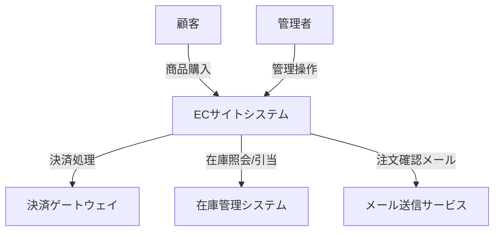
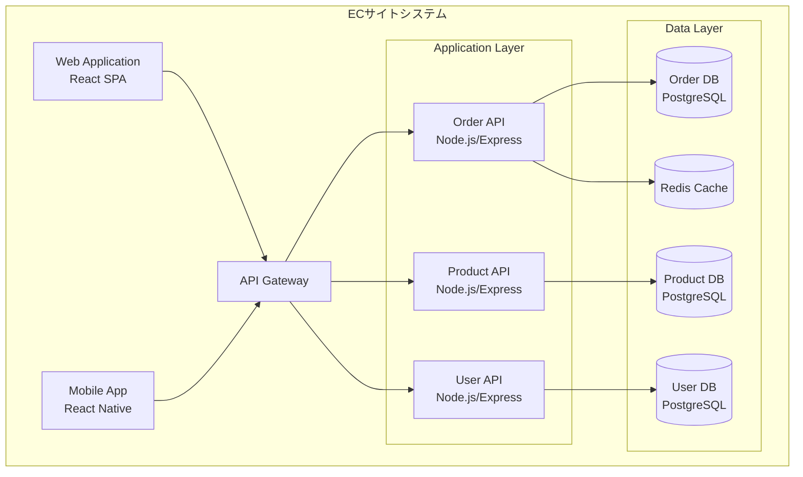
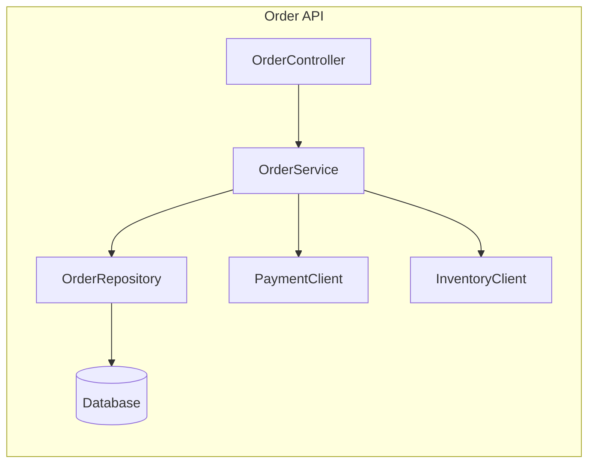
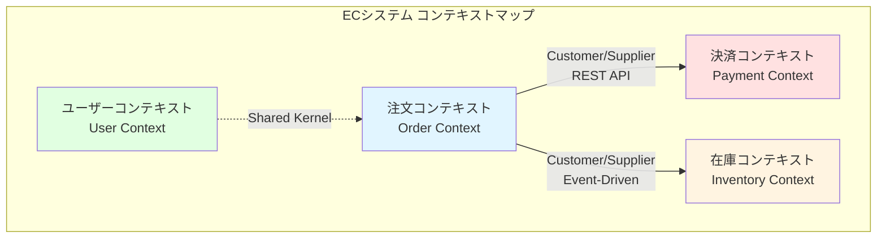
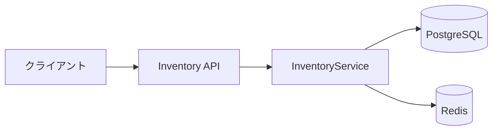
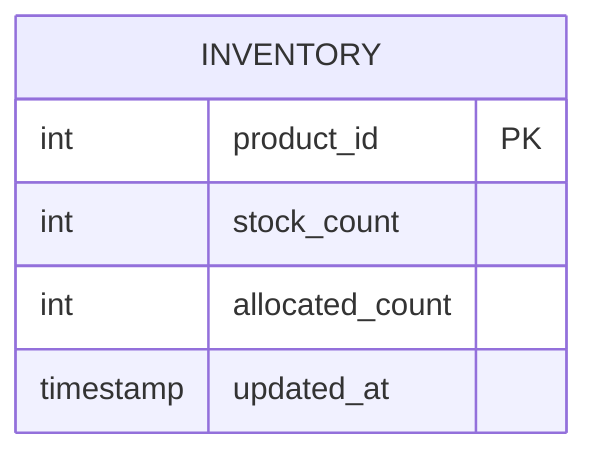

# AI駆動開発を加速するドキュメント戦略: 追加開発・保守運用で必要なドキュメント体系

## 概要

AIでリバースエンジニアリングを行う際、「どんなドキュメントを生成すべきか」が追加開発の効率を大きく左右する。本ドキュメントでは、AI駆動開発において最大の効果を発揮するドキュメントの種類、形式、優先順位を体系的に解説する。

**前提**: 本ドキュメントは「39-legacy-system-reverse-engineering-ai-documentation.md」の続編として、「何を作るべきか」に焦点を当てる。

## 目次

1. [なぜドキュメントの種類が重要か](#1-なぜドキュメントの種類が重要か)
2. [ドキュメントの階層構造](#2-ドキュメントの階層構造)
3. [AI駆動開発に効果的なドキュメント](#3-ai駆動開発に効果的なドキュメント)
4. [ドキュメント別の詳細解説](#4-ドキュメント別の詳細解説)
5. [優先順位と段階的整備](#5-優先順位と段階的整備)
6. [ドキュメントの形式とベストプラクティス](#6-ドキュメントの形式とベストプラクティス)
7. [実践ガイド](#7-実践ガイド)

---

## 1. なぜドキュメントの種類が重要か

### 1.1 「どんなドキュメント」で効果が変わる

**同じコードベースでも、生成するドキュメント次第で追加開発の効率が劇的に変わる**

```
ケースA: コードコメントのみ生成
  ↓
AIは関数の動作は理解できるが、
ビジネス意図やアーキテクチャ全体は理解できない
  ↓
追加開発時に誤った実装

ケースB: 要件定義書 + ADR + API仕様 + Runbook
  ↓
AIはシステム全体の文脈を理解し、
適切な設計判断と実装が可能
  ↓
高品質な追加開発
```

### 1.2 AIが理解しやすいドキュメント vs 人間向けドキュメント

**重要な洞察**
```
AI（LLM）の特性:
- 自然言語で書かれたドキュメントを最も理解しやすい
- 構造化されたデータ（JSON, YAML等）も得意
- コードよりもドキュメントの方が文脈理解が容易
- マークダウン形式が最適（軽量・構造化）
```

**ナレッジ「33-ai-context-documentation-importance.md」より**
```
「コンテキストは新しいコード」
Documentation is the ideal contextual input for LLMs
（ドキュメントはLLMにとって理想的なコンテキスト入力）
```

### 1.3 保守開発の4つの類型とドキュメント

**ソフトウェア保守の分類**

| 保守タイプ | 説明 | 必要なドキュメント |
|-----------|------|------------------|
| **修正保守** | バグ修正 | ・コード仕様書<br>・既知の問題リスト<br>・テスト仕様書 |
| **適応保守** | プラットフォーム変更対応 | ・システム構成図<br>・依存関係図<br>・デプロイ手順書 |
| **完全化保守** | 新機能追加 | ・要件定義書<br>・ADR<br>・API仕様書<br>・アーキテクチャ図 |
| **予防保守** | 将来の問題予防 | ・技術的負債リスト<br>・パフォーマンス監視データ<br>・セキュリティ監査結果 |

---

## 2. ドキュメントの階層構造

### 2.1 3層アーキテクチャ

```
┌─────────────────────────────────────────────┐
│  L1: 戦略層（Why: なぜそうするのか）          │
│  ・要件定義書                                │
│  ・ADR（Architecture Decision Records）      │
│  ・ビジネスルール文書                        │
│  ・コンテキストマップ（DDD）                 │
└─────────────────────────────────────────────┘
              ↓ 戦略を実現
┌─────────────────────────────────────────────┐
│  L2: 設計層（What/How: 何をどう作るか）      │
│  ・システムアーキテクチャ図                  │
│  ・API仕様書（OpenAPI/Swagger）              │
│  ・データモデル図（ER図）                    │
│  ・シーケンス図・データフロー図              │
│  ・モジュール設計書                          │
└─────────────────────────────────────────────┘
              ↓ 設計を実装
┌─────────────────────────────────────────────┐
│  L3: 実装層（How to implement: 実装詳細）    │
│  ・コードコメント（JSDoc等）                 │
│  ・関数/クラス仕様書                         │
│  ・テストコード・テスト仕様書                │
│  ・Runbook（運用手順書）                     │
└─────────────────────────────────────────────┘
```

### 2.2 AI駆動開発における各層の役割

**L1: 戦略層（Why）**
```
役割:
- AIに「システムの存在理由」を教える
- ビジネス判断の基準を提供
- 技術選択の背景を説明

AI活用例:
「この機能を追加したいが、既存の設計思想と矛盾しないか？」
→ ADRを参照して整合性をチェック
```

**L2: 設計層（What/How）**
```
役割:
- AIに「システム全体の構造」を教える
- モジュール間の関係を明示
- データの流れを可視化

AI活用例:
「在庫管理モジュールに新しいAPIを追加する」
→ 既存API仕様と整合性のある設計を提案
```

**L3: 実装層（How to implement）**
```
役割:
- AIに「具体的な実装方法」を教える
- コーディング規約の遵守
- 運用時の手順を明示

AI活用例:
「この関数を修正したい」
→ コード仕様を理解して適切な修正案を生成
```

---

## 3. AI駆動開発に効果的なドキュメント

### 3.1 最優先ドキュメント（Top 5）

**1位: ADR（Architecture Decision Records）**

```markdown
重要度: ★★★★★
AI理解度: ★★★★★
作成難易度: ★★★☆☆

理由:
- 「なぜその技術を選んだか」をAIが理解できる
- 将来の変更時に過去の判断を尊重できる
- 分散チーム・AIコーディングで特に重要
```

**2位: API仕様書（OpenAPI/Swagger）**

```markdown
重要度: ★★★★★
AI理解度: ★★★★★
作成難易度: ★★☆☆☆（自動生成可能）

理由:
- 構造化されたデータ形式でAIが完璧に理解
- コード生成・テスト生成が自動化可能
- 外部連携の際の契約書として機能
```

**3位: システムアーキテクチャ図**

```markdown
重要度: ★★★★★
AI理解度: ★★★★☆（Mermaid形式なら★5）
作成難易度: ★★★☆☆

理由:
- システム全体の構造をAIに理解させる
- 依存関係の把握が可能
- 変更の影響範囲を特定できる
```

**4位: データモデル図（ER図）**

```markdown
重要度: ★★★★☆
AI理解度: ★★★★☆
作成難易度: ★★☆☆☆（DBから自動生成可能）

理由:
- データ構造の理解が追加開発の基礎
- AI生成SQLの精度向上
- データ整合性の維持
```

**5位: Runbook（運用手順書）**

```markdown
重要度: ★★★★☆
AI理解度: ★★★★★
作成難易度: ★★★☆☆

理由:
- 運用時の手順をAIが実行可能
- トラブルシューティングの自動化
- DevOps/SREでの標準ドキュメント
```

### 3.2 効果的なドキュメント一覧表

| ドキュメント種類 | AI理解度 | 追加開発への効果 | 自動生成可能性 | 優先度 |
|-----------------|---------|----------------|--------------|--------|
| **ADR** | ★★★★★ | ★★★★★ | △（一部） | 最高 |
| **API仕様書** | ★★★★★ | ★★★★★ | ◎ | 最高 |
| **アーキテクチャ図** | ★★★★☆ | ★★★★★ | ◎ | 最高 |
| **ER図** | ★★★★☆ | ★★★★☆ | ◎ | 高 |
| **Runbook** | ★★★★★ | ★★★★☆ | ○ | 高 |
| **コンテキストマップ** | ★★★★☆ | ★★★★☆ | △ | 高 |
| **シーケンス図** | ★★★★☆ | ★★★★☆ | ◎ | 高 |
| **データフロー図** | ★★★★☆ | ★★★☆☆ | ◎ | 中 |
| **要件定義書** | ★★★★★ | ★★★★★ | △ | 最高 |
| **ビジネスルール文書** | ★★★★★ | ★★★★★ | △ | 高 |
| **コード仕様書** | ★★★★☆ | ★★★☆☆ | ◎ | 中 |
| **テスト仕様書** | ★★★★☆ | ★★★☆☆ | ○ | 中 |

---

## 4. ドキュメント別の詳細解説

### 4.1 ADR（Architecture Decision Records）

**定義**
重要なアーキテクチャ決定を記録する構造化ドキュメント。決定の背景、検討した選択肢、結果、トレードオフを記載。

**なぜAI駆動開発で重要か**

```
近年の重要性増大の理由（調査結果より）:
1. 分散チームの増加
2. マイクロサービスの複雑化
3. 生成AIのコーディングプロセスへの導入

→ 「なぜそうしたか」の記録が極めて重要に
```

**基本構造（Michael Nygardテンプレート）**

```markdown
# ADR-001: データベースとしてPostgreSQLを採用

## Status
Accepted（受理済み）

## Context（背景）
顧客管理システムのバックエンドデータベースを選定する必要がある。
要件:
- ACID特性の保証
- JSON型データの柔軟な格納
- 将来的な大規模化（100万レコード以上）
- オープンソース

## Decision（決定内容）
PostgreSQLをメインデータベースとして採用する。

## Consequences（結果・影響）

### Positive（ポジティブ）
- JSON型のネイティブサポート
- 成熟したエコシステム
- パフォーマンスチューニングの豊富なノウハウ
- AWS RDS、Google Cloud SQLでのマネージドサービス

### Negative（ネガティブ）
- MySQLに比べて初期学習コストが高い
- レプリケーション設定がやや複雑

### Risks（リスク）
- チームメンバーのPostgreSQL経験が少ない
  → 対策: 2週間のトレーニング期間を設ける

## Alternatives Considered（検討した他の選択肢）
1. **MySQL**: シンプルだが、JSON型のサポートが弱い
2. **MongoDB**: NoSQLの柔軟性はあるが、ACID特性が不十分
3. **Amazon DynamoDB**: スケーラブルだが、ベンダーロックインのリスク

## Notes
- 2025-01-15 決定
- レビュアー: 田中（アーキテクト）、佐藤（DBA）
```

**ADRベストプラクティス**

```markdown
## 会議運営
- 時間: 30-45分を上限
- スタイル: Readoutミーティング
  （10-15分の黙読 + コメント収集）

## 文書品質
- 1-2ページ以内に収める
- 1つの決定に1つのADR（分割を躊躇しない）
- 明確なステータス管理
  - Proposed（提案中）
  - Accepted（受理済み）
  - Deprecated（非推奨）
  - Superseded（上書きされた）

## 保管場所
- アプリケーションコードと同じリポジトリ
- Markdown形式
- パス例: docs/architecture/decisions/

## ツール
- ADR Manager（Web UI）
- ADR Tools（CLI）
- AI Agent for ADR Writing（自動生成支援）
```

**AI活用例**

```
プロンプト例:

既存のADRを考慮して、新しい機能の技術選定を提案してください。

[ADR-001.md]
...PostgreSQLを採用...

新機能: リアルタイム通知機能
要件:
- ブラウザへのプッシュ通知
- 遅延100ms以内
- 同時接続1,000ユーザー

既存のADRとの整合性を保ちながら、
最適な技術スタックを提案してください。
```

### 4.2 API仕様書（OpenAPI/Swagger）

**定義**
RESTful APIの仕様を記述する標準化されたフォーマット（OpenAPI Specification 3.x）

**AI駆動開発での重要性**

```
構造化データ形式 → AIが完璧に理解
  ↓
以下が自動化可能:
- クライアントコード生成
- サーバースタブ生成
- APIテストコード生成
- ドキュメントUI生成（Swagger UI）
```

**OpenAPI 3.x 基本構造**

```yaml
openapi: 3.0.3
info:
  title: 在庫管理API
  version: 1.0.0
  description: 在庫の照会・更新を行うREST API

servers:
  - url: https://api.example.com/v1
    description: 本番環境
  - url: https://api-staging.example.com/v1
    description: ステージング環境

paths:
  /inventory/{productId}:
    get:
      summary: 在庫数照会
      description: 指定した商品IDの在庫数を取得する
      operationId: getInventory
      tags:
        - Inventory
      parameters:
        - name: productId
          in: path
          required: true
          description: 商品ID
          schema:
            type: string
            example: "A001"
      responses:
        '200':
          description: 成功
          content:
            application/json:
              schema:
                $ref: '#/components/schemas/InventoryResponse'
              examples:
                success:
                  value:
                    productId: "A001"
                    stockCount: 50
                    nextDeliveryDate: "2025-02-01"
        '404':
          description: 商品が見つかりません
          content:
            application/json:
              schema:
                $ref: '#/components/schemas/ErrorResponse'

components:
  schemas:
    InventoryResponse:
      type: object
      required:
        - productId
        - stockCount
      properties:
        productId:
          type: string
          description: 商品ID
        stockCount:
          type: integer
          description: 在庫数
          minimum: 0
        nextDeliveryDate:
          type: string
          format: date
          description: 次回入荷予定日（在庫0の場合のみ）

    ErrorResponse:
      type: object
      properties:
        message:
          type: string
        errorCode:
          type: string

  securitySchemes:
    BearerAuth:
      type: http
      scheme: bearer
      bearerFormat: JWT

security:
  - BearerAuth: []
```

**ベストプラクティス**

```markdown
## 1. サーバー情報の明示
- servers プロパティを必ず設定
- 環境ごとのURL（本番/ステージング/開発）

## 2. 認証スキームの定義
- securitySchemes で最低1つの認証方式を定義
- JWT、OAuth2、APIキー等

## 3. スキーマの再利用
- インラインスキーマを避ける
- components/schemas に定義して参照
- 一貫した命名規則

## 4. Examples の充実
- parameters, responses に具体例を提供
- 自動テストケース生成に活用
- ドキュメントの可読性向上

## 5. タグによる整理
- エンドポイントをカテゴリ分け
- ドキュメントの構造化

## 6. Design-First vs Code-First
推奨: Design-First
- API仕様を先に記述
- コードは仕様から生成
- 変更時の影響を事前に検証
```

**AI活用例**

```yaml
# AIにOpenAPI仕様を渡す

AI「このAPI仕様に基づいて、以下を生成してください:
1. TypeScriptのクライアントコード
2. APIのユニットテストコード
3. 使用例のサンプルコード
4. エラーハンドリングのロジック」

→ 仕様が正確なら、高品質なコードを自動生成
```

### 4.3 システムアーキテクチャ図

**定義**
システム全体の構造、コンポーネント間の関係、データフローを可視化した図

**AI推奨形式: Mermaid**

```
理由:
- テキストベース（LLMが理解しやすい）
- Markdown内に埋め込み可能
- GitHub/GitLabでネイティブレンダリング
- バージョン管理が容易
```

**階層別のアーキテクチャ図**

**L1: システムコンテキスト図（C4モデル Level 1）**



**L2: コンテナ図（C4モデル Level 2）**



**L3: コンポーネント図（内部構造）**



**AI活用のポイント**

```
AIに渡す情報:
1. システムコンテキスト図（全体像）
2. コンテナ図（技術スタック）
3. コンポーネント図（詳細設計）

効果:
- 「どのモジュールを変更すべきか」の判断が正確に
- 依存関係を考慮したコード生成
- 影響範囲の自動分析
```

### 4.4 データモデル図（ER図）

**定義**
エンティティ（データの塊）とその関係性を表現した図

**Mermaid形式のER図**

```mermaid
erDiagram
    CUSTOMER ||--o{ ORDER : places
    ORDER ||--|{ ORDER_ITEM : contains
    PRODUCT ||--o{ ORDER_ITEM : "ordered in"
    PRODUCT }o--|| CATEGORY : belongs_to
    ORDER ||--|| PAYMENT : has

    CUSTOMER {
        int customer_id PK
        string name
        string email UK
        string phone
        date created_at
    }

    ORDER {
        int order_id PK
        int customer_id FK
        date order_date
        string status
        decimal total_amount
    }

    ORDER_ITEM {
        int order_item_id PK
        int order_id FK
        int product_id FK
        int quantity
        decimal unit_price
    }

    PRODUCT {
        int product_id PK
        string product_name
        int category_id FK
        decimal price
        int stock_quantity
    }

    CATEGORY {
        int category_id PK
        string category_name
    }

    PAYMENT {
        int payment_id PK
        int order_id FK UK
        string payment_method
        decimal amount
        date payment_date
        string status
    }
```

**AIに与えるべき情報**

```markdown
## ER図と合わせて提供すべき情報

### 1. ビジネスルール
- CUSTOMER.email は一意（UK制約）
- ORDER.total_amount は ORDER_ITEM の合計と一致
- PRODUCT.stock_quantity は 0 以上

### 2. データ制約
- NOT NULL制約
- CHECK制約
- デフォルト値

### 3. インデックス情報
- プライマリキー
- 外部キー
- 検索用インデックス

→ これらをまとめて「データディクショナリ」として提供
```

**データディクショナリ例**

```markdown
# データディクショナリ

## CUSTOMER テーブル

| カラム名 | 型 | NULL | デフォルト | 制約 | 説明 |
|---------|-----|------|-----------|------|------|
| customer_id | INT | NO | AUTO_INCREMENT | PK | 顧客ID |
| name | VARCHAR(100) | NO | - | - | 顧客名 |
| email | VARCHAR(255) | NO | - | UNIQUE | メールアドレス（ログインID） |
| phone | VARCHAR(20) | YES | NULL | - | 電話番号 |
| created_at | TIMESTAMP | NO | CURRENT_TIMESTAMP | - | 登録日時 |

### ビジネスルール
- email は重複不可（ユニーク制約）
- 論理削除を実装（is_deleted フラグ）
- created_at は自動設定、変更不可

### インデックス
- PRIMARY KEY (customer_id)
- UNIQUE INDEX idx_email (email)
- INDEX idx_created_at (created_at)
```

### 4.5 Runbook（運用手順書）

**定義**
頻繁に発生するIT業務の手順を詳細に記した説明書。インシデント対応、システム運用、トラブルシューティングの手順を標準化。

**なぜAI駆動開発で重要か**

```
AI自動化の前提条件:
- 手順が明文化されている
- 再現可能な形式で記載
- 判断基準が明確

Runbookがあれば:
→ AIが手順を理解し実行可能
→ 運用の自動化が進む
```

**Runbook基本構造**

```markdown
# Runbook: データベースバックアップ失敗時の対応

## メタデータ
- タスクID: RB-001
- 作成日: 2025-01-01
- 最終更新: 2025-01-15
- 責任者: インフラチーム（田中）
- 想定時間: 15-30分
- 重要度: 高

## 概要
夜間バッチでのデータベースバックアップが失敗した際の復旧手順。

## 前提条件
- AWSコンソールへのアクセス権
- RDSインスタンスへの接続権限
- PagerDutyからのアラート受信

## アラート検知
**症状:**
- PagerDutyアラート: "DB Backup Failed - RDS-PROD-01"
- CloudWatch Logs にエラーメッセージ

**確認方法:**
1. CloudWatch Logs を開く
2. ログストリーム `/aws/rds/backup-job` を確認
3. エラーメッセージを特定

## トラブルシューティング手順

### ステップ1: ディスク容量の確認
```bash
aws rds describe-db-instances \
  --db-instance-identifier rds-prod-01 \
  --query 'DBInstances[0].AllocatedStorage'
```

**判断基準:**
- 使用率 > 90%: ディスク容量不足 → ステップ2へ
- 使用率 <= 90%: 他の原因 → ステップ3へ

### ステップ2: ディスク容量の拡張
```bash
aws rds modify-db-instance \
  --db-instance-identifier rds-prod-01 \
  --allocated-storage 200 \
  --apply-immediately
```

**注意:**
- 本番環境では事前承認が必要
- 拡張中は一時的にパフォーマンス低下の可能性

### ステップ3: バックアップの手動実行
```bash
aws rds create-db-snapshot \
  --db-instance-identifier rds-prod-01 \
  --db-snapshot-identifier manual-backup-$(date +%Y%m%d-%H%M%S)
```

### ステップ4: 確認
```bash
aws rds describe-db-snapshots \
  --db-instance-identifier rds-prod-01 \
  --query 'DBSnapshots[0].[DBSnapshotIdentifier,Status,PercentProgress]'
```

**期待結果:**
- Status: "available"
- PercentProgress: 100

## エスカレーション
以下の場合はインフラマネージャーに即座にエスカレーション:
- 2回連続でバックアップ失敗
- ディスク容量が95%超
- RDSインスタンスが応答しない

**連絡先:**
- インフラマネージャー: 田中太郎（携帯: 080-XXXX-XXXX）
- Slack: #infra-emergency

## 事後対応
- Jiraチケット作成（プロジェクト: OPS）
- 失敗原因の調査レポート作成
- 再発防止策の検討

## 関連リンク
- AWS RDSダッシュボード: https://console.aws.amazon.com/rds/
- CloudWatch Logs: https://console.aws.amazon.com/cloudwatch/
- PagerDuty: https://example.pagerduty.com/
```

**Runbook自動化**

```yaml
# GitHub Actions で Runbook を自動実行

name: Auto Recovery - DB Backup

on:
  repository_dispatch:
    types: [db_backup_failed]

jobs:
  auto-recovery:
    runs-on: ubuntu-latest
    steps:
      - name: Check Disk Space
        id: check_disk
        run: |
          # Runbook Step 1 を自動実行
          USAGE=$(aws rds describe-db-instances ...)
          echo "usage=$USAGE" >> $GITHUB_OUTPUT

      - name: Expand Disk if Needed
        if: steps.check_disk.outputs.usage > 90
        run: |
          # Runbook Step 2 を自動実行
          aws rds modify-db-instance ...

      - name: Manual Backup
        run: |
          # Runbook Step 3 を自動実行
          aws rds create-db-snapshot ...

      - name: Notify Slack
        uses: 8398a7/action-slack@v3
        with:
          status: ${{ job.status }}
          text: 'Auto-recovery completed for DB backup'
```

### 4.6 コンテキストマップ（DDD: Domain-Driven Design）

**定義**
ドメイン駆動設計（DDD）において、境界づけられたコンテキスト（Bounded Context）間の関係を可視化した図。

**大規模システムでの重要性**

```
マイクロサービス化されたシステム:
- 各サービスが独立した境界づけられたコンテキスト
- コンテキスト間の関係が複雑化
- AIが全体像を理解するのに必須
```

**コンテキストマッピングパターン**

| パターン | 説明 | 使用例 |
|---------|------|--------|
| **Partnership** | 相互協力関係 | 注文管理 ⇔ 在庫管理 |
| **Shared Kernel** | 共通コアの共有 | 複数サービスで共通のドメインモデル |
| **Customer/Supplier** | 上流/下流関係 | 決済サービス（上流）→ 注文サービス（下流） |
| **Conformist** | 上流に従う | レガシーシステムの仕様に従う |
| **Anticorruption Layer** | 腐敗防止層 | 外部APIとの境界に変換層を設置 |
| **Open Host Service** | 公開インターフェース | REST APIで公開 |
| **Published Language** | 共通言語 | JSON Schema, OpenAPIで定義 |

**Context Mapper記法（CML）**

```
ContextMap ECSystemMap {
  contains OrderContext
  contains InventoryContext
  contains PaymentContext
  contains UserContext

  OrderContext [D, ACL] -> [U, OHS, PL] PaymentContext {
    implementationTechnology = "RESTful HTTP"
  }

  OrderContext [D] -> [U, OHS] InventoryContext {
    implementationTechnology = "Event-Driven (Kafka)"
  }

  UserContext [SK] -> OrderContext
}

BoundedContext OrderContext {
  type FEATURE
  domainVisionStatement = "注文の作成・管理を担当"

  Aggregate Order {
    Entity Order {
      aggregateRoot
      - OrderId id
      - CustomerId customerId
      - List<OrderItem> items
      - OrderStatus status
    }
  }
}
```

**Mermaid形式でのコンテキストマップ**



**AIに提供すべき情報**

```markdown
## コンテキスト境界の説明

### 注文コンテキスト（Order Context）
**責務:**
- 注文の作成・更新・キャンセル
- 注文ステータス管理

**ユビキタス言語:**
- Order（注文）
- OrderItem（注文明細）
- OrderStatus（ステータス: Pending, Confirmed, Shipped等）

**統合方式:**
- 決済コンテキスト: REST API（Downstream = 下流側）
- 在庫コンテキスト: Event-Driven（Kafka）

**腐敗防止層（ACL）:**
外部決済APIの複雑な仕様を内部モデルに変換

### 在庫コンテキスト（Inventory Context）
**責務:**
- 在庫数の管理
- 在庫引当・解放

**統合方式:**
- 注文コンテキスト: イベント受信（OrderCreated, OrderCancelled）
```

---

## 5. 優先順位と段階的整備

### 5.1 フェーズ別ドキュメント整備計画

**Phase 0: 最小限（1-2週間）**

```markdown
目標: AIで基本的なコード理解が可能に

必須ドキュメント:
1. システム構成図（1枚絵）
2. データモデル図（ER図）
3. README.md（プロジェクト概要）

生成方法:
- すべてAI自動生成
- 人間は軽くレビューのみ

効果:
- AI「このシステムは何をするものか」を理解
- 基本的なコード修正が可能に
```

**Phase 1: 基礎（1ヶ月）**

```markdown
目標: 新機能追加が安全にできる

追加ドキュメント:
4. API仕様書（OpenAPI）
5. 主要モジュールの設計書
6. Runbook（重要な運用手順のみ）

生成方法:
- API仕様: コードから自動生成
- 設計書: AI生成 + 30%人間レビュー
- Runbook: 人間主導でテンプレート作成

効果:
- APIの変更が安全に
- 運用トラブル時の対応が標準化
```

**Phase 2: 充実（2-3ヶ月）**

```markdown
目標: 戦略的な判断をAIが支援できる

追加ドキュメント:
7. ADR（過去の重要な決定を記録）
8. ビジネスルール文書
9. シーケンス図（主要処理フロー）
10. テスト仕様書

生成方法:
- ADR: 人間が作成（AIが下書き支援）
- ビジネスルール: AI抽出 + 人間検証
- シーケンス図: AI自動生成
- テスト仕様: AI自動生成

効果:
- 「なぜそうしたか」をAIが理解
- ビジネスロジックの変更が正確に
```

**Phase 3: 完全（3-6ヶ月）**

```markdown
目標: AI駆動開発のフル活用

追加ドキュメント:
11. コンテキストマップ（DDD）
12. データフロー図
13. 全Runbook
14. パフォーマンス要件書
15. セキュリティ要件書

効果:
- 大規模システムの全体像をAIが把握
- 複雑な機能追加も高精度で実装
- 運用の大部分を自動化
```

### 5.2 優先順位マトリックス

```
      │ 追加開発への効果
      │ 高
  重  │ ┌─────────┐  ┌─────────┐
  要  │ │  ADR    │  │API仕様書 │ Phase 1
  性  │ │アーキ図 │  │ER図      │ 最優先
      │ └─────────┘  └─────────┘
      │ ┌─────────┐  ┌─────────┐
      │ │ビジネス │  │シーケンス│ Phase 2
      │ │ルール   │  │図        │ 次点
      │ └─────────┘  └─────────┘
  低  │ ┌─────────┐  ┌─────────┐
      │ │データ   │  │コード    │ Phase 3
      │ │フロー図 │  │コメント  │ 後回し
      │ └─────────┘  └─────────┘
      └────────────────────────
        低          自動生成容易度  高
```

### 5.3 ROI（投資対効果）分析

**ドキュメント別のROI**

| ドキュメント | 作成工数 | 効果 | ROI | 優先順位 |
|-------------|---------|------|-----|---------|
| **API仕様書** | 低（自動生成） | 極大 | ★★★★★ | 1位 |
| **ER図** | 低（自動生成） | 大 | ★★★★★ | 1位 |
| **アーキ図** | 中 | 極大 | ★★★★☆ | 2位 |
| **ADR** | 中 | 大 | ★★★★☆ | 2位 |
| **Runbook** | 中～高 | 大 | ★★★☆☆ | 3位 |
| **シーケンス図** | 低（自動生成） | 中 | ★★★☆☆ | 3位 |
| **ビジネスルール** | 高（人間主導） | 大 | ★★★☆☆ | 3位 |
| **コンテキストマップ** | 高 | 中（大規模時） | ★★☆☆☆ | 4位 |
| **データフロー図** | 中（自動生成） | 小 | ★★☆☆☆ | 4位 |

---

## 6. ドキュメントの形式とベストプラクティス

### 6.1 AI最適化フォーマット

**推奨形式の優先順位**

```
1位: Markdown
- LLMが最も理解しやすい
- バージョン管理に最適
- 軽量・可搬性が高い

2位: YAML/JSON（構造化データ）
- プログラマブル
- スキーマ検証可能
- 自動処理が容易

3位: Mermaid（図）
- テキストベースで記述
- Markdown内に埋め込み可能
- GitHub/GitLabでレンダリング

避けるべき形式:
❌ Word/Excel（バイナリ）
❌ PDF（テキスト抽出が不完全）
❌ Visio/PowerPoint（再利用が困難）
```

**MarkdownとMermaidの組み合わせ例**

```markdown
# 在庫管理サービス 設計書

## 概要
在庫の照会・更新を行うマイクロサービス。

## アーキテクチャ



## API仕様

詳細は [openapi.yaml](./openapi.yaml) を参照。

### エンドポイント一覧
- `GET /inventory/{productId}`: 在庫照会
- `POST /inventory/{productId}/allocate`: 在庫引当
- `POST /inventory/{productId}/release`: 在庫解放

## データモデル



## ビジネスルール

### BR-001: 在庫引当
在庫引当時、`stock_count >= allocated_count + 引当数` であることを確認。

### BR-002: 在庫解放
注文キャンセル時、引き当てた在庫を自動解放。
```

### 6.2 ドキュメントの粒度

**原則: 適切な粒度で分割**

```markdown
## 悪い例: 1つの巨大ドキュメント
docs/
  └── all-in-one-spec.md  # 10,000行（読みづらい、更新しづらい）

## 良い例: 適切に分割
docs/
  ├── README.md                    # プロジェクト概要
  ├── architecture/
  │   ├── overview.md             # システム全体像
  │   ├── decisions/              # ADR
  │   │   ├── 001-database-choice.md
  │   │   └── 002-cache-strategy.md
  │   └── diagrams/
  │       ├── context.md          # コンテキスト図
  │       └── container.md        # コンテナ図
  ├── api/
  │   └── openapi.yaml            # API仕様
  ├── database/
  │   ├── er-diagram.md           # ER図
  │   └── data-dictionary.md     # データディクショナリ
  ├── modules/
  │   ├── order-service.md        # 注文サービス設計
  │   ├── inventory-service.md    # 在庫サービス設計
  │   └── payment-service.md      # 決済サービス設計
  └── operations/
      ├── runbooks/
      │   ├── db-backup-failure.md
      │   └── high-cpu-alert.md
      └── monitoring.md
```

**ファイル分割の基準**

```
1ファイルの目安:
- 長さ: 300-500行以内
- トピック: 1つの明確なテーマ
- 更新頻度: 似た頻度でグループ化

例:
- ADR: 1決定 = 1ファイル
- Runbook: 1手順 = 1ファイル
- モジュール設計: 1モジュール = 1ファイル
```

### 6.3 メタデータの付与

**フロントマター（YAML）の活用**

```markdown
---
title: "ADR-001: データベースとしてPostgreSQLを採用"
date: 2025-01-15
status: Accepted
tags:
  - database
  - architecture
  - postgresql
authors:
  - 田中太郎
reviewers:
  - 佐藤花子
  - 鈴木一郎
version: 1.0
last_updated: 2025-01-15
---

# ADR-001: データベースとしてPostgreSQLを採用

## Status
Accepted
...
```

**メタデータの効果**

```
検索性の向上:
- タグで関連ドキュメントをグループ化
- ステータスで有効/無効を判別

トレーサビリティ:
- 作成者・レビュアーの記録
- 更新履歴の追跡

自動処理:
- CIでメタデータを検証
- ドキュメントインデックスの自動生成
```

### 6.4 Living Documentation化

**原則: ドキュメントとコードを同期**

```yaml
# .github/workflows/update-docs.yml
name: Update Documentation

on:
  push:
    paths:
      - 'src/**'
      - 'database/migrations/**'

jobs:
  update-api-docs:
    runs-on: ubuntu-latest
    steps:
      - uses: actions/checkout@v2

      - name: Generate OpenAPI Spec
        run: |
          npm run generate:openapi
          git add docs/api/openapi.yaml

      - name: Generate ER Diagram
        run: |
          # データベースから最新のER図を生成
          npm run generate:er-diagram
          git add docs/database/er-diagram.md

      - name: Update Module Docs
        env:
          CLAUDE_API_KEY: ${{ secrets.CLAUDE_API_KEY }}
        run: |
          # 変更されたファイルのドキュメントを再生成
          python scripts/update-module-docs.py

      - name: Commit & Push
        run: |
          git config user.name "GitHub Actions"
          git config user.email "actions@github.com"
          git commit -m "Auto-update documentation" || echo "No changes"
          git push
```

---

## 7. 実践ガイド

### 7.1 ドキュメント生成の実行計画

**Week 1: 準備**

```markdown
## Day 1-2: 現状把握
- [ ] コードベースの規模測定
- [ ] 既存ドキュメントの棚卸し
- [ ] 欠落しているドキュメントの特定

## Day 3-4: ツール選定
- [ ] AIリバースエンジニアリングツールのトライアル
  - SHIFT AIドキュメントリバース
  - Swimm Auto-docs
  - DocuWriter.ai
- [ ] コスト試算

## Day 5: 計画策定
- [ ] Phase 1 の優先ドキュメント決定
- [ ] 担当者アサイン
- [ ] スケジュール作成
```

**Week 2-3: Phase 1 実行**

```markdown
## Week 2: 自動生成
- [ ] システム構成図（AI生成）
- [ ] ER図（DBから自動生成）
- [ ] API仕様書（コードから自動生成）

## Week 3: レビュー・補完
- [ ] システム構成図のレビュー（アーキテクト）
- [ ] ER図のビジネスルール追記（ドメインエキスパート）
- [ ] API仕様書の Examples 追加
```

**Week 4-8: Phase 2 実行**

```markdown
## Week 4-5: ADR作成
- [ ] 過去の重要な決定を洗い出し（ブレインストーミング）
- [ ] ADRテンプレート作成
- [ ] 5-10個のADRを作成

## Week 6-7: 設計書・Runbook
- [ ] 主要モジュールの設計書（AI生成 + レビュー）
- [ ] 重要な運用手順のRunbook化

## Week 8: 統合・公開
- [ ] ドキュメント管理システムへの格納
- [ ] 検索インデックス構築
- [ ] チームへの周知・トレーニング
```

### 7.2 チェックリスト

**ドキュメント品質チェック**

```markdown
## 技術的正確性
- [ ] コードと記述が一致しているか
- [ ] バージョン情報が最新か
- [ ] リンク切れがないか

## 可読性
- [ ] 新人エンジニアが理解できる記述か
- [ ] 専門用語に説明があるか
- [ ] 図が適切に配置されているか

## AI最適性
- [ ] Markdown形式か（バイナリ形式でないか）
- [ ] 構造化されているか（見出し階層が明確）
- [ ] メタデータが付与されているか

## 保守性
- [ ] 自動更新の仕組みがあるか
- [ ] 更新責任者が明確か
- [ ] バージョン管理されているか
```

**AIコンテキスト提供チェック**

```markdown
## Phase 1（最小限）
- [ ] システム全体の目的が記載されているか
- [ ] 主要なモジュール構成が分かるか
- [ ] データ構造が理解できるか

## Phase 2（基礎）
- [ ] API仕様が完全か
- [ ] 主要な処理フローが図示されているか
- [ ] 運用手順が明文化されているか

## Phase 3（充実）
- [ ] 過去の設計判断（ADR）が記録されているか
- [ ] ビジネスルールが明確か
- [ ] システム間の関係（コンテキストマップ）が分かるか
```

### 7.3 よくある失敗と対策

**失敗1: 完璧主義で進まない**

```markdown
症状:
「完璧なドキュメントを作ろう」として、いつまでも完成しない

対策:
- 80%の完成度で公開（Pareto原則）
- AI生成の粗いドキュメントでもまずは公開
- フィードバックを受けて改善
```

**失敗2: 更新されず陳腐化**

```markdown
症状:
せっかく作ったドキュメントが3ヶ月で陳腐化

対策:
- CI/CDパイプラインで自動更新
- PRレビュー時にドキュメント更新を必須化
- 定期的な全体レビュー（四半期ごと）
```

**失敗3: ドキュメントが分散**

```markdown
症状:
Confluence、GitHub、Google Docs、ローカルファイル...
どこに何があるか分からない

対策:
- Single Source of Truth（唯一の情報源）を決める
- 推奨: GitHubリポジトリ（コードと同居）
- 他のツールはリンクのみ
```

**失敗4: 誰も読まない**

```markdown
症状:
ドキュメントを作ったが、誰も参照しない

対策:
- AIに読ませることで価値を実証
  「このドキュメントのおかげでAIが正確なコード生成」
- 検索しやすくする（タグ、インデックス）
- オンボーディングで必読資料に指定
```

---

## まとめ

### 重要ポイント

**1. ドキュメントの種類で効果が劇的に変わる**
```
コードコメントのみ → AIの理解度 30%
ADR + API仕様 + アーキ図 → AIの理解度 90%
```

**2. 最優先ドキュメント Top 5**
1. ADR（Architecture Decision Records）
2. API仕様書（OpenAPI/Swagger）
3. システムアーキテクチャ図
4. データモデル図（ER図）
5. Runbook（運用手順書）

**3. AI最適化フォーマット**
- Markdown（最優先）
- YAML/JSON（構造化データ）
- Mermaid（図）
- OpenAPI Specification（API）

**4. 段階的整備が成功の鍵**
```
Phase 0（1-2週間）: システム図 + ER図
  ↓
Phase 1（1ヶ月）: API仕様 + 設計書 + Runbook
  ↓
Phase 2（2-3ヶ月）: ADR + ビジネスルール + シーケンス図
  ↓
Phase 3（3-6ヶ月）: コンテキストマップ + 全Runbook
```

**5. Living Documentation化必須**
- CI/CD統合で自動更新
- ドキュメントとコードを同じリポジトリで管理
- 定期的な全体レビュー

### 関連ナレッジとの連携

**このドキュメントの位置づけ**

```
[39] レガシーシステムのリバースエンジニアリング
  ↓ 「何を作るか」を明確化
[40] AI駆動開発を加速するドキュメント戦略（本ドキュメント）
  ↓ 作成したドキュメントを活用
[33] AIコンテキストとドキュメントの重要性
  ↓ コンテキストを整備
[37] ヒアリングからユーザーストーリー生成
  ↓ 追加開発を実施
[38] V字モデルとテスト駆動開発
```

### 次のアクション

**今日からできること**

```markdown
## 小規模実験（1週間）
1. 最も重要な1モジュールを選定
2. 以下を生成:
   - API仕様書（コードから自動生成）
   - ER図（DBから自動生成）
   - モジュール設計書（AI生成）
3. AIに読ませて追加開発を試す

## 本格導入（1ヶ月）
1. Phase 1 の5つのドキュメントを整備
2. CI/CDで自動更新を設定
3. チームトレーニング

## 最終目標（3-6ヶ月）
1. 全ドキュメントの整備完了
2. AI駆動開発の全面適用
3. 開発生産性の劇的向上
```

---

## 参考資料

### Architecture Decision Records (ADR)
- AWS Architecture Blog: "Master architecture decision records (ADRs)"
  https://aws.amazon.com/blogs/architecture/master-architecture-decision-records-adrs-best-practices-for-effective-decision-making/

- adr.github.io: Official ADR repository
  https://adr.github.io/

- GitHub: joelparkerhenderson/architecture-decision-record
  https://github.com/joelparkerhenderson/architecture-decision-record

### API Documentation
- Swagger: "API Documentation Made Easy with OpenAPI & Swagger"
  https://swagger.io/resources/articles/documenting-apis-with-swagger/

- OpenAPI: "Best Practices"
  https://learn.openapis.org/best-practices.html

### Domain-Driven Design
- Context Mapper: Official Documentation
  https://contextmapper.org/

- GitHub: ddd-crew/context-mapping
  https://github.com/ddd-crew/context-mapping

### Runbooks
- Atlassian: "DevOps runbook template"
  https://www.atlassian.com/software/confluence/templates/devops-runbook

- Scribe: "How To Create a Runbook: Guide + Best Practices"
  https://scribe.com/library/runbooks

### AI-Driven Development
- Workik: "FREE AI-Powered Code Documentation"
  https://workik.com/ai-powered-code-documentation

- Red Hat: "How spec-driven development improves AI coding quality"
  https://developers.redhat.com/articles/2025/10/22/how-spec-driven-development-improves-ai-coding-quality

- Swimm: "Understanding AI Coding Assistants: Harnessing Source Code Context"
  https://swimm.io/blog/contextualizing-ai-source-code

---

**文書バージョン:** 1.0
**作成日:** 2025-01-08
**最終更新:** 2025-01-08
