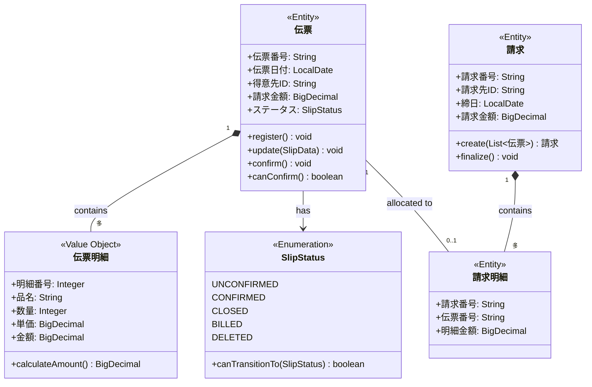

# レガシーシステム向け必須ドキュメントカタログ: Excel設計書とソースコードの活用指針

## 概要

既存システム（特にExcel設計書が中心のプロジェクト）に対して、AI駆動開発を適用する際に作成すべきドキュメントを体系化。各ドキュメントを「Excel設計書のみで作成可能」と「ソースコード参照で品質向上」に分類し、効率的なドキュメント整備戦略を提示する。

**対象システム例**: NFBMS（運送業務管理システム）のような、Excel中心の設計書が存在するレガシーシステム

## 目次

1. [ドキュメント全体像](#1-ドキュメント全体像)
2. [Excel設計書のみで作成可能なドキュメント](#2-excel設計書のみで作成可能なドキュメント)
3. [ソースコード参照で品質向上するドキュメント](#3-ソースコード参照で品質向上するドキュメント)
4. [ソースコード必須のドキュメント](#4-ソースコード必須のドキュメント)
5. [作成戦略とロードマップ](#5-作成戦略とロードマップ)
6. [実践ガイド](#6-実践ガイド)

---

## 1. ドキュメント全体像

### 1.1 ドキュメント分類マトリックス

```
              │ Excel設計書のみ │ コード参照で品質向上 │ コード必須
──────────────┼─────────────────┼──────────────────────┼───────────
L1: 戦略層    │ ・ビジネスルール │ ・ADR（一部）         │ ・ADR（技術判断）
              │ ・要件定義書     │ ・非機能要件書       │
              │ ・ユビキタス言語 │                      │
──────────────┼─────────────────┼──────────────────────┼───────────
L2: 設計層    │ ・業務フロー図   │ ・ドメインモデル図   │ ・API仕様書
              │ ・画面遷移図     │ ・ER図（実装との整合）│ ・アーキテクチャ図
              │ ・状態遷移図     │ ・シーケンス図       │ ・データディクショナリ
              │ ・帳票仕様       │                      │
──────────────┼─────────────────┼──────────────────────┼───────────
L3: 実装層    │ ・エラーメッセージ│ ・テストシナリオ     │ ・コーディング規約
              │   一覧           │ ・バッチ仕様（一部） │ ・ログ設計（実装）
              │                  │                      │ ・Runbook（実装依存）
──────────────┼─────────────────┼──────────────────────┼───────────
運用・保守    │ ・運用手順（概要）│ ・監視設計           │ ・デプロイ手順
              │ ・障害対応手順   │                      │ ・パフォーマンス
              │                  │                      │   チューニングガイド
```

### 1.2 情報源の優先順位

**原則: 信頼できる情報源を選択**

```
1. 実際に動作しているコード（真実）
2. 最新のExcel設計書（意図）
3. 古いExcel設計書（参考）
4. 口頭の説明（補足）
```

**判断基準**

| 状況 | 情報源の選択 | 理由 |
|------|------------|------|
| **設計書とコードが一致** | Excel設計書を優先 | ビジネス意図が明確 |
| **設計書とコードが乖離** | コードを真実とする | 実際の動作が正 |
| **設計書が不完全** | コードで補完 | 実装詳細を抽出 |
| **コードが不明瞭** | 設計書で意図を理解 | ビジネスロジックの背景 |

---

## 2. Excel設計書のみで作成可能なドキュメント

### 2.1 ビジネスルール文書 ⭐⭐⭐⭐⭐

**情報源**: 機能設計書のビジネスロジック記述

```markdown
作成方法:
1. Excel設計書から業務ルールを抽出
2. Markdown形式に変換
3. 構造化（カテゴリ分類）

入力:
- 機能設計書（例: B002_請求明細表_機能設計書.xlsx）
- 共通仕様書（例: Z000_共通仕様.xlsx）

出力例:
docs/business-rules/billing-rules.md
```

**サンプル構造**

```markdown
# 請求処理のビジネスルール

## BR-BIL-001: 締日処理の実行条件
**定義:**
請求締日処理は、毎月指定された締日の翌営業日に実行する。

**前提条件:**
- 対象月の全伝票が「確定」状態である
- 前月の請求処理が完了している

**処理内容:**
1. 対象期間: 前回締日翌日 ～ 今回締日
2. 対象伝票: ステータスが「確定」の伝票のみ
3. 集計単位: 請求先ごと

**例外:**
- 未確定伝票がある場合: エラーメッセージ「NFB-BIL-001」を表示し、処理中断

**関連:**
- メッセージ: B40_メッセージ一覧.xlsx の NFB-BIL-001
- 画面: B001_請求書・請求一覧表_機能設計書.xlsx
```

**AI活用効果:**
- ビジネスロジックの正確な理解
- ドメイン知識のない開発者への知識伝達
- AIが仕様に沿ったコード生成

---

### 2.2 ユビキタス言語辞書 ⭐⭐⭐⭐⭐

**情報源**: DB項目命名ルール、機能設計書の用語

```markdown
作成方法:
1. J05_DB項目命名ルール、区分名称一覧.xlsx を解析
2. 機能設計書から業務用語を抽出
3. 統一的な用語集として整理

入力:
- J05_DB項目命名ルール、区分名称一覧.xlsx
- 各機能設計書の用語説明

出力:
docs/domain/ubiquitous-language.md
```

**サンプル**

```markdown
# NFBMS ユビキタス言語辞書

## ビジネス用語

| 用語 | 読み | 定義 | コード上の表現 | 使用例 |
|------|------|------|--------------|--------|
| 伝票 | でんぴょう | 運送取引の基本単位 | Slip, Denpyo | 伝票番号: D20250108-001 |
| 締日 | しめび | 請求・支払計算の基準日 | closingDate | 毎月20日締め |
| 請求先 | せいきゅうさき | 請求書を送付する取引先 | billingDestination | 請求先コード: BC001 |
| 得意先 | とくいさき | サービスを提供する顧客 | customer | 得意先コード: C001 |
| 運賃 | うんちん | 運送に対する基本料金 | freight | 基本運賃: 10,000円 |
| 付帯料金 | ふたいりょうきん | 運賃以外の追加料金 | incidentalCharge | 待機料、高速代 |
| 引当 | ひきあて | 請求に伝票を紐付ける処理 | allocate() | 締日処理で実行 |
| 消込 | けしこみ | 支払に伝票を紐付ける処理 | apply() | 支払処理で実行 |

## ステータス値

| ステータス名 | 値 | 意味 | 遷移可能な次状態 |
|------------|-----|------|----------------|
| 未確定 | 0 | 登録直後 | 確定、削除済 |
| 確定 | 1 | 承認済み | 締処理済 |
| 締処理済 | 2 | 締日処理完了 | 請求済 |
| 請求済 | 3 | 請求確定 | - |
| 削除済 | 9 | 論理削除 | - |

## 区分値

### 得意先区分
| コード | 名称 | 説明 |
|--------|------|------|
| 1 | 一般 | 通常の得意先 |
| 2 | 特約店 | 特別料金適用 |
| 9 | その他 | 単発取引 |
```

**AI活用効果:**
- 用語の誤解釈防止
- 一貫した命名規則
- チーム全体での用語統一

---

### 2.3 業務フロー図（概要レベル） ⭐⭐⭐⭐☆

**情報源**: 10_業務・画面フロー.xlsx

```markdown
作成方法:
1. Excel の業務フロー図を確認
2. Mermaid flowchart 形式に変換
3. 主要な処理フローのみ抽出（詳細は後回し）

入力:
- 10_業務・画面フロー.xlsx

出力:
docs/flows/business-flow-overview.md
```

**サンプル（Mermaid）**


---

### 2.4 画面遷移図 ⭐⭐⭐☆☆

**情報源**: B02_機能・画面一覧.xlsx、10_業務・画面フロー.xlsx

```markdown
作成方法:
1. 画面一覧から画面IDと画面名を抽出
2. 業務フローから遷移関係を抽出
3. Mermaid stateDiagram 形式に変換

出力:
docs/ui/screen-transition.md
```

**サンプル**


---

### 2.5 状態遷移図（ビジネスオブジェクト） ⭐⭐⭐⭐⭐

**情報源**: 機能設計書のステータス定義

```markdown
作成方法:
1. 機能設計書からステータス項目を抽出
2. 状態遷移ルールを確認
3. Mermaid stateDiagram-v2 形式に変換

入力:
- A001_伝票管理_機能設計書.xlsx
- B001_請求書・請求一覧表_機能設計書.xlsx

出力:
docs/domain/state-machines/slip-status.md
```

**サンプル**


**ビジネスルール記述**

```markdown
## 伝票ステータス遷移ルール

### 未確定 → 確定
**条件:**
- 必須項目がすべて入力されている
- 金額が0円より大きい
- 得意先マスタに登録済み

**実行者:** 営業担当者、管理者
**実行タイミング:** 伝票内容確認後

### 確定 → 締処理済
**条件:**
- 締日処理バッチが正常実行される
- 対象締日の範囲内

**実行者:** システム（自動）
**実行タイミング:** 締日翌営業日の夜間バッチ

### 確定 → 未確定（承認取消）
**条件:**
- 締日処理未実施
- 管理者権限を持つユーザー

**実行者:** 管理者のみ
**実行タイミング:** 締日前のみ
```

---

### 2.6 帳票仕様（レイアウト） ⭐⭐⭐⭐☆

**情報源**: 帳票仕様書（例: B001R01_請求書_帳票仕様書.xlsx）

```markdown
作成方法:
1. Excel の帳票仕様書からレイアウト情報を抽出
2. 項目定義、ヘッダー・フッター情報を整理
3. Markdown形式で記述

出力:
docs/reports/invoice-specification.md
```

**サンプル**

```markdown
# 請求書 帳票仕様

## 基本情報
- 帳票ID: R-BIL-001
- 帳票名: 請求書
- 出力形式: PDF（A4縦）
- 出力タイミング: 締日処理完了後
- 出力先: 請求先ごとに1ファイル

## ヘッダー情報
| 項目名 | 取得元 | 備考 |
|--------|--------|------|
| 請求書番号 | 請求テーブル.請求番号 | 例: INV-2025-01-001 |
| 請求日 | 請求テーブル.請求日 | 和暦表示 |
| 請求先名 | 請求先マスタ.請求先名 | |
| 請求先住所 | 請求先マスタ.住所 | |

## 明細情報
| 項目名 | 取得元 | 書式 |
|--------|--------|------|
| 伝票番号 | 伝票テーブル.伝票番号 | |
| 伝票日付 | 伝票テーブル.伝票日付 | YYYY/MM/DD |
| 得意先名 | 得意先マスタ.得意先名 | |
| 金額 | 伝票テーブル.請求金額 | #,##0円 |

## フッター情報
| 項目名 | 計算式 | 書式 |
|--------|--------|------|
| 小計 | SUM(明細.金額) | #,##0円 |
| 消費税 | 小計 × 0.10 | #,##0円 |
| 合計 | 小計 + 消費税 | #,##0円 |

## 出力条件
- 請求金額が0円の場合は出力しない
- 削除済み伝票は対象外
```

---

### 2.7 エラーメッセージ一覧 ⭐⭐⭐☆☆

**情報源**: B40_メッセージ一覧.xlsx

```markdown
作成方法:
1. Excel からメッセージID、メッセージ内容を抽出
2. カテゴリ分類（エラー、警告、情報）
3. Markdown テーブル形式に変換

出力:
docs/design/error-messages.md
```

**サンプル**

```markdown
# エラーメッセージ一覧

## システムエラー（NFB-SYS-xxx）

| メッセージID | 重要度 | メッセージ内容 | 発生条件 | 対処方法 |
|------------|--------|--------------|---------|---------|
| NFB-SYS-001 | ERROR | データベース接続に失敗しました | DB接続エラー | システム管理者に連絡 |
| NFB-SYS-002 | ERROR | ファイルの読み込みに失敗しました | ファイルI/Oエラー | ファイルパスを確認 |

## ビジネスエラー（NFB-BIL-xxx: 請求関連）

| メッセージID | 重要度 | メッセージ内容 | 発生条件 | 対処方法 |
|------------|--------|--------------|---------|---------|
| NFB-BIL-001 | ERROR | 未確定の伝票が存在します。締日処理を中止します。 | 未確定伝票あり | 全伝票を確定してから実行 |
| NFB-BIL-002 | WARN | 請求金額が0円の請求先があります。 | 請求額=0 | 確認の上、処理続行 |

## バリデーションエラー（NFB-VAL-xxx）

| メッセージID | 重要度 | メッセージ内容 | 発生条件 | 対処方法 |
|------------|--------|--------------|---------|---------|
| NFB-VAL-001 | ERROR | {項目名}は必須入力です。 | 必須項目未入力 | 項目を入力 |
| NFB-VAL-002 | ERROR | {項目名}は数値を入力してください。 | 数値項目に非数値 | 数値を入力 |
| NFB-VAL-003 | ERROR | {項目名}は{最大桁数}桁以内で入力してください。 | 桁数超過 | 桁数を確認 |
```

---

## 3. ソースコード参照で品質向上するドキュメント

### 3.1 ドメインモデル図 ⭐⭐⭐⭐⭐

**Excel設計書のみの場合: 60%の品質**
- ER図から推測可能
- エンティティ名、属性名は把握可能
- しかし、振る舞い（メソッド）は不明

**ソースコード参照の場合: 95%の品質**
- 実際のクラス構造を反映
- メソッド（振る舞い）を正確に記述
- 集約境界を正確に把握

```markdown
作成方法（ソースコード活用）:
1. ER図（Excel）でエンティティを把握
2. Javaクラス（domain層）を解析
3. Mermaid classDiagram で統合

入力:
- Excel: 00_データベース設計/A11_ER図.xlsx
- コード: springboot.pj.nfbms.domain パッケージ

出力:
docs/domain/domain-model.md
```

**サンプル（コード反映版）**



**コード参照のメリット**
- 実際のメソッド名が正確
- 集約ルート（Aggregate Root）の識別
- Value Object と Entity の区別
- Enum の実際の値

---

### 3.2 シーケンス図（詳細レベル） ⭐⭐⭐⭐☆

**Excel設計書のみの場合: 50%の品質**
- 概要フローは把握可能
- しかし、クラス間の呼び出し順序は不明

**ソースコード参照の場合: 90%の品質**
- 実際のメソッド呼び出し順序
- トランザクション境界
- 例外処理フロー

```markdown
作成方法（ソースコード活用）:
1. Excel で業務フローの概要を把握
2. Controllerから処理を追跡
3. 実際の呼び出し順序で Mermaid sequenceDiagram 作成

入力:
- Excel: 機能設計書（例: B001_請求書・請求一覧表_機能設計書.xlsx）
- コード: Controller → Service → Repository の呼び出し

出力:
docs/flows/billing-process-sequence.md
```

**サンプル（コード反映版）**


**コード参照のメリット**
- 実際のメソッド名・引数
- トランザクション境界（@Transactional）
- データベースアクセスの順序
- エラーハンドリングの実装

---

### 3.3 ER図（実装との整合性） ⭐⭐⭐⭐⭐

**Excel設計書のみの場合: 70%の品質**
- 設計時のER図
- しかし、実装時の変更が反映されていない可能性

**ソースコード参照の場合: 100%の品質**
- DBFluteのスキーマ定義から自動生成
- 実際のテーブル構造を反映
- インデックス、制約も正確

```markdown
作成方法（ソースコード活用）:
1. DBFlute の manage.sh を実行してスキーマ情報を取得
2. または、データベースから直接スキーマを抽出
3. Mermaid erDiagram 形式に変換

入力:
- Excel: A11_ER図.xlsx（設計意図の理解）
- コード: dbflute_nfbms/schema/project-schema.xml
- DB: INFORMATION_SCHEMA（実際のスキーマ）

出力:
docs/database/er-diagram.md
```

**サンプル（DB実態反映版）**


**データディクショナリ（DB実態版）**

```markdown
## SLIP テーブル（伝票）

| カラム名 | 型 | NULL | デフォルト | 制約 | 説明 | 実装備考 |
|---------|-----|------|-----------|------|------|---------|
| slip_id | BIGINT | NO | AUTO_INCREMENT | PK | 伝票ID | サロゲートキー |
| slip_no | VARCHAR(20) | NO | - | UK, INDEX | 伝票番号 | 業務キー、形式: DYYYYMMDD-NNN |
| slip_date | DATE | NO | - | INDEX | 伝票日付 | 締日処理の対象判定に使用 |
| customer_id | BIGINT | NO | - | FK → CUSTOMER | 得意先ID | |
| billing_destination_id | BIGINT | NO | - | FK → BILLING_DESTINATION | 請求先ID | customer.default_billing_destination_id から初期値設定 |
| billing_amount | DECIMAL(10,0) | NO | 0 | CHECK >= 0 | 請求金額 | 明細の合計と一致必須 |
| status | VARCHAR(1) | NO | '0' | CHECK IN ('0','1','2','3','9') | ステータス | 0:未確定, 1:確定, 2:締処理済, 3:請求済, 9:削除済 |
| created_at | DATETIME | NO | CURRENT_TIMESTAMP | - | 作成日時 | 自動設定 |
| updated_at | DATETIME | NO | CURRENT_TIMESTAMP ON UPDATE | - | 更新日時 | 自動更新 |
| version | BIGINT | NO | 0 | - | バージョン | 楽観的ロック（JPA @Version） |

### インデックス
- PRIMARY KEY (slip_id)
- UNIQUE INDEX uk_slip_no (slip_no)
- INDEX idx_slip_date (slip_date)
- INDEX idx_customer_id (customer_id)
- INDEX idx_status (status)
- INDEX idx_billing_search (billing_destination_id, slip_date, status) -- 締日処理用複合インデックス

### ビジネスルール（コードで実装されている内容）
- status が '1'（確定）以降は、billing_amount の変更不可（UPDATE trigger で制御）
- 論理削除のみ（status = '9'）、物理削除は実行しない
- version カラムで楽観的ロック制御（同時更新時は OptimisticLockException）
```

**コード参照のメリット**
- 実際のカラム名・型が正確
- インデックス情報（パフォーマンス重要）
- 制約（CHECK, UNIQUE等）の実態
- JPA/DBFlute アノテーションの反映

---

### 3.4 非機能要件書（パフォーマンス実測値） ⭐⭐⭐⭐☆

**Excel設計書のみの場合: 30%の品質**
- 要求値は記載されている可能性
- しかし、実際の性能は不明

**ソースコード参照の場合: 80%の品質**
- ログから実測値を抽出
- ボトルネックを特定
- 実装上の制約を把握

```markdown
作成方法（ソースコード活用）:
1. Excel の非機能要件（あれば）を確認
2. アプリケーションログからパフォーマンスデータを抽出
3. コードからタイムアウト設定、リトライ設定を抽出

入力:
- Excel: 非機能要件書（存在する場合）
- コード: application.properties, application.yml
- ログ: アプリケーションログ、アクセスログ

出力:
docs/requirements/non-functional-requirements.md
```

**サンプル（実測値反映版）**

```markdown
# 非機能要件書

## パフォーマンス要件

| 処理 | 目標値 | 実測値（現行） | 測定条件 | 改善要否 |
|------|--------|--------------|---------|---------|
| 伝票検索 | 3秒以内 | 平均1.2秒 | 1万件登録時 | OK |
| 伝票登録 | 2秒以内 | 平均0.8秒 | - | OK |
| 締日処理バッチ | 10分以内 | 平均8分 | 月間伝票1万件 | OK |
| 請求書PDF生成 | 30秒以内 | 平均45秒 | 100枚同時生成 | **要改善** |

### コード実装状況

**データベース接続プール（application.yml）**
```yaml
spring:
  datasource:
    hikari:
      maximum-pool-size: 20  # 最大接続数
      minimum-idle: 5        # 最小アイドル接続数
      connection-timeout: 30000  # 30秒
```

**HTTPタイムアウト設定**
```yaml
server:
  tomcat:
    connection-timeout: 20000  # 20秒
```

**バッチ処理タイムアウト（コード）**
```java
@Scheduled(fixedDelay = 60000)  // 1分間隔でチェック
@Timeout(value = 600, unit = TimeUnit.SECONDS)  // 10分タイムアウト
public void executeClosingBatch() {
    // 締日処理
}
```

## 可用性要件

| 項目 | 要件 | 実装状況 |
|------|------|---------|
| 稼働時間 | 平日 8:00-20:00 | サーバー稼働: 24/365、メンテナンス窓口: 第2日曜 2:00-6:00 |
| 目標稼働率 | 99.9% | 実績: 99.7%（直近6ヶ月平均） |
| RPO | 24時間 | 実装: 日次バックアップ（毎日2:00） |
| RTO | 4時間 | 実装: バックアップからのリストア手順書あり（Runbook RB-003） |

### データバックアップ（実装）

**バックアップスクリプト（/opt/nfbms/backup.sh）**
- 実行時刻: 毎日 2:00（cron）
- 保存先: /backup/nfbms/
- 世代管理: 7世代保持
- 形式: pg_dump による論理バックアップ

## セキュリティ要件

| 項目 | 要件 | 実装状況（コード確認） |
|------|------|---------------------|
| 認証 | セッションベース | Spring Security + HttpSession |
| セッションタイムアウト | 30分 | server.servlet.session.timeout=30m |
| パスワードポリシー | 8文字以上、英数字混在 | PasswordValidator.java で実装 |
| パスワードハッシュ | BCrypt | BCryptPasswordEncoder 使用 |
| 監査ログ | 全更新操作を記録 | AuditLogInterceptor で実装 |

### CSRF対策（実装確認）
```java
@EnableWebSecurity
public class SecurityConfig {
    @Bean
    public SecurityFilterChain filterChain(HttpSecurity http) {
        http.csrf().csrfTokenRepository(
            CookieCsrfTokenRepository.withHttpOnlyFalse()
        );
        // CSRFトークンをCookieに保存
    }
}
```
```

**コード参照のメリット**
- 実際の設定値（タイムアウト、プールサイズ等）
- 実測パフォーマンスデータ
- セキュリティ実装の詳細
- 改善すべき箇所の特定

---

## 4. ソースコード必須のドキュメント

### 4.1 API仕様書（OpenAPI 3.x） ⭐⭐⭐⭐⭐

**Excel設計書からは作成不可**
- 画面フローはわかるが、APIエンドポイントは不明
- リクエスト/レスポンスの詳細構造が不明

**ソースコード必須**

```markdown
作成方法:
1. Spring Boot プロジェクトに springdoc-openapi を導入
2. Controllerに Swagger アノテーション追加（または自動生成）
3. OpenAPI 3.x 形式で出力

実装:
pom.xml に依存関係追加
```xml
<dependency>
    <groupId>org.springdoc</groupId>
    <artifactId>springdoc-openapi-ui</artifactId>
    <version>1.7.0</version>
</dependency>
```

Controller にアノテーション追加
```java
@RestController
@RequestMapping("/api/billing")
@Tag(name = "Billing", description = "請求処理API")
public class BillingController {

    @Operation(summary = "締日請求処理実行",
               description = "指定された締日で請求処理を実行する")
    @ApiResponses({
        @ApiResponse(responseCode = "200", description = "処理成功"),
        @ApiResponse(responseCode = "400", description = "バリデーションエラー"),
        @ApiResponse(responseCode = "422", description = "ビジネスルールエラー")
    })
    @PostMapping("/execute")
    public ResponseEntity<BillingResult> executeBilling(
        @Parameter(description = "締日", required = true)
        @RequestParam @DateTimeFormat(iso = DateTimeFormat.ISO.DATE)
        LocalDate closingDate
    ) {
        // 実装
    }
}
```

出力:
http://localhost:8080/v3/api-docs（JSON）
→ docs/api/openapi.yaml に保存
```

**生成されるOpenAPI仕様（サンプル）**

```yaml
openapi: 3.0.3
info:
  title: NFBMS API
  description: 運送業務管理システム REST API
  version: 1.0.0

servers:
  - url: http://localhost:8080/api
    description: 開発環境
  - url: https://nfbms.example.com/api
    description: 本番環境

tags:
  - name: Billing
    description: 請求処理API
  - name: Slip
    description: 伝票管理API

paths:
  /billing/execute:
    post:
      tags:
        - Billing
      summary: 締日請求処理実行
      description: 指定された締日で請求処理を実行する
      operationId: executeBilling
      parameters:
        - name: closingDate
          in: query
          required: true
          description: 締日
          schema:
            type: string
            format: date
            example: "2025-01-20"
      responses:
        '200':
          description: 処理成功
          content:
            application/json:
              schema:
                $ref: '#/components/schemas/BillingResult'
        '400':
          description: バリデーションエラー
          content:
            application/json:
              schema:
                $ref: '#/components/schemas/ErrorResponse'
        '422':
          description: ビジネスルールエラー（未確定伝票あり等）
          content:
            application/json:
              schema:
                $ref: '#/components/schemas/ErrorResponse'

components:
  schemas:
    BillingResult:
      type: object
      properties:
        billingNumbers:
          type: array
          items:
            type: string
          description: 生成された請求番号リスト
          example: ["INV-2025-01-001", "INV-2025-01-002"]
        processedSlipCount:
          type: integer
          description: 処理した伝票数
          example: 150

    ErrorResponse:
      type: object
      properties:
        errorCode:
          type: string
          description: エラーコード
          example: "NFB-BIL-001"
        message:
          type: string
          description: エラーメッセージ
          example: "未確定の伝票が存在します。締日処理を中止します。"
        details:
          type: array
          items:
            type: string
          description: 詳細情報
```

---

### 4.2 システムアーキテクチャ図（実装構造） ⭐⭐⭐⭐⭐

**Excel設計書からは作成不可**
- 業務フローはわかるが、技術的な構造は不明

**ソースコード必須**

```markdown
作成方法:
1. pom.xml から技術スタックを確認
2. パッケージ構造を解析
3. application.yml から設定を確認
4. C4モデルで階層的に記述

出力:
docs/architecture/system-architecture.md
```

**サンプル（コード解析版）**

```markdown
# NFBMS システムアーキテクチャ

## C4 Level 1: システムコンテキスト図


## C4 Level 2: コンテナ図


## 技術スタック（pom.xml より）

### Backend
- **フレームワーク**: Spring Boot 2.7.x
- **Java**: 11
- **ORM**: DBFlute 1.2.x
- **バッチ**: Spring Batch
- **セキュリティ**: Spring Security 5.7

### Database
- **RDBMS**: PostgreSQL 14
- **接続プール**: HikariCP

### Frontend
- **テンプレートエンジン**: Thymeleaf 3.0
- **JavaScript**: jQuery 3.6

### 帳票
- **PDF生成**: iText 5.5（推測、pom.xml確認）

## パッケージ構造（実装）

```
springboot.pj.nfbms/
├── domain/                 # ドメイン層
│   ├── model/             # ドメインモデル
│   │   ├── Slip.java
│   │   ├── Billing.java
│   │   └── ...
│   ├── repository/        # リポジトリインターフェース
│   └── service/           # ドメインサービス
├── application/           # アプリケーション層
│   ├── BillingService.java
│   ├── SlipService.java
│   └── ...
├── infrastructure/        # インフラ層
│   ├── persistence/       # DBFlute実装
│   ├── mail/              # メール送信
│   └── file/              # ファイルI/O
├── presentation/          # プレゼンテーション層
│   ├── controller/        # Spring MVC Controller
│   ├── dto/               # DTO（リクエスト/レスポンス）
│   └── validator/         # バリデーター
└── batch/                 # バッチ処理
    ├── job/               # Spring Batch Job
    └── tasklet/           # Tasklet
```

## データフロー

### 締日請求処理フロー

```

---

### 4.3 コーディング規約（実装パターン） ⭐⭐⭐⭐☆

**Excel設計書からは作成不可**

**ソースコード必須**

```markdown
作成方法:
1. 既存コードから命名規則を抽出
2. パッケージ構造のパターンを文書化
3. コメント規約を確認
4. チェックスタイル設定があれば反映

出力:
docs/development/coding-standards.md
```

**サンプル（コード解析版）**

```markdown
# NFBMSコーディング規約

## 命名規約（実装パターンより）

### クラス名
- **Entity**: 名詞、PascalCase
  - 例: `Slip`, `Billing`, `Customer`
- **Service**: 〜Service
  - 例: `BillingService`, `SlipService`
- **Repository**: 〜Repository
  - 例: `SlipRepository`, `BillingRepository`
- **Controller**: 〜Controller
  - 例: `BillingController`, `SlipController`
- **DTO**: 〜Request, 〜Response, 〜Form
  - 例: `BillingRequest`, `SlipResponse`, `LoginForm`

### メソッド名
- **CRUD操作**: find〜, save〜, update〜, delete〜
  - 例: `findById()`, `saveSlip()`, `updateStatus()`
- **ビジネスロジック**: 動詞で開始
  - 例: `executeBilling()`, `confirmSlip()`, `calculateAmount()`
- **boolean返却**: is〜, can〜, has〜
  - 例: `isConfirmed()`, `canExecuteBilling()`, `hasUnconfirmedSlips()`

### 定数
- UPPER_SNAKE_CASE
  - 例: `MAX_RETRY_COUNT`, `DEFAULT_PAGE_SIZE`

## パッケージ構造規約

### レイヤー分割
```
domain/         # ドメインロジック、エンティティ
application/    # ユースケース、アプリケーションサービス
infrastructure/ # 技術的な実装（DB, メール等）
presentation/   # UI層（Controller, View）
```

### 機能別サブパッケージ
```
domain/
  ├── slip/      # 伝票関連
  ├── billing/   # 請求関連
  └── payment/   # 支払関連
```

## アノテーション規約

### トランザクション
```java
// Service層のpublicメソッドに@Transactional
@Service
@Transactional
public class BillingService {

    // 読み取り専用の場合は明示
    @Transactional(readOnly = true)
    public List<Billing> findAll() {
        // ...
    }
}
```

### バリデーション
```java
// DTOにバリデーションアノテーション
public class SlipRequest {

    @NotNull(message = "{validation.slip.slipDate.notNull}")
    @DateTimeFormat(iso = DateTimeFormat.ISO.DATE)
    private LocalDate slipDate;

    @NotNull
    @Positive(message = "{validation.slip.amount.positive}")
    private BigDecimal amount;
}
```

## コメント規約

### Javadoc（public API）
```java
/**
 * 締日請求処理を実行する
 *
 * <p>指定された締日で、確定済み伝票を対象に請求データを生成する。
 * 未確定伝票が存在する場合は{@link BusinessException}をスローする。
 *
 * @param closingDate 締日
 * @return 生成された請求番号のリスト
 * @throws BusinessException 未確定伝票が存在する場合（エラーコード: NFB-BIL-001）
 */
public List<String> executeBilling(LocalDate closingDate) throws BusinessException {
    // ...
}
```

### インラインコメント
```java
// ビジネスロジックの意図を説明
// 締日処理済みの伝票は対象外（二重処理防止）
if (slip.getStatus() == SlipStatus.CLOSED) {
    continue;
}
```

## エラーハンドリング規約

### 例外の使い分け
```java
// ビジネスルールエラー: BusinessException
if (hasUnconfirmedSlips()) {
    throw new BusinessException("NFB-BIL-001",
        "未確定の伝票が存在します。締日処理を中止します。");
}

// バリデーションエラー: ValidationException
if (amount.compareTo(BigDecimal.ZERO) <= 0) {
    throw new ValidationException("NFB-VAL-002",
        "金額は0円より大きい値を入力してください。");
}

// システムエラー: RuntimeException（または独自SystemException）
catch (SQLException e) {
    throw new SystemException("NFB-SYS-001",
        "データベース接続に失敗しました", e);
}
```
```

---

### 4.4 Runbook（実装依存の手順） ⭐⭐⭐⭐☆

**Excel設計書からは作成不可**
- 運用の概要はわかるが、具体的なコマンドは不明

**ソースコード必須**

```markdown
作成方法:
1. バッチスクリプト、Makefileを確認
2. application.ymlから設定値を確認
3. 実際のコマンドを記述

出力:
docs/operations/runbooks/rb-002-closing-batch.md
```

**サンプル（実装確認版）**

```markdown
# Runbook: 締日バッチ処理

## メタデータ
- Runbook ID: RB-002
- 最終更新: 2025-01-08
- 責任者: システム運用チーム
- 想定時間: 8-10分（通常時）

## 概要
月次の締日バッチ処理を手動実行する手順。
通常はcronで自動実行されるが、障害時や再実行時に使用。

## 前提条件
- サーバーへのSSHアクセス権
- nfbmsユーザーでのログイン
- 本番環境: nfbms-prod-01

## 手順

### 1. 事前確認

#### 1-1. 未確定伝票の確認
```bash
ssh nfbms@nfbms-prod-01
cd /opt/nfbms

# 未確定伝票の件数を確認
psql -U nfbms -d nfbms_db -c \
  "SELECT COUNT(*) FROM slip WHERE status = '0' AND slip_date <= CURRENT_DATE;"
```

**判断基準:**
- 件数 = 0: OK、次へ進む
- 件数 > 0: NG、営業担当者に伝票確定を依頼

#### 1-2. 前回バッチの完了確認
```bash
# 最新のバッチ実行ログを確認
tail -n 50 /var/log/nfbms/batch.log | grep "BillingBatchJob"
```

**期待される出力:**
```
2025-01-08 02:05:30 INFO  BillingBatchJob - Job completed: EXIT_CODE=COMPLETED
```

### 2. バッチ実行

#### 2-1. バッチの起動
```bash
cd /opt/nfbms

# Spring Batch ジョブ実行（実装に基づく）
java -jar nfbms-batch.jar \
  --spring.profiles.active=production \
  --spring.batch.job.names=billingBatchJob \
  --closingDate=2025-01-20
```

**パラメータ説明:**
- `--spring.profiles.active=production`: 本番環境設定を使用
- `--spring.batch.job.names=billingBatchJob`: 実行するジョブ名（コードで確認）
- `--closingDate`: 締日（YYYY-MM-DD形式）

#### 2-2. 実行ログの監視
```bash
# 別ターミナルでログ監視
tail -f /var/log/nfbms/batch.log
```

**チェックポイント:**
```
[期待されるログメッセージ]
INFO  BillingBatchJob - Job started
INFO  BillingTasklet - 対象伝票抽出: 1,234件
INFO  BillingTasklet - 請求データ生成: 45件
INFO  BillingTasklet - PDF生成完了
INFO  BillingTasklet - メール送信完了: 45通
INFO  BillingBatchJob - Job completed: EXIT_CODE=COMPLETED
```

### 3. 結果確認

#### 3-1. データベース確認
```bash
# 生成された請求データを確認
psql -U nfbms -d nfbms_db -c \
  "SELECT billing_no, billing_destination_id, billing_amount
   FROM billing
   WHERE closing_date = '2025-01-20'
   ORDER BY billing_no;"
```

#### 3-2. PDFファイル確認
```bash
# 生成されたPDFファイルを確認
ls -lh /opt/nfbms/output/pdf/2025-01-20/
```

**期待結果:**
- ファイル数 = 請求件数
- ファイル名形式: INV-2025-01-001.pdf

#### 3-3. メール送信確認
```bash
# メール送信ログを確認
grep "2025-01-20" /var/log/nfbms/mail.log | grep "SUCCESS"
```

## エラー対応

### エラー1: 未確定伝票エラー
**症状:**
```
ERROR BusinessException: NFB-BIL-001 未確定の伝票が存在します
```

**対処:**
1. 未確定伝票を特定
```sql
SELECT slip_no, slip_date, customer_id, status
FROM slip
WHERE status = '0'
AND slip_date BETWEEN '2024-12-21' AND '2025-01-20';
```
2. 営業担当者に連絡し、伝票を確定
3. バッチを再実行

### エラー2: PDFファイル生成失敗
**症状:**
```
ERROR FileSystemException: ディスク容量不足
```

**対処:**
1. ディスク容量確認
```bash
df -h /opt/nfbms
```
2. 古いPDFファイルを削除（3ヶ月以前）
```bash
find /opt/nfbms/output/pdf -type f -mtime +90 -delete
```
3. バッチを再実行

## ロールバック手順

バッチ処理失敗時のロールバック:

```sql
-- トランザクション内で実行されているため、通常は自動ロールバック
-- 手動ロールバックが必要な場合:

BEGIN;

-- 当日生成された請求データを削除
DELETE FROM billing_detail
WHERE billing_id IN (
  SELECT billing_id FROM billing WHERE closing_date = '2025-01-20'
);

DELETE FROM billing WHERE closing_date = '2025-01-20';

-- 伝票ステータスを「確定」に戻す
UPDATE slip
SET status = '1'
WHERE status = '2'
AND slip_date BETWEEN '2024-12-21' AND '2025-01-20';

COMMIT;
```

## 関連情報
- バッチジョブ実装: `src/main/java/springboot/pj/nfbms/batch/job/BillingBatchJob.java`
- Cron設定: `/etc/cron.d/nfbms-batch`
- ログ設定: `/opt/nfbms/config/logback-spring.xml`
```

---

## 5. 作成戦略とロードマップ

### 5.1 3段階アプローチ

```
Phase 1: Excel設計書のみで作成（1-2週間）
  ↓ 60-70%の品質で公開
Phase 2: コード参照で品質向上（2-3週間）
  ↓ 90%の品質に改善
Phase 3: コード必須ドキュメント作成（1-2週間）
  ↓ 完全なドキュメントセット
```

### 5.2 優先順位マトリックス

```
        Excel設計書活用度
        高│
          │ ┌──────────┐  ┌──────────┐
  AI      │ │ビジネス   │  │状態遷移図 │
  駆      │ │ルール    │  │業務フロー │
  動      │ │ユビキタス │  │帳票仕様   │
  開      │ │言語      │  │          │
  発      │ └──────────┘  └──────────┘
  効        Phase 1（Excel中心）
  果      │
          │ ┌──────────┐  ┌──────────┐
          │ │ドメイン   │  │シーケンス │
          │ │モデル図   │  │図        │
          │ │ER図       │  │非機能要件 │
          │ │          │  │          │
          │ └──────────┘  └──────────┘
            Phase 2（コード参照で向上）
          │
          │ ┌──────────┐  ┌──────────┐
        低│ │API仕様書  │  │Runbook   │
          │ │アーキ図   │  │コーディング│
          │ │          │  │規約      │
          │ └──────────┘  └──────────┘
            Phase 3（コード必須）
          └────────────────────────
            低        作成工数        高
```

### 5.3 具体的ロードマップ

**Week 1: Excel設計書→Markdown変換**

| Day | 作業内容 | 成果物 | 工数 |
|-----|---------|--------|------|
| 1 | ビジネスルール抽出 | business-rules.md | 4h |
| 2 | ユビキタス言語辞書作成 | ubiquitous-language.md | 4h |
| 3 | 業務フロー図変換 | business-flow-overview.md | 4h |
| 4 | 状態遷移図作成 | state-machines/*.md | 4h |
| 5 | エラーメッセージ一覧変換 | error-messages.md | 2h |

**Week 2: コード参照でドキュメント作成**

| Day | 作業内容 | 成果物 | 工数 |
|-----|---------|--------|------|
| 1-2 | ドメインモデル図作成 | domain-model.md | 8h |
| 3 | ER図（DB実態版）作成 | er-diagram.md + data-dictionary.md | 6h |
| 4 | シーケンス図作成 | *-sequence.md | 4h |
| 5 | 非機能要件（実測値）作成 | non-functional-requirements.md | 2h |

**Week 3: コード必須ドキュメント作成**

| Day | 作業内容 | 成果物 | 工数 |
|-----|---------|--------|------|
| 1 | API仕様書生成 | openapi.yaml | 4h |
| 2 | システムアーキテクチャ図 | system-architecture.md | 4h |
| 3-4 | コーディング規約 | coding-standards.md | 8h |
| 5 | Runbook作成（主要3つ） | runbooks/*.md | 4h |

**Week 4: 統合・レビュー**

| Day | 作業内容 | 成果物 | 工数 |
|-----|---------|--------|------|
| 1-2 | README.md、CLAUDE.md作成 | README.md, CLAUDE.md | 8h |
| 3-4 | 全ドキュメントレビュー | - | 8h |
| 5 | CI/CD統合、公開 | - | 4h |

---

## 6. 実践ガイド

### 6.1 効率的な変換ツール

**Excel → Markdown変換スクリプト（Python）**

```python
# excel_to_markdown.py
import pandas as pd
import sys

def convert_error_messages(excel_file, output_md):
    """
    エラーメッセージ一覧（Excel）をMarkdownテーブルに変換
    """
    df = pd.read_excel(excel_file, sheet_name='メッセージ一覧')

    with open(output_md, 'w', encoding='utf-8') as f:
        f.write("# エラーメッセージ一覧\n\n")
        f.write("| メッセージID | 重要度 | メッセージ内容 | 発生条件 | 対処方法 |\n")
        f.write("|------------|--------|--------------|---------|----------|\n")

        for _, row in df.iterrows():
            f.write(f"| {row['メッセージID']} | {row['重要度']} | "
                   f"{row['メッセージ内容']} | {row['発生条件']} | "
                   f"{row['対処方法']} |\n")

if __name__ == "__main__":
    convert_error_messages(
        "src/nfbms_設計関連/B40_メッセージ一覧.xlsx",
        "docs/design/error-messages.md"
    )
```

**ER図変換（DBFlute → Mermaid）**

```python
# dbflute_to_mermaid.py
import xml.etree.ElementTree as ET

def convert_dbflute_to_mermaid(schema_xml, output_md):
    """
    DBFluteのschema XMLをMermaid ER図に変換
    """
    tree = ET.parse(schema_xml)
    root = tree.getroot()

    with open(output_md, 'w', encoding='utf-8') as f:
        f.write("# ER図\n\n```mermaid\nerDiagram\n")

        # テーブル定義
        for table in root.findall('.//table'):
            table_name = table.get('name')
            f.write(f"    {table_name} {{\n")

            for column in table.findall('.//column'):
                col_name = column.get('name')
                col_type = column.get('type')
                is_pk = 'PK' if column.get('primaryKey') == 'true' else ''
                f.write(f"        {col_type} {col_name} {is_pk}\n")

            f.write("    }\n")

        # リレーション
        for fk in root.findall('.//foreignKey'):
            from_table = fk.get('foreignTable')
            to_table = fk.get('table')
            f.write(f"    {from_table} ||--o{{ {to_table} : has\n")

        f.write("```\n")

if __name__ == "__main__":
    convert_dbflute_to_mermaid(
        "dbflute_nfbms/schema/project-schema.xml",
        "docs/database/er-diagram.md"
    )
```

### 6.2 AI活用での自動生成

**Claude Codeでのドキュメント生成プロンプト**

```
以下のJavaコードから、ドメインモデル図をMermaid classDiagram形式で生成してください。

[コードを貼り付け]

要件:
1. Entityクラスは <<Entity>> ステレオタイプを付与
2. Aggregate Rootは明示
3. Value Objectは <<Value Object>> を付与
4. メソッド（振る舞い）を含める
5. 関連（Association）、集約（Aggregation）、コンポジション（Composition）を正確に表現

出力形式: Markdown形式で、説明文 + Mermaidコードブロック
```

### 6.3 品質チェックリスト

**Phase 1完了時のチェック**

```markdown
□ ビジネスルール文書にすべての主要ルールが記載されているか
□ ユビキタス言語辞書に主要な業務用語が網羅されているか
□ 状態遷移図に不正な遷移が含まれていないか
□ エラーメッセージ一覧がExcelと一致しているか
□ Markdown形式が正しくレンダリングされるか
```

**Phase 2完了時のチェック**

```markdown
□ ドメインモデル図のクラス名がコードと一致しているか
□ ドメインモデル図のメソッドが実装と一致しているか
□ ER図のテーブル名・カラム名がDBと一致しているか
□ シーケンス図の呼び出し順序が実装と一致しているか
□ 非機能要件の設定値がapplication.ymlと一致しているか
```

**Phase 3完了時のチェック**

```markdown
□ API仕様書が実際のエンドポイントと一致しているか
□ API仕様書のサンプルレスポンスが正確か
□ アーキテクチャ図の技術スタックがpom.xmlと一致しているか
□ Runbookのコマンドが実際に実行可能か
□ コーディング規約が既存コードのパターンを反映しているか
```

---

## まとめ

### 重要ポイント

**1. Excel設計書とソースコードは補完関係**
```
Excel設計書: ビジネス意図、要件
ソースコード: 実装の真実
→ 両方を活用することで高品質なドキュメント
```

**2. 段階的アプローチで効率化**
```
Phase 1（Excel中心）: 60-70%の品質、1-2週間
  ↓
Phase 2（コード参照）: 90%の品質、2-3週間
  ↓
Phase 3（コード必須）: 100%の品質、1-2週間
```

**3. 情報源の優先順位を明確に**
```
コードが真実 > Excel設計書（意図）
ただし、ビジネスルールはExcelが詳しい場合も
```

### NFBMSに特に重要なドキュメント

**Excel設計書のみで作成可能（優先度高）**
1. ビジネスルール文書
2. ユビキタス言語辞書
3. 状態遷移図

**コード参照で品質向上（優先度高）**
1. ドメインモデル図
2. ER図（DB実態版）
3. シーケンス図

**コード必須（優先度高）**
1. API仕様書
2. システムアーキテクチャ図
3. Runbook

### 次のアクション

1. **Week 1**: Excel設計書からビジネスルール、ユビキタス言語を抽出
2. **Week 2**: ソースコードからドメインモデル、ER図を生成
3. **Week 3**: API仕様書、アーキテクチャ図を自動生成
4. **Week 4**: 統合・レビュー・CI/CD設定

---

## 参考資料

### 関連ナレッジ
- [39-legacy-system-reverse-engineering-ai-documentation.md](./39-legacy-system-reverse-engineering-ai-documentation.md)
  - AIリバースエンジニアリングの手法
- [40-optimal-documentation-for-ai-driven-development.md](./40-optimal-documentation-for-ai-driven-development.md)
  - AI駆動開発に最適なドキュメント全体像
- [33-ai-context-documentation-importance.md](./33-ai-context-documentation-importance.md)
  - コンテキストの重要性

---

**文書バージョン:** 1.0
**作成日:** 2025-01-08
**最終更新:** 2025-01-08
