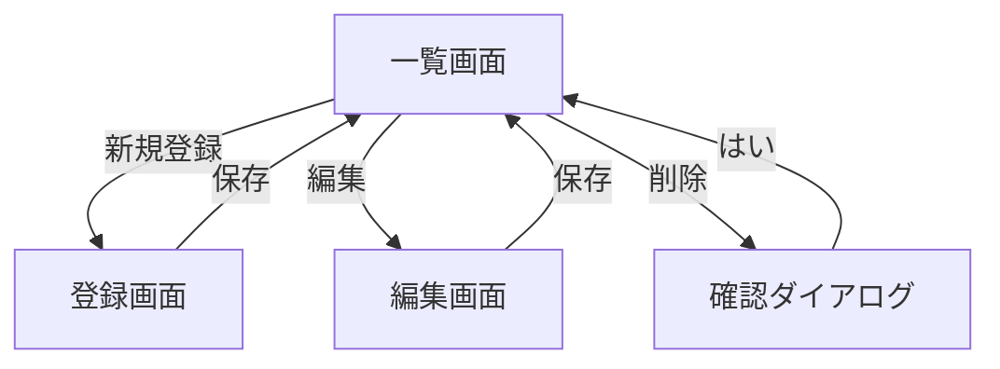

# Day2演習: 得意先マスター作成ガイド

## 演習の目標
AI（Claude）を活用して、既存システムに「得意先マスター管理機能」を追加する

## 完成イメージ
- 得意先の一覧表示
- 得意先の新規登録
- 得意先の編集
- 得意先の削除

---

## 事前準備チェックリスト

### 環境
- [ ] VS Code起動済み
- [ ] Claude（ブラウザ）起動済み
- [ ] プロジェクトをVS Codeで開いている
- [ ] README.mdが準備できている（Day1で作成）

### 参考資料
- [ ] Excelファイル（業務仕様）を開いている
- [ ] モックアップHTMLを開いている
- [ ] 既存のm001_userのコードが見られる状態

---

## Phase 1: テーブル設計（30分）

### Step 1-1: 要件の整理
**やること**: 業務要件をまとめる

**Excelを見ながら確認**:
- どんな情報を管理するか？
  - 得意先コード
  - 得意先名
  - 電話番号
  - 住所
  - 請求締日
  - など

**メモを作成**:
```
得意先マスター要件:
- 得意先を一意に識別するコード
- 得意先名（会社名）
- 連絡先情報
- 請求に関する設定
```

---

### Step 1-2: 既存テーブルの確認
**やること**: 参考にする既存テーブルを確認

**ファイル**: `src/nfbms_設計関連/00_データベース設計/ddl-20240729/m001_user.sql`

**Claudeに依頼**:
```
以下のm001_user.sqlを読んで、テーブル構造を説明してください。
特に以下の点を教えてください:
1. テーブル名の命名規則
2. 主キーの設定方法
3. 共通項目（regUser, updTimeなど）
4. コメントの付け方

[m001_user.sqlの内容を貼り付け]
```

**Claudeの回答を確認**:
- ✅ 命名規則が理解できた
- ✅ 共通項目がわかった
- ✅ CREATE TABLE構文のパターンがわかった

---

### Step 1-3: テーブル定義の生成
**やること**: AIにテーブル定義を作成してもらう

**Claudeへのプロンプト**:
```
m001_user.sqlを参考に、得意先マスター（m021_customer）の
CREATE TABLE文を作成してください。

要件:
1. テーブル名: m021_customer
2. 主キー: customerCd (得意先コード, NVARCHAR(20))
3. 項目:
   - customerNm (得意先名, NVARCHAR(100), 必須)
   - tel (電話番号, NVARCHAR(15))
   - zipCode (郵便番号, NVARCHAR(8))
   - address (住所, NVARCHAR(200))
   - closingDay (締日, INT) ※1-31の値
   - baseCd (拠点コード, NVARCHAR(2))
4. 共通項目を含める (regUser, regTime, updUser, updTime, delFlg)
5. コメント（MS_Description）も付ける

m001_userと同じ構造で作成してください。
```

**生成されたSQLを確認**:
```sql
CREATE TABLE m021_customer (
     customerCd NVARCHAR(20) NOT NULL
    ,customerNm NVARCHAR(100) NOT NULL
    ,tel NVARCHAR(15)
    ,zipCode NVARCHAR(8)
    ,address NVARCHAR(200)
    ,closingDay INT
    ,baseCd NVARCHAR(2)
    ,delFlg INT DEFAULT 0 NOT NULL
    ,regUser NVARCHAR(20)
    ,regTime DATETIME
    ,updUser NVARCHAR(20)
    ,updTime DATETIME
     PRIMARY KEY (customerCd)
);

-- MS_Descriptionも生成されているか確認
```

**確認ポイント**:
- [ ] 主キーが設定されている
- [ ] 共通項目が含まれている
- [ ] データ型が適切
- [ ] コメントが付いている

**問題があれば**:
```
「closingDayのデフォルト値を末日（31）にしてください」
「MS_Descriptionが足りない項目があります」
など、具体的に指示して修正
```

**保存**:
- ファイル名: `m021_customer.sql`
- 保存先: `src/nfbms_設計関連/00_データベース設計/ddl-20240729/`

---

## Phase 2: 画面設計（30分）

### Step 2-1: モックアップの確認
**やること**: 既存のモックアップを確認

**ファイル**: `src/nfbms/Mock/html/M001/` (ユーザーマスターの画面)

**ブラウザで開く**:
- 一覧画面
- 登録・編集画面

**確認ポイント**:
- どんなレイアウトか？
- 検索機能は？
- ボタンの配置は？

---

### Step 2-2: 画面仕様の決定
**やること**: 得意先マスターの画面仕様を決める

**一覧画面の項目**:
- 得意先コード
- 得意先名
- 電話番号
- 拠点
- 締日
- 操作ボタン（編集・削除）

**検索条件**:
- 得意先コード（部分一致）
- 得意先名（部分一致）
- 拠点（完全一致）

**登録・編集画面の項目**:
- すべての項目

---

### Step 2-3: HTMLモックアップ生成
**やること**: AIに画面HTMLを作成してもらう

**Claudeへのプロンプト**:
```
M001（ユーザーマスター）のHTMLモックアップを参考に、
M021（得意先マスター）の一覧画面のHTMLを作成してください。

要件:
1. Bootstrap 4を使用
2. 検索フォーム（得意先コード、得意先名、拠点）
3. 検索ボタン、クリアボタン、新規登録ボタン
4. 一覧テーブル（得意先コード、得意先名、電話番号、拠点、締日、操作）
5. 編集・削除ボタン
6. ページング（10件/ページ）

M001の構造と同じデザインでお願いします。

[M001のHTMLの一部を貼り付けて参考にする]
```

**生成されたHTMLを確認**:
1. VS Codeで新規ファイル作成: `M021_list.html`
2. 生成されたHTMLを貼り付け
3. ブラウザで開く（Live Serverなどを使用）
4. 見た目を確認

**問題があれば**:
```
「検索ボタンが右寄せになっていません」
「テーブルの列幅を調整してください」
など、具体的に修正依頼
```

**同様に登録・編集画面も作成**:
```
次に、登録・編集画面を作成してください。
フォーム項目は:
- 得意先コード（必須、新規時のみ入力可）
- 得意先名（必須）
- 電話番号
- 郵便番号
- 住所
- 締日（1-31のセレクトボックス）
- 拠点（セレクトボックス）

保存ボタン、キャンセルボタンを配置してください。
```

---

### Step 2-4: 画面遷移図の作成
**やること**: Mermaidで画面遷移図を描く

**Claudeへのプロンプト**:
```
得意先マスターの画面遷移をMermaidのフローチャートで作成してください。

画面:
1. 一覧画面
2. 登録画面
3. 編集画面

遷移:
- 一覧 → 新規登録ボタン → 登録画面
- 登録画面 → 保存 → 一覧（登録完了メッセージ）
- 一覧 → 編集ボタン → 編集画面
- 編集画面 → 保存 → 一覧（更新完了メッセージ）
- 一覧 → 削除ボタン → 確認ダイアログ → 削除実行 → 一覧（削除完了メッセージ）
```

**生成されたMermaidコードを確認**:


**VS Codeで確認**:
1. 新規ファイル: `M021_screen_flow.md`
2. Mermaidコードを貼り付け
3. Mermaid Previewで表示

---

## Phase 3: Javaコード実装（90分）

### Step 3-1: エンティティクラス作成
**やること**: テーブルに対応するJavaクラスを作成

**Claudeへのプロンプト**:
```
m021_customerテーブルに対応するDoma2のエンティティクラスを作成してください。

参考: M001UserEntity.java

要件:
1. パッケージ: springboot.pj.nfbms.app.m021
2. クラス名: M021CustomerEntity
3. Lombok使用（@Data, @Builder, @NoArgsConstructor, @AllArgsConstructor）
4. Doma2アノテーション（@Entity, @Table, @Id）
5. すべての項目をフィールドとして定義

[M001UserEntity.javaの内容を貼り付け]
```

**生成されたコードを確認**:
```java
package springboot.pj.nfbms.app.m021;

import lombok.*;
import org.seasar.doma.*;
import java.time.LocalDateTime;

@Entity
@Table(name = "m021_customer")
@Data
@Builder
@NoArgsConstructor
@AllArgsConstructor
public class M021CustomerEntity {
    @Id
    private String customerCd;
    private String customerNm;
    private String tel;
    private String zipCode;
    private String address;
    private Integer closingDay;
    private String baseCd;
    private Integer delFlg;
    private String regUser;
    private LocalDateTime regTime;
    private String updUser;
    private LocalDateTime updTime;
}
```

**保存**:
- パッケージ: `src/main/java/springboot/pj/nfbms/app/m021/`
- ファイル名: `M021CustomerEntity.java`

---

### Step 3-2: DAOインターフェース作成
**やること**: データアクセス用のインターフェースを作成

**Claudeへのプロンプト**:
```
M021CustomerEntity用のDAOインターフェースを作成してください。

参考: M001UserDao.java

メソッド:
1. selectAll() - 全件取得
2. selectById(String customerCd) - 1件取得
3. selectByCondition(検索条件) - 条件検索
4. insert(M021CustomerEntity entity) - 登録
5. update(M021CustomerEntity entity) - 更新
6. delete(String customerCd) - 削除

Doma2の@Dao, @Select, @Insert, @Update, @Deleteを使用してください。

[M001UserDao.javaの内容を貼り付け]
```

**生成されたコードを確認し保存**

---

### Step 3-3: SQLファイル作成
**やること**: DAOメソッドに対応するSQLファイルを作成

**Claudeへのプロンプト**:
```
M021CustomerDaoのselectAll()メソッド用のSQLファイルを作成してください。

要件:
- ファイル名: selectAll.sql
- 削除フラグ=0のデータのみ取得
- 得意先コード順にソート

[参考となるSQL例を提示]
```

**生成されたSQL**:
```sql
SELECT
     customerCd
    ,customerNm
    ,tel
    ,zipCode
    ,address
    ,closingDay
    ,baseCd
    ,delFlg
    ,regUser
    ,regTime
    ,updUser
    ,updTime
FROM
    m021_customer
WHERE
    delFlg = 0
ORDER BY
    customerCd
```

**保存**:
- パス: `src/main/resources/META-INF/springboot/pj/nfbms/app/m021/M021CustomerDao/`
- ファイル名: `selectAll.sql`

**同様に他のSQLファイルも作成**:
- `selectById.sql`
- `selectByCondition.sql`
- `insert.sql`
- `update.sql`
- `delete.sql` ※物理削除ではなく論理削除（delFlg=1に更新）

---

### Step 3-4: Formクラス作成
**やること**: 画面入力を受け取るクラスを作成

**Claudeへのプロンプト**:
```
M021（得意先マスター）のFormクラスを作成してください。

参考: M001Form.java

要件:
1. パッケージ: springboot.pj.nfbms.app.m021
2. クラス名: M021Form
3. 画面入力項目をフィールドに
4. バリデーションアノテーション
   - @NotBlank(得意先コード、得意先名)
   - @Size(電話番号、郵便番号、住所)
   - @Min/@Max(締日: 1-31)
5. エンティティへの変換メソッド toEntity()

[M001Form.javaを貼り付け]
```

**保存**:
- ファイル名: `M021Form.java`

---

### Step 3-5: Beanクラス作成
**やること**: 画面表示用のクラスを作成

**Claudeへのプロンプト**:
```
M021（得意先マスター）のBeanクラスを作成してください。

参考: M001Bean.java

要件:
1. 一覧画面表示用のフィールド
2. エンティティからの変換メソッド fromEntity()
3. Lombokの@Dataを使用

[M001Bean.javaを貼り付け]
```

**保存**:
- ファイル名: `M021Bean.java`

---

### Step 3-6: Serviceクラス作成
**やること**: ビジネスロジックを実装

**Claudeへのプロンプト**:
```
M021Service（得意先マスターのビジネスロジック）を作成してください。

参考: M001Service.java

メソッド:
1. findAll() - 全件取得
2. findById(String customerCd) - 1件取得
3. save(M021Form form) - 登録・更新
4. delete(String customerCd) - 削除

要件:
- @Serviceアノテーション
- @Transactional（save, delete）
- DAOを@Autowiredで注入
- 登録時: regUser, regTimeを設定
- 更新時: updUser, updTimeを設定

[M001Service.javaを貼り付け]
```

**生成されたコードを確認**:
- トランザクション管理が適切か
- NULL安全性は大丈夫か
- 登録・更新の共通項目設定は正しいか

**保存**:
- ファイル名: `M021Service.java`

---

### Step 3-7: Controllerクラス作成
**やること**: 画面とサービスをつなぐ

**Claudeへのプロンプト**:
```
M021Controller（得意先マスターのコントローラー）を作成してください。

参考: M001Controller.java

エンドポイント:
1. GET /m021 - 一覧画面表示
2. GET /m021/new - 登録画面表示
3. POST /m021 - 登録実行
4. GET /m021/{customerCd}/edit - 編集画面表示
5. POST /m021/{customerCd} - 更新実行
6. POST /m021/{customerCd}/delete - 削除実行

要件:
- @Controllerアノテーション
- @RequestMappingで/m021をベースパスに
- バリデーション（@Valid）
- エラーハンドリング
- リダイレクトとフラッシュメッセージ

[M001Controller.javaを貼り付け]
```

**生成されたコードを確認**:
- URL設計は適切か
- バリデーションが動作するか
- エラー時の画面遷移は正しいか

**保存**:
- ファイル名: `M021Controller.java`

---

## Phase 4: テストとデバッグ（60分）

### Step 4-1: コンパイル確認
**やること**: Javaコードがコンパイルできるか確認

**Maven実行**:
```bash
mvn clean compile
```

**エラーが出たら**:
1. エラーメッセージをコピー
2. Claudeに貼り付け
3. 「このエラーを解決してください」と依頼

**よくあるエラー**:
- インポート文の不足
- パッケージ名の誤り
- 型の不一致

---

### Step 4-2: アプリケーション起動
**やること**: Spring Bootアプリを起動

**起動方法**:
```bash
mvn spring-boot:run
```

または

VS Codeの実行ボタン

**起動確認**:
- コンソールにエラーが出ていないか
- ポート8080で起動しているか

---

### Step 4-3: 画面表示確認
**やること**: ブラウザで画面を確認

**アクセス**:
```
http://localhost:8080/m021
```

**確認ポイント**:
- [ ] 一覧画面が表示される
- [ ] 検索フォームが表示される
- [ ] 新規登録ボタンが表示される

**エラーが出たら**:
1. ブラウザのコンソールを確認
2. サーバーログを確認
3. エラー内容をClaudeに伝える

---

### Step 4-4: 機能テスト
**やること**: 各機能が動作するか確認

#### 新規登録テスト
1. 「新規登録」ボタンをクリック
2. 登録画面が表示されるか
3. すべての項目に入力
4. 「保存」ボタンをクリック
5. 一覧画面にリダイレクトされるか
6. 登録したデータが表示されるか

**問題があれば**:
- ログを確認
- SQLが正しく実行されているか確認
- Claudeに「登録時にエラーが発生します」と相談

#### 編集テスト
1. 一覧画面で「編集」ボタンをクリック
2. 編集画面が表示されるか
3. 既存データが入力済みか
4. データを変更
5. 「保存」ボタンをクリック
6. 変更が反映されているか

#### 削除テスト
1. 一覧画面で「削除」ボタンをクリック
2. 確認ダイアログが表示されるか
3. 「はい」をクリック
4. データが一覧から消えるか
5. DBを確認（delFlg=1になっているか）

---

### Step 4-5: バリデーションテスト
**やること**: 入力チェックが動作するか確認

**テストケース**:
- 必須項目を空欄で保存 → エラーメッセージ表示
- 締日に32を入力 → エラーメッセージ表示
- 締日に0を入力 → エラーメッセージ表示

**期待動作**:
- 画面にエラーメッセージが表示される
- 入力値が保持されている
- DBには登録されない

---

## Phase 5: コードレビューとドキュメント（30分)

### Step 5-1: AIによるコードレビュー
**やること**: 作成したコードをAIにレビューしてもらう

**Claudeへのプロンプト**:
```
以下のコードをレビューしてください。
問題点や改善提案があれば教えてください。

チェック観点:
1. 命名規則
2. NULL安全性
3. トランザクション管理
4. SQLインジェクション対策
5. パフォーマンス
6. エラーハンドリング

[M021Service.javaのコードを貼り付け]
```

**レビュー結果を確認**:
- 指摘された問題を修正
- 改善提案を検討
- 必要に応じて再実装

---

### Step 5-2: 単体テスト作成
**やること**: JUnitテストを作成

**Claudeへのプロンプト**:
```
M021Serviceの単体テストを作成してください。

テストケース:
1. findAll() - データが取得できること
2. findById() - 存在するIDで取得できること
3. findById() - 存在しないIDでnullが返ること
4. save() - 新規登録ができること
5. save() - 更新ができること
6. delete() - 削除（論理削除）ができること

JUnit 5とMockitoを使用してください。

[参考となるテストクラスがあれば貼り付け]
```

**テスト実行**:
```bash
mvn test
```

**全テストが通ればOK**

---

### Step 5-3: ドキュメント作成
**やること**: マスター仕様書を作成

**Claudeへのプロンプト**:
```
得意先マスターの仕様書をMarkdown形式で作成してください。

含める内容:
1. 概要
2. テーブル定義
3. 項目定義（一覧表）
4. 画面仕様
5. 業務ルール
6. API仕様（エンドポイント一覧）

[テーブル定義SQLを貼り付け]
[画面のスクリーンショットがあれば説明]
```

**生成されたドキュメントを保存**:
- ファイル名: `M021_得意先マスター仕様書.md`
- 保存先: `docs/` または `src/nfbms_設計関連/`

---

### Step 5-4: README.mdの更新
**やること**: プロジェクトREADMEに新機能を追記

**Claudeへのプロンプト**:
```
README.mdに得意先マスター（M021）の情報を追加してください。

追加内容:
- 機能一覧に「得意先マスター管理」を追加
- パッケージ一覧に「app/m021」を追加
- テーブル一覧に「m021_customer」を追加

[現在のREADME.mdを貼り付け]
```

---

### Step 5-5: Gitコミット
**やること**: 変更をコミット

**ステージング**:
```bash
git add .
```

**コミットメッセージ生成をAIに依頼**:
```
以下の変更内容に対して、適切なGitコミットメッセージを作成してください:

変更内容:
- 得意先マスター（M021）の新規作成
- エンティティ、DAO、Service、Controller実装
- 一覧・登録・編集・削除機能
- 単体テスト作成
- ドキュメント作成

プロジェクトのコミットメッセージルールに従ってください。
```

**生成されたメッセージでコミット**:
```bash
git commit -m "生成されたメッセージ"
```

---

## 完了チェックリスト

### 機能
- [ ] 一覧画面が表示される
- [ ] 新規登録ができる
- [ ] 編集ができる
- [ ] 削除（論理削除）ができる
- [ ] 検索ができる
- [ ] バリデーションが動作する

### コード品質
- [ ] コンパイルエラーがない
- [ ] 警告が出ていない
- [ ] 単体テストが全て通る
- [ ] コードレビューで問題なし

### ドキュメント
- [ ] テーブル定義が文書化されている
- [ ] 画面仕様が文書化されている
- [ ] README.mdが更新されている

### Git
- [ ] 変更がコミットされている
- [ ] コミットメッセージが適切

---

## トラブルシューティング

### Q1: コンパイルエラーが出る
**A**: エラーメッセージをClaudeに貼り付けて解決を依頼

**プロンプト例**:
```
以下のコンパイルエラーを解決してください:

[エラーメッセージ]

関連ファイル:
[エラーが出ているファイルのコード]
```

---

### Q2: 画面が真っ白
**A**: ブラウザの開発者ツールでエラーを確認

1. F12で開発者ツールを開く
2. Consoleタブを確認
3. エラーメッセージをClaudeに相談

---

### Q3: データが登録されない
**A**: ログを確認してSQLを調査

1. サーバーログでSQLを確認
2. SQLが実行されているか
3. エラーログがないか
4. 問題のSQLをClaudeに見せて修正依頼

---

### Q4: 削除が動作しない
**A**: 論理削除の実装を確認

**確認ポイント**:
- delete.sqlでdelFlg=1にUPDATEしているか
- 一覧取得でdelFlg=0のみ取得しているか

---

## まとめ

### 今日できるようになったこと
✅ AIを使ってテーブル定義を作成
✅ AIを使って画面HTMLを生成
✅ AIを使ってJavaコード（エンティティ～Controller）を生成
✅ AIにエラー解決を依頼
✅ AIにコードレビューを依頼
✅ AIにドキュメント作成を依頼

### 実務で活かせるスキル
✅ 新規機能開発の効率化
✅ 既存コードの理解促進
✅ トラブルシューティングの時間短縮
✅ ドキュメント作成の自動化

### 次のステップ
- 他のマスターも同じ手順で作成してみる
- より複雑な機能（親子関係のマスター等）に挑戦
- AIとのプロンプト技術を磨く
- 実務のプロジェクトで活用

---

**お疲れ様でした！**
