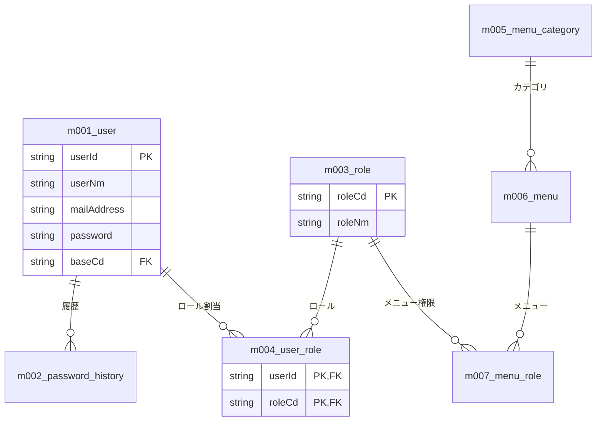
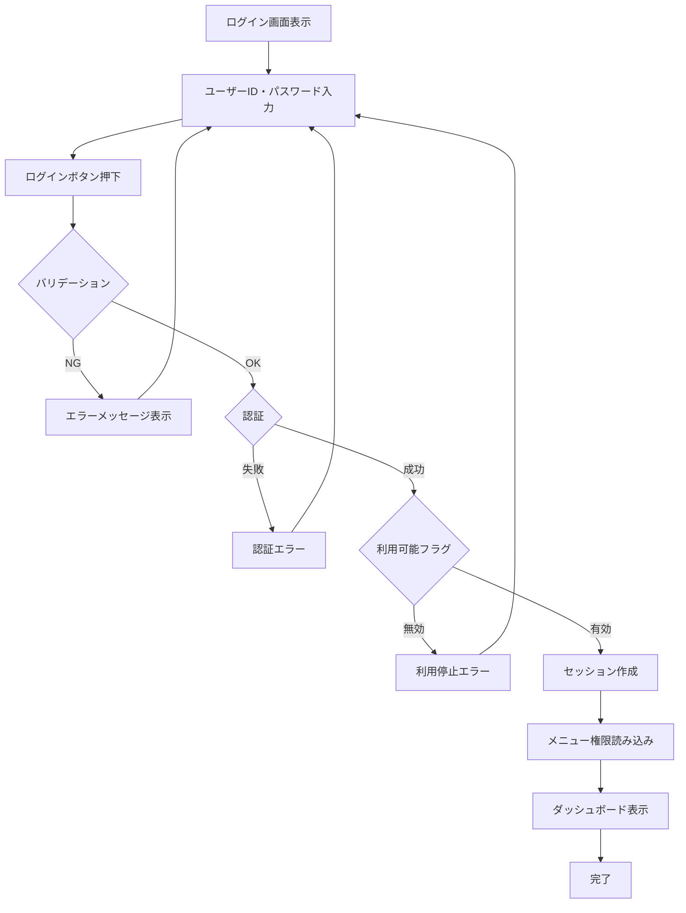
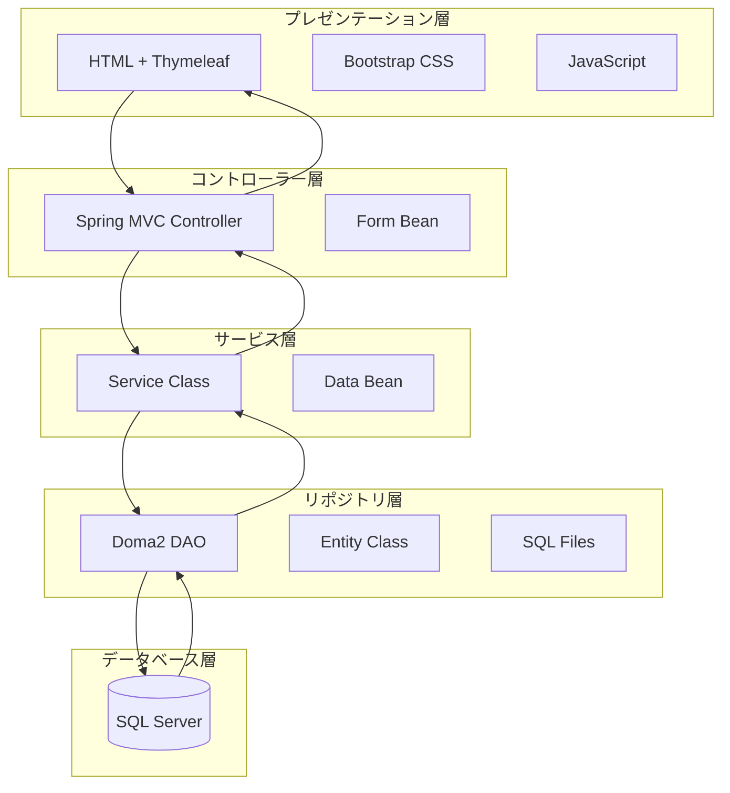
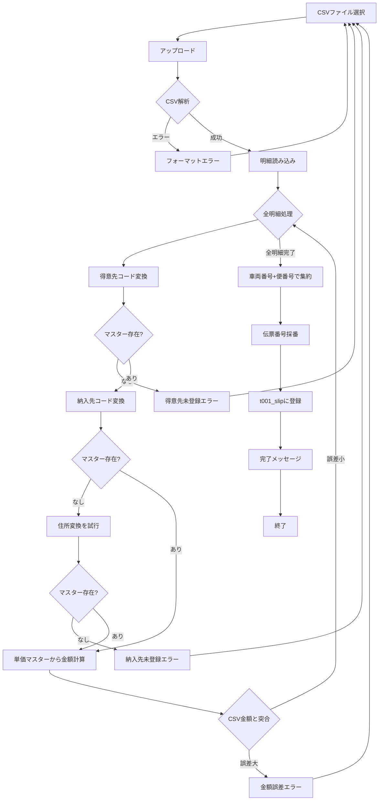

# AIを活用したリバースエンジニアリング実践ガイド

## このガイドの目的
既存システム（NFBMS）のソースコードと設計書から、AIを活用して効率的にシステム全体を理解し、ドキュメント化する方法を学ぶ

---

## Phase 1: ER図の自動生成（60分）

### 目標
全テーブルのER図をMermaid形式で生成し、データモデル全体を把握する

---

### Step 1-1: DDLファイルの収集（10分）

**やること**: すべてのテーブル定義を1つのファイルにまとめる

**ファイル場所**:
```
src/nfbms_設計関連/00_データベース設計/ddl-20240729/*.sql
```

**Bash操作**:
```bash
# 全DDLを1つのファイルに結合
cd src/nfbms_設計関連/00_データベース設計/ddl-20240729
cat m*.sql t*.sql i*.sql > all_tables.sql
```

**確認**:
```bash
# テーブル数を確認
grep "CREATE TABLE" all_tables.sql | wc -l
```

---

### Step 1-2: マスターテーブル一覧の生成（10分）

**Claudeへのプロンプト**:
```
以下のDDLファイルから、マスターテーブルの一覧を
Markdown表形式で作成してください。

表の列:
- テーブル物理名
- テーブル論理名（コメントから抽出）
- 主キー
- 説明（簡潔に）

[all_tables.sqlの内容を貼り付け]
```

**期待される出力例**:
```markdown
| 物理名 | 論理名 | 主キー | 説明 |
|--------|--------|--------|------|
| m001_user | ユーザー | userId | システム利用者 |
| m002_password_history | パスワード履歴 | userId, historySeq | パスワード変更履歴 |
| m003_role | ロール | roleCd | 権限ロール |
...
```

**保存**:
- ファイル名: `docs/テーブル一覧.md`

---

### Step 1-3: ER図の生成（30分）

**Claudeへのプロンプト（重要）**:
```
以下のDDLファイルから、ER図をMermaid形式で作成してください。

要件:
1. マスターテーブル（m001～）を青色で表示
2. トランザクションテーブル（t001～）を緑色で表示
3. インポートテーブル（i001～）を黄色で表示
4. 主キー・外部キーの関係を線で表現
5. 全テーブルを表示すると複雑すぎるため、以下のグループに分けて図を作成:
   - グループ1: ユーザー・権限関連（m001, m002, m003, m004, m005, m006, m007）
   - グループ2: マスター管理（m009, m010, m011, m013）
   - グループ3: 業務マスター（m021, m022, m023, m024, m025）
   - グループ4: トランザクション（t001, t011, t021, i001, i002）

各グループごとにMermaidのERDコードを生成してください。

[all_tables.sqlの内容を貼り付け]
```

**生成例（グループ1: ユーザー・権限関連）**:


**確認方法**:
1. VS Codeで新規ファイル作成: `docs/ER図_ユーザー権限.md`
2. 生成されたMermaidコードを貼り付け
3. Mermaid Previewで表示確認
4. 見にくい部分があればClaudeに修正依頼

**同様に他のグループも作成**

---

### Step 1-4: テーブル関連図の整理（10分）

**Claudeへのプロンプト**:
```
生成したER図から、主要なテーブル関連を
箇条書きで説明してください。

特に以下の観点で:
1. 親子関係（1対多）
2. 中間テーブル（多対多）
3. 外部キー制約

[ER図のMermaidコードを貼り付け]
```

**期待される出力**:
```markdown
## 主要なテーブル関連

### ユーザー・権限グループ
- **m001_user** -(1対多)-> **m004_user_role** -(多対1)-> **m003_role**
  - ユーザーは複数のロールを持てる（多対多関係）
  - m004_user_roleが中間テーブル

- **m003_role** -(1対多)-> **m007_menu_role** -(多対1)-> **m006_menu**
  - ロールごとにメニュー権限を設定（多対多関係）

### 業務マスターグループ
- **m021_customer** -(1対多)-> **t001_slip**
  - 得意先に対して複数の伝票

- **m022_delivery_point** -(1対多)-> **t001_slip**
  - 納入先ごとに伝票
```

**保存**:
- ファイル名: `docs/テーブル関連説明.md`

---

## Phase 2: 業務フロー図の生成（75分）

### 目標
主要な業務処理のフロー図を作成し、システムの動きを理解する

---

### Step 2-1: 既存機能の洗い出し（15分）

**やること**: 設計書（Excel）から既存機能を確認

**確認ファイル**:
```
src/nfbms_設計関連/B02_機能・画面一覧.xlsx
```

**Excelを開いて確認**:
- どんな機能があるか
- 機能ID（M001, A001など）
- 画面遷移

**メモ作成**:
```markdown
## 既存機能一覧

### 共通機能（Z系）
- Z001: ログイン
- Z002: ダッシュボード
- Z003: パスワード変更

### 日次処理（A系）
- A001: 伝票管理
- A011: 支払運賃明細修正

### 締日請求処理（B系）
- B001: 請求書・請求一覧表
- B002: 請求明細表
- B004: 得意先請求支払一覧表

### 締日支払処理（C系）
- C001: 支払・収支一覧表

### マスタ管理（M系）
- M001: ユーザーマスタ
- M002: 拠点マスタ
- M003: 請求先マスタ
- M011: 得意先マスタ
- M012: 納入先マスタ
- M013: 支払先マスタ
- M014: 発地マスタ
- M015: 運送店マスタ
- M091: 名称マスタ
```

---

### Step 2-2: ログイン処理のフロー図生成（20分）

**対象コード**:
```
src/nfbms/src/main/java/springboot/pj/zcore/common/controller/Z001_LoginController.java
src/nfbms/src/main/java/springboot/pj/zcore/common/config/SecurityConfig.java
```

**Claudeへのプロンプト**:
```
以下のコードから、ログイン処理のフロー図を
Mermaidのフローチャートで作成してください。

要件:
1. ユーザーの操作
2. 画面遷移
3. バリデーション
4. 認証処理
5. セッション管理
6. エラーハンドリング

すべての分岐を明確に表現してください。

[LoginControllerのコードを貼り付け]
[SecurityConfigのコードを貼り付け]
```

**期待される出力**:


**保存**:
- ファイル名: `docs/フロー図_ログイン.md`

---

### Step 2-3: 伝票登録処理のフロー図生成（20分）

**対象コード**:
```
src/nfbms/src/main/java/springboot/pj/nfbms/app/a001/A001Controller.java
src/nfbms/src/main/java/springboot/pj/nfbms/app/a001/A001Service.java
```

**Claudeへのプロンプト**:
```
伝票登録処理のフロー図を作成してください。

特に以下を明確に:
1. CSVアップロード
2. 明細の読み込み
3. マスター参照（得意先、納入先など）
4. バリデーション
5. 金額計算
6. DB登録
7. エラーハンドリング

[A001Controllerのコード]
[A001Serviceのコード]
```

**保存**:
- ファイル名: `docs/フロー図_伝票登録.md`

---

### Step 2-4: システムアーキテクチャ図の作成（20分）

**Claudeへのプロンプト**:
```
NFBMSのシステムアーキテクチャ図を
Mermaid（C4モデルまたはフローチャート）で作成してください。

レイヤー構造:
1. プレゼンテーション層（HTML + Thymeleaf）
2. コントローラー層（Spring MVC）
3. サービス層（ビジネスロジック）
4. リポジトリ層（Doma2 DAO）
5. データベース層（SQL Server）

各層の役割と技術スタックを明示してください。

参考:
- Spring Boot 2.7
- Thymeleaf
- Doma2
- SQL Server
```

**期待される出力**:


**保存**:
- ファイル名: `docs/アーキテクチャ図.md`

---

## Phase 3: 新機能設計（60分）

### 目標
CSV取り込み→伝票入力の新機能を設計する

---

### Step 3-1: 現状のExcel運用を理解（15分）

**やること**: Excelファイルを開いて業務フローを確認

**確認ファイル**:
```
src/nfbms_設計関連/（Excelの業務フロー）
```

**確認ポイント**:
1. CSVのどの項目を使っているか
2. どんな計算をしているか
3. どんなマスターを参照しているか
4. 集約ルール（車両番号+便番号）

**メモ作成**:
```markdown
## 現状の業務フロー（Excel）

### CSV項目
- 日付
- 車両番号
- 便番号
- 得意先名
- 納入先名
- 住所
- 商品種類
- 数量（kg）
- など

### 処理内容
1. CSV貼り付け
2. 得意先コード自動変換（VLOOKUP）
3. 納入先コード自動変換（VLOOKUP）
4. 単価マスターから金額計算
5. CSV金額と突合
6. 車両番号+便番号で集約
7. 伝票番号採番
8. システムへコピー

### 使用するマスター
- 得意先変換マスター
- 納入先変換マスター
- 住所変換マスター
- 単価マスター
```

---

### Step 3-2: 新マスターの定義（20分）

**やること**: 必要な新マスターのDDLを作成

#### マスター1: 納入先変換マスター

**Claudeへのプロンプト**:
```
m001_userのテーブル定義を参考に、
納入先変換マスター（m026_delivery_conversion）のDDLを作成してください。

要件:
1. 拠点コード + 得意先コード + CSV上の納入先名 で一意
2. 変換後の納入先コードを保持
3. 共通項目（delFlg, regUser, regTime, updUser, updTime）を含める
4. コメント（MS_Description）を付ける

項目:
- baseCd: 拠点コード（m013_baseへの外部キー）
- customerCd: 得意先コード（m021_customerへの外部キー）
- csvDeliveryNm: CSV上の納入先名（NVARCHAR(100)）
- deliveryPointCd: 変換後の納入先コード（m022_delivery_pointへの外部キー）

[m001_user.sqlを貼り付け]
```

**生成されたDDLを確認・保存**:
- ファイル名: `docs/新マスターDDL/m026_delivery_conversion.sql`

#### マスター2: 住所変換マスター

**同様の手順で作成**:
- ファイル名: `docs/新マスターDDL/m027_address_conversion.sql`

---

### Step 3-3: 業務フロー図の作成（25分）

**Claudeへのプロンプト**:
```
CSV取り込みから伝票登録までの業務フローを
Mermaidのフローチャートで作成してください。

処理ステップ:
1. CSVファイルアップロード
2. CSV解析・明細読み込み
3. 得意先コード変換（マスター参照）
4. 納入先コード変換（マスター参照、住所変換も含む）
5. 単価マスターから金額計算
6. CSV金額との突合・誤差チェック
7. 車両番号+便番号で集約処理
8. 伝票番号採番
9. 伝票登録（t001_slip）
10. 完了メッセージ

エラー処理も含めてください:
- CSVフォーマットエラー
- マスター未登録エラー
- 金額誤差エラー（許容範囲を超える）
```

**生成例**:


**保存**:
- ファイル名: `docs/フロー図_CSV取り込み伝票登録.md`

---

## Phase 4: 実装演習（90分）

### 目標
納入先変換マスターの管理機能を実装する

---

### Step 4-1: エンティティ作成（15分）

**Claudeへのプロンプト**:
```
M001UserEntity.javaを参考に、
M026DeliveryConversionEntity.javaを作成してください。

テーブル定義:
[m026_delivery_conversion.sqlの内容]

参考コード:
[M001UserEntity.javaの内容]

要件:
- Lombok使用（@Data, @Builder, @NoArgsConstructor, @AllArgsConstructor）
- Doma2アノテーション（@Entity, @Table, @Id）
- 複合主キー（baseCd, customerCd, csvDeliveryNm）
```

**生成されたコードを保存**:
- パス: `src/main/java/springboot/pj/nfbms/app/m026/`
- ファイル名: `M026DeliveryConversionEntity.java`

---

### Step 4-2: DAO作成（15分）

**Claudeへのプロンプト**:
```
M026DeliveryConversionEntity用のDAOを作成してください。

参考: M001UserDao.java

メソッド:
1. selectAll() - 全件取得
2. selectByKey(baseCd, customerCd, csvDeliveryNm) - 主キー検索
3. selectByBaseCd(baseCd) - 拠点別検索
4. insert(entity) - 登録
5. update(entity) - 更新
6. delete(baseCd, customerCd, csvDeliveryNm) - 削除（論理削除）

[M001UserDao.javaの内容]
```

**生成されたコードを保存**:
- ファイル名: `M026DeliveryConversionDao.java`

---

### Step 4-3: SQLファイル作成（15分）

**必要なSQL**:
1. `selectAll.sql`
2. `selectByKey.sql`
3. `selectByBaseCd.sql`
4. `insert.sql`
5. `update.sql`
6. `delete.sql`

**Claudeへのプロンプト（selectAll.sql）**:
```
M026DeliveryConversionDao.selectAll()用のSQLを作成してください。

要件:
- 削除フラグ=0のデータのみ
- baseCd, customerCd, csvDeliveryNm順にソート
- 納入先マスター（m022_delivery_point）を結合して納入先名も取得

テーブル定義:
[m026のDDL]
[m022のDDL]
```

**生成されたSQLを保存**:
- パス: `src/main/resources/META-INF/springboot/pj/nfbms/app/m026/M026DeliveryConversionDao/`
- ファイル名: `selectAll.sql`

**同様に他のSQLも作成**

---

### Step 4-4: Service作成（20分）

**Claudeへのプロンプト**:
```
M026Service（納入先変換マスターのビジネスロジック）を作成してください。

参考: M001Service.java

メソッド:
1. findAll() - 全件取得
2. findByKey(baseCd, customerCd, csvDeliveryNm) - 主キー検索
3. save(form) - 登録・更新
4. delete(baseCd, customerCd, csvDeliveryNm) - 削除

要件:
- @Service, @Transactional
- 登録時: regUser, regTimeを設定
- 更新時: updUser, updTimeを設定
- 削除は論理削除（delFlg=1）

[M001Service.javaの内容]
```

**生成されたコードを保存**:
- ファイル名: `M026Service.java`

---

### Step 4-5: Form・Bean作成（15分）

**Form作成**:
```
M026Form.javaを作成してください。

項目:
- baseCd（必須、@NotBlank）
- customerCd（必須、@NotBlank）
- csvDeliveryNm（必須、@NotBlank, @Size(max=100)）
- deliveryPointCd（必須、@NotBlank）

バリデーションアノテーションを含めてください。

[M001Form.javaの内容]
```

**Bean作成**:
```
M026Bean.javaを作成してください。

一覧画面表示用のフィールド:
- baseCd
- customerCd
- csvDeliveryNm
- deliveryPointCd
- deliveryPointNm（納入先名、結合して取得）

fromEntity()メソッドを含めてください。
```

---

### Step 4-6: Controller作成（10分）

**Claudeへのプロンプト**:
```
M026Controller（納入先変換マスターのコントローラー）を作成してください。

参考: M001Controller.java

エンドポイント:
1. GET /m026 - 一覧画面
2. GET /m026/new - 登録画面
3. POST /m026 - 登録実行
4. GET /m026/{baseCd}/{customerCd}/{csvDeliveryNm}/edit - 編集画面
5. POST /m026/{baseCd}/{customerCd}/{csvDeliveryNm} - 更新実行
6. POST /m026/{baseCd}/{customerCd}/{csvDeliveryNm}/delete - 削除実行

[M001Controller.javaの内容]
```

---

## Phase 5: テストと総括（45分）

### Step 5-1: コンパイル・起動確認（15分）

**Maven実行**:
```bash
mvn clean compile
mvn spring-boot:run
```

**ブラウザでアクセス**:
```
http://localhost:8080/m026
```

**エラーが出たら**:
- ログを確認
- Claudeにエラーメッセージを貼り付けて解決依頼

---

### Step 5-2: 機能テスト（15分）

1. 一覧表示
2. 新規登録
3. 編集
4. 削除

**テストデータ**:
```
拠点コード: 01
得意先コード: 0001
CSV納入先名: 東京本社
納入先コード: 00001
```

---

### Step 5-3: ドキュメントレビューと総括（15分）

**作成したドキュメント一覧**:
- [ ] ER図（4グループ）
- [ ] テーブル一覧
- [ ] テーブル関連説明
- [ ] フロー図（ログイン、伝票登録、CSV取り込み）
- [ ] アーキテクチャ図
- [ ] 新マスターDDL
- [ ] 納入先変換マスター仕様書

**振り返り**:
1. リバースエンジニアリングで理解できたことは？
2. AIでドキュメント生成は役立ったか？
3. 実務でどう活かせるか？

---

## トラブルシューティング

### Q1: ER図が複雑すぎて見づらい
**A**: グループ分けを細かくする
```
「m021～m025のテーブルだけで
ER図を作成してください」
```

### Q2: フロー図の分岐が多すぎる
**A**: 正常系のみにする
```
「エラー処理を省略して、
正常系のフローだけ作成してください」
```

### Q3: 複合主キーのエンティティがエラー
**A**: Doma2の複合主キーアノテーション
```
@Id
@Column(name = "baseCd")
private String baseCd;

@Id
@Column(name = "customerCd")
private String customerCd;

@Id
@Column(name = "csvDeliveryNm")
private String csvDeliveryNm;
```

---

## まとめ

### Day2で習得したスキル
✅ DDLからER図自動生成
✅ コードから業務フロー図生成
✅ 既存システムのドキュメント化
✅ 新機能の設計
✅ 複合主キーのマスター実装

### 実務での活用
✅ レガシーシステムの理解
✅ 引き継ぎ資料の作成
✅ 改修前の現状把握
✅ 新メンバーへのオンボーディング

**リバースエンジニアリングは実務の基本！**
